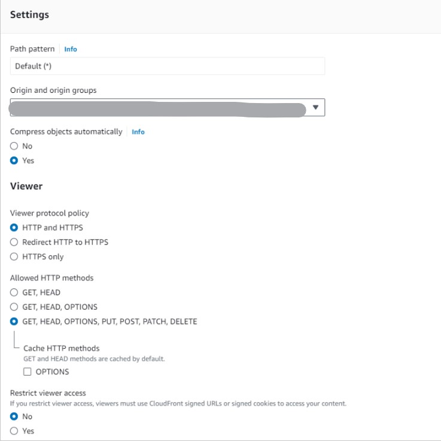
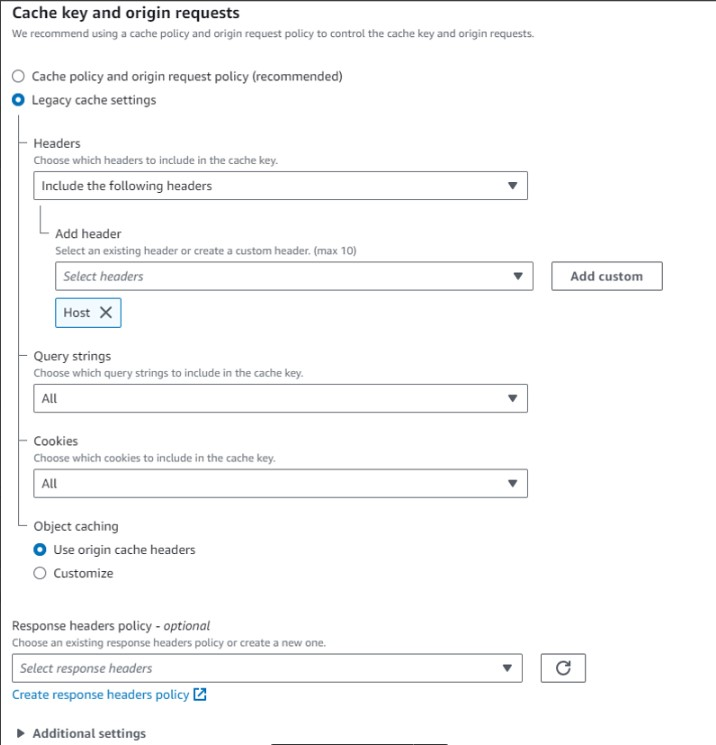

- CloudFront → Public VPC上のNLB(HTTP)（Internet facing）→ Private VPC上のGrafana
  - NLBはInternet facingである必要がある
  - Public VPC上のNLBのTargetではTarget typeをIPにしてPrivate VPC上のGrafanaインスタンスを指定する
- NLBのセキュリティグループでソースをCloudFrontプレフィックスにすることで、NLBがInternet facingでもCloudFront経由のみアクセスを許可することができる。

### 以下実際アクセス確認ができたCloudFrontの設定
##### Origins
- Protocolは`HTTP only`、HTTP portはデフォルトの80

> [!Warning]
> CloudFront → ELBの通信はHTTPで良いか確認！
> 厳密にはSSL/TLSで暗号化しなくても良いけど、暗号化することが推奨されているっぽい
> その場合はNLBではなくて、ALBを使ってALBにもSSL/TLS証明書をアタッチしないといけない

##### Behaviors

### WAF
- WAFを有効化すると(Core protections)、一部のDataSourceの変更やダッシュボードでのパネルの追加などができなかったので、デフォルトの無効のままにした