## Grafana本体の設定
- 基本的な設定ファイルは`/etc/grafana/grafana.ini`
- `/etc/grafana/grafana.ini`に設定できるのはすべて環境変数で設定できる
  - フォーマット
    ~~~
    GF_<SectionName>_<KeyName>
    ~~~
  - 例
    - `/etc/grafana/grafana.ini`
      ~~~
      # default section
      instance_name = ${HOSTNAME}

      [security]
      admin_user = admin

      [auth.google]
      client_secret = 0ldS3cretKey

      [plugin.grafana-image-renderer]
      rendering_ignore_https_errors = true
      ~~~
    - 環境変数
      ~~~
      export GF_DEFAULT_INSTANCE_NAME=my-instance
      export GF_SECURITY_ADMIN_USER=owner
      export GF_AUTH_GOOGLE_CLIENT_SECRET=newS3cretKey
      export GF_PLUGIN_GRAFANA_IMAGE_RENDERER_RENDERING_IGNORE_HTTPS_ERRORS=true
      ~~~
- デフォルトではViewer権限ユーザはExploreを操作できない(表示されない)が、  
  `users`セクションの`viewers_can_edit`を`true`(defaultはfalse)にすれば
  - https://grafana.com/docs/grafana/latest/setup-grafana/configure-grafana/#viewers_can_edit
- `server`セクションの`serve_from_sub_path`を`true`したら`root_url`に指定したURLのsubpathでGrafanaにアクセスすることもできる
  - 例えば`root_url`を`http://<GrafanaのIP>/unk`にしたら`<GrafanaのIP>/unk`でアクセスできるようになる
  - https://grafana.com/docs/grafana/latest/setup-grafana/configure-grafana/#serve_from_sub_path

## DashBoard / Panel設定
### ■ Variablesについて
- Grafanaダッシュボードの中の値(Query、Min interval、Panelタイトルなどなど)をダッシュボードで選択/記入した値に動的に変更できる仕組み
- 事前にダッシュボードの「Settings」の「Variables」で定義しておく必要がある
  - variablesにはいくつかのTypeがあり、Variablesの値に動的にPrometheusなどのクエリーの結果を使ったり(`Query`type)、Variablesの値を静的に設定したり(`Custom`type)することができる
- 参考URL
  - https://grafana.com/docs/grafana/latest/dashboards/variables/
  - https://grafana.com/docs/grafana/latest/dashboards/variables/add-template-variables/
  - https://grafana.com/docs/grafana/latest/dashboards/variables/inspect-variable/
  - https://grafana.com/docs/grafana/latest/dashboards/variables/variable-syntax/

### ■ Tooltipについて  
- グラフにマウスをかざした時に表示する対象についての設定  
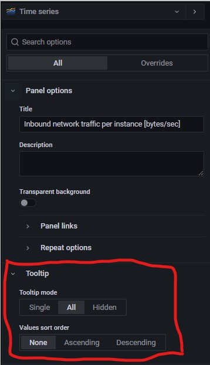
  - Single  
    → 1つだけ表示
    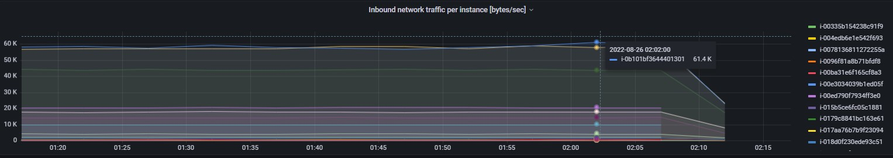
  - All  
    → すべて表示
    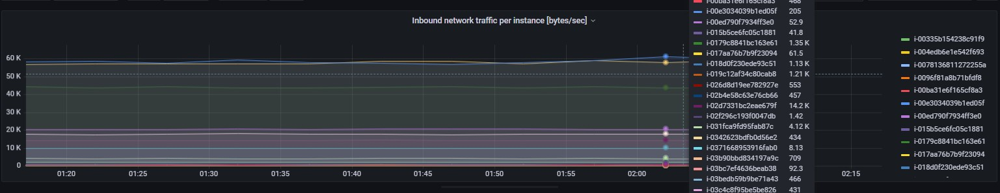
  - Hidden  
    → 表示しない
    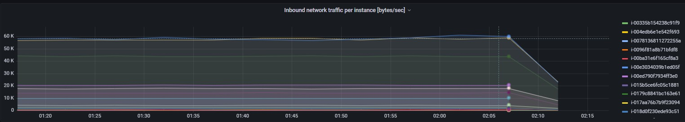

### ■ Graph stylesのStack series
- Bar/グラフ/Pointsで各値を重複して見せるか、重ねて見せるかの設定
  - Off  
    → 小さい値は大きい値のBar/グラフ中に表示される  
    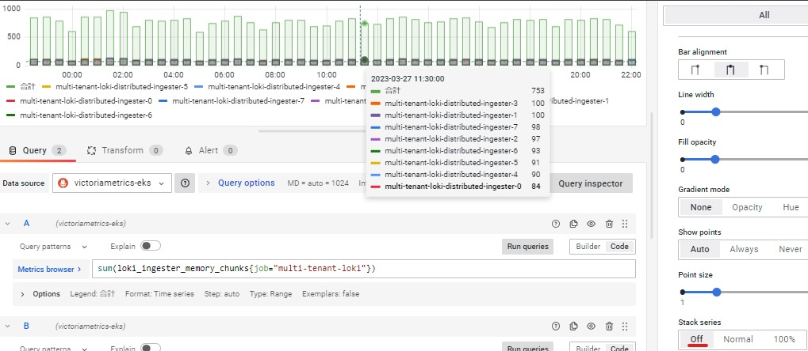
  - Normal  
    → 各値が別の値の上に(から)表示される  
    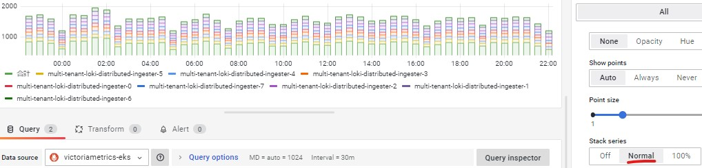
  - 100%  
    → 全体を100%にして各値の割合で表示される  
    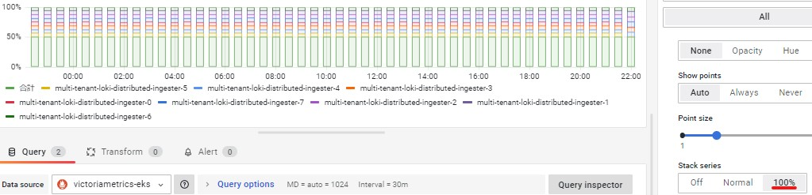
- Grafana関連ページ
  - https://grafana.com/docs/grafana/latest/panels-visualizations/visualizations/time-series/#stack-series

#### `$__interval`、`$__rate_interval`、`$__range`について
- `$__interval`
  > Grafana automatically calculates an interval that can be used to group by time in queries.
- `$__rate_interval`
  > We recommend using \$__rate_interval in the rate and increase functions instead of \$__interval or a fixed interval value. Because $__rate_interval is always at least four times the value of the Scrape interval, it avoid problems specific to Prometheus.
- `$__range`
  - DashboardのTimeRangeの時間範囲が適用される
  - 例えばDashboardのTimeRangeを"Last 30 minutes"にしてる場合、`[$__range]`は`[30m]`になる
- 参考URL
  - https://grafana.com/docs/grafana/latest/dashboards/variables/add-template-variables/#global-variables
  - https://grafana.com/docs/grafana/latest/datasources/prometheus/template-variables/#use-__rate_interval

### ■ Min intervalについて
- データの集計間隔(rollup)
- 例えばMin intervalを1hに設定したらデータは12h、13h、14h、・・・と1時間間隔で表示される
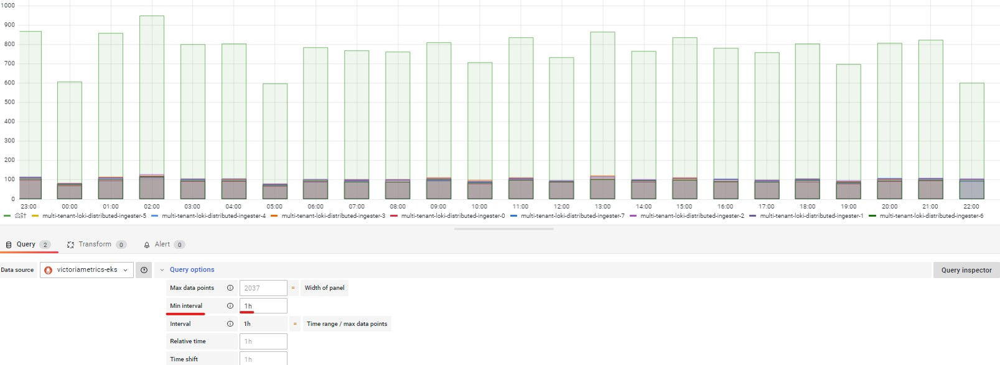
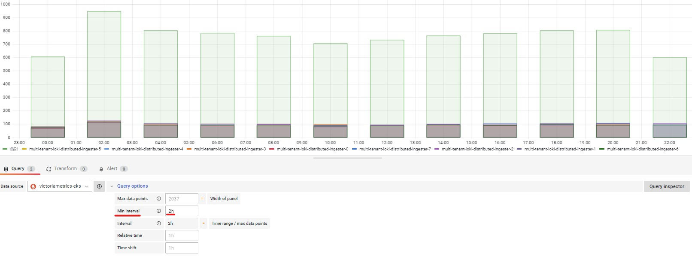

### ■ Relative timeについて
- PanelごとのTimeRange（Panelごとに設定できる）
- Relative timeが設定されているPanelはDashboardのTimeRangeに影響されなくなる
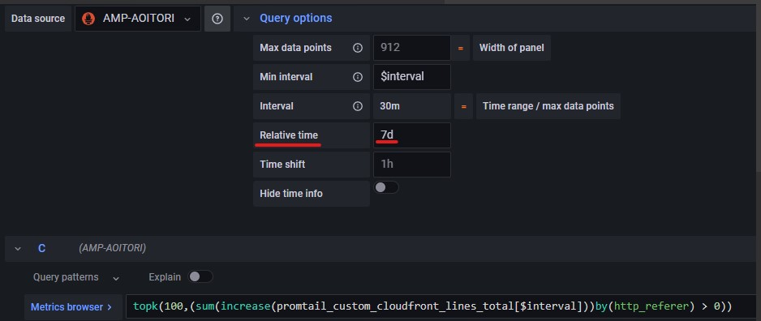
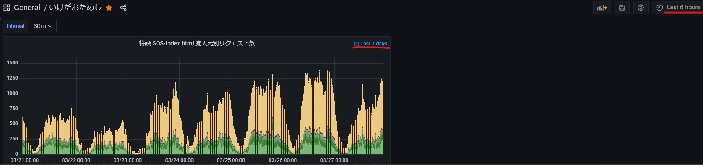

### ■ Graph(old) Panel
- Grafana9.0からGraph(old)がPanelから選択できないようになった
  - 既存のGraph(old)Panelはそのまま使い続けられる
- ただ一旦Timeseries Panelを作成後、jsonからtypeをtimeseries → graphに変更することでGraph(old) Panelを作成できる
  - https://stackoverflow.com/questions/73353757/grafana-get-graph-old-back 

### ■ No Dataを0に変える方法
- Grafanaの機能でNo Valueを他の値に変える
  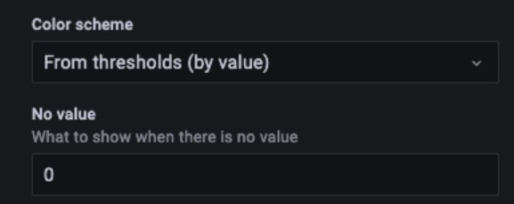
- (Prometheus)クエリーの最後に`or vector(0)`をつけてNo Dataの時は0を表示させる
  - e.g. `http_requests_total{method="GET", code="400"} or vector(0)`
- 参考URL
  - https://community.grafana.com/t/how-to-get-no-data-to-0-when-there-is-no-data-value/64845/6

## Alert設定
#### ■ AlertのGroupingについて
- 参考URL
  - https://grafana.com/docs/grafana/latest/alerting/notifications/  
- GrafanaのAlertもPrometheusと同様にラベルによるGroupingを行う  
- `Group by`に何も設定しない場合はすべてのAlertが1つのGroupとして扱う
- `Group by`に`...`を設定するとすべてのlabelによってGroupingされるので、すべてのアラートが個別のGroupとして扱われる  
  (1つのalertnameに属していてもpodやhostname等が違えば別のGroupとして扱われる)
  >Note: Grafana also has a special label named ... that you can use to group all alerts by all labels (effectively disabling grouping), 
therefore each alert will go into its own group. It is different from the default of group_by: null where all alerts go into a single group.  
- 複数のNotification policiesが存在する場合、各Policy側で`Group by`設定を`...`に上書きすること  
  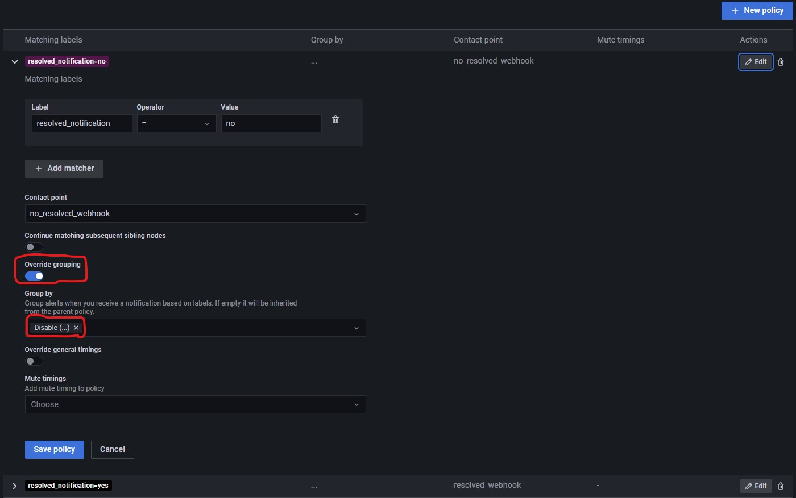

#### ■ GrafanaのAlertに関するコンポーネントについて
- 参考URL
  - https://grafana.com/docs/grafana/next/alerting/high-availability/
- Grafana Alerting systemは内部的に`Scheduler`と`Alertmanager`を持っている
  > The Grafana Alerting system has two main components: a Scheduler and an internal Alertmanager. The Scheduler evaluates your alert rules, while the internal Alertmanager manages routing and grouping.
- Scheduler  
  → alert rulesを評価する
- Alertmanager  
  → Alertのroutingとgroupingを行う

#### ■ Grafana Alerting(Webhook)から発行されるアラートデータ形式
- Alertmanager形式と同じ
  - https://prometheus.io/docs/alerting/latest/clients/
  - https://prometheus.io/docs/alerting/latest/notifications/

#### ■ Alertのメッセージ文の中にクエリーのValueを埋め込む方法
- `Summary and annotaions`部分の本文にクエリーのValue(e.g. CPU使用率)を埋め込むことができる
- `Classic condition`では使えない
  - `Threshold`や`Math`でアラートを設定すること
- 設定例
  - `DX Ping mean success rate is {{ $values.B.Value }}%`

#### ■ GrafanaのAlert発行単位について
- 参考URL
  - https://grafana.com/docs/grafana/latest/alerting/fundamentals/alert-rules/alert-instances/
- Grafanaは1つのAlert Ruleで複数のインスタンすを作成できる
- つまり、1つのAlert Ruleから複数のアラートが発行される（上記URL参照）
- 1つのAlert Ruleから発行される複数のアラートは1回の処理で連携される。  
  例えば、Webhookに連携する場合、以下添付のように1つのAlert Ruleから同時に発行される62個のAlertは1回のWebhook(POST)で連携される  
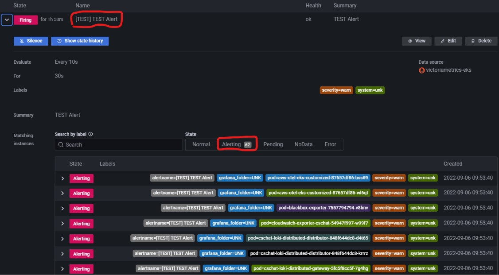

#### ■Notification policiesについて
- どのnested policyにもmatchしなかったら大元のDefault policyが適用される
- defaultでは1つのnested policyにmatchすると次のnested policyは評価されないけど、`Continue matching subsequent sibling nodes`のenableにすればすべてのnested policyが評価される
- `Mute Timings`タブでアラートをmuteする時間帯を設定し、特定のnested policyと紐づけることができる
##### `Continue matching subsequent sibling nodes`について
> If the Continue matching subsequent sibling nodes option is enabled for a nested policy, then evaluation continues even after one or more matches. A parent policy’s configuration settings and contact point information govern the behavior of an alert that does not match any of the nested policies. A default policy governs any alert that does not match a nested policy.
> 
> You can configure Grafana-managed notification policies as well as notification policies for an external Alertmanager data source.
- `Continue matching subsequent sibling nodes`をenableにすると1つのアラートに対して複数の通知を受け取ることができる
  > enable Continue matching subsequent sibling nodes to continue matching sibling policies even after the alert matched the current policy. When this option is enabled, you can get more than one notification for one alert.
- nested policyの順番で想定とは違う動きをすることもあり得るので注意！
  - 例えば、`Mute Timings`と紐づいているnested policyがあるとして、そのnested policyが下の方にあると上のpolicyで評価されて発砲されてしまい、muteが効かない
  - そういう場合は、既存のnested policyにmuteの為のラベル追加と`Mute Timings`の紐づけを行う
- 参考URL
  - https://grafana.com/docs/grafana/latest/alerting/alerting-rules/create-notification-policy/
  - https://grafana.com/docs/grafana/latest/alerting/fundamentals/notification-policies/

#### ■ CloudWatch LogsのAlert設定
- CloudWatch Logsに対してアラートを設定するためにはCloudwatch Logs Insightsを使ってnumericデータが返ってくるようにクエリーを投げる必要がある
  > Alerting require queries that return numeric data, which CloudWatch Logs support. For example through the use of the stats command, alerts are supported.

  > **Warning**  
  > When trying to alert on a query, if an error like `input data must be a wide series but got ...` is received, make sure that your query returns valid numeric data that can be printed in a Time series panel.
- `fileds`で`@message`を指定し、`filter`で`like`または`not like`や`=~`で検知したい文字列を特定し、`stats count(*) by bin(1m)`で件数を取得する
- `bin`はLogQL`count_over_time`の`[]`で指定する時間と同じ感覚で、件数をまとめる間隔を指定
  - 例えばあるログが12:00に2件、12:03に5件、12:08に3件あったとした場合、`bin(10m)`は`12:00 10件`と表示されるけど、`bin(1m)`は`12:00 2件`,`12:03 5件`,`12:08 3件`と表示される
  - 1mが無難
- Cloudwatch Logs Insightsクエリー例
  - 条件が1つのみの場合
    ```
    fields @message
    | filter @message like /error/
    | stats count(*) by bin(1m)
    ```
  - 条件が複数の場合は`and`や`or`でつなげることができる
    ```
    fields @message
    | filter @message like /error/ and @message not like /exception/
    | stats count(*) by bin(1m)
    ```
- `fields`で指定できる項目はマネコンのCloudwatch Logs Insightsから確認できる
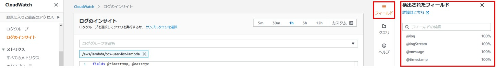
- 参考URL
  - https://grafana.com/docs/grafana/latest/datasources/aws-cloudwatch/
  - https://docs.aws.amazon.com/ja_jp/AmazonCloudWatch/latest/logs/CWL_QuerySyntax.html
  - https://qiita.com/suuu/items/8387df88f134348f22c7 

#### ■ AlertのEvaluation(評価)で時々`fetching of query results exceeded max number of attempts`エラーが出る件
- GrafanaのAlertで時々以下のようなエラーが出た
  ~~~
  Failed to evaluate queries and expressions: [plugin.downstreamError] failed to query data:
  fetching of query results exceeded max number of attempts
  ~~~
- `[unified_alerting]`ブロックで`evaluation_timeout`(default: `30s`)と`max_attempts`(default: `3`)で評価時のTimeoutと評価を何回まで試すかを設定できる
  - **これで再発しないか確認しあとでUpdateする**
  - https://grafana.com/docs/grafana/latest/setup-grafana/configure-grafana/#unified_alerting

## Plugin
#### ■ X-Ray
- 参考URL
  - https://github.com/grafana/x-ray-datasource
  - https://grafana.com/grafana/plugins/grafana-x-ray-datasource/
- X-Rayプラグイン利用に必要なIAMポリシーに`ec2:DescribeRegions`も含まれる
  - be used to list regions
  - https://github.com/grafana/x-ray-datasource/issues/135

#### ■ CloudWatch
- Grafanaから表示できるCloudWatch LogsのLog Groupsの数は50個までだが、これはGrafanaの制約ではなく、AWS側の制約である
  - AWSの`DescribeLogGroups`APIの制約
  - https://github.com/grafana/grafana/issues/50532

## その他
- GrafanaもGrafanaに関するメトリクスを開示している  
  - https://grafana.com/docs/grafana/latest/alerting/fundamentals/evaluate-grafana-alerts/#metrics-from-the-alerting-engine
  - https://grafana.com/docs/grafana/latest/alerting/images-in-notifications/#metrics