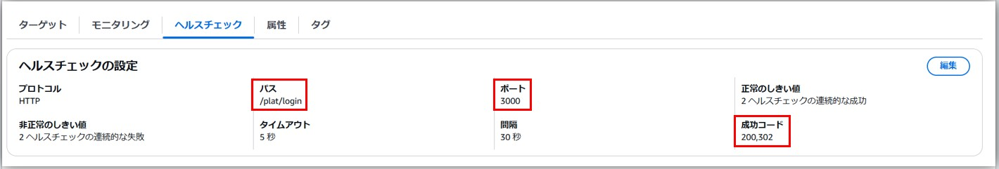
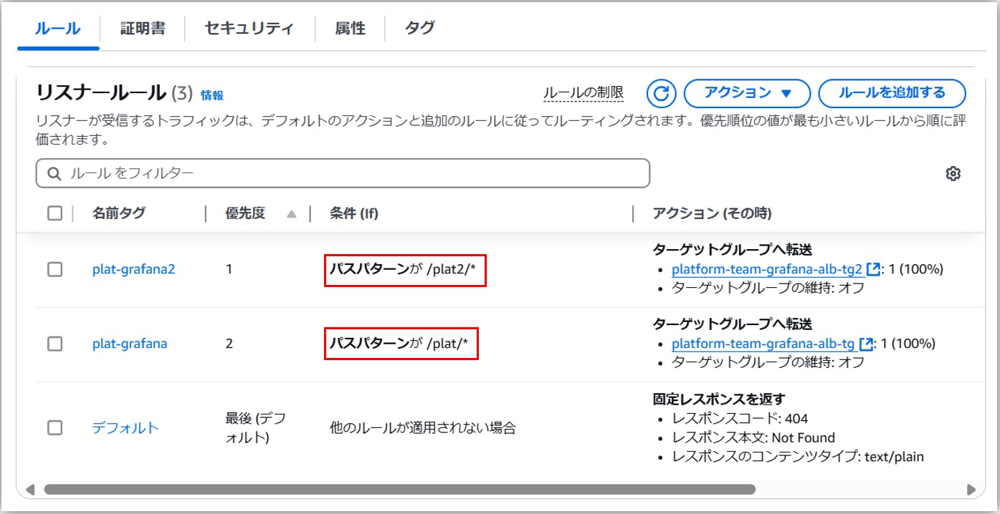

- 参考URL
  - https://grafana.com/tutorials/run-grafana-behind-a-proxy/

- **複数のOrgを使っている場合、`root_url`にGrafanaに接続するためのReverse ProxyのIPとPortを設定する必要がある**
  - 例えばGrafanaのNginx接続アドレスが`10.0.0.8:800`の場合、`root_url`(環境変数は`GF_SERVER_ROOT_URL`)に`http://10.0.0.8:800`を設定する

- nginxのConfigに`proxy_set_header Host $http_host;`を追加する必要がある

## 1つのALBの後ろにURLパスで、複数のGrafanaにアクセスする方法
### 前提
- ALBのドメインをRoute53でCNAMEとして登録して別のドメインでアクセスする
- ALBでTLSを終端する

### Grafana側の設定
- 環境変数`GF_SERVER_ROOT_URL`で`https://<ドメイン名>/<Subパス>`を指定
- 環境変数`GF_SERVER_DOMAIN`でドメイン名を指定
- 環境変数`GF_SERVER_SERVE_FROM_SUB_PATH`を`"true"`に設定

#### Grafanaのマニフェストファイルのサンプル
```yaml
---
apiVersion: v1
kind: Service
metadata:
  name: grafana
  namespace: monitoring
spec:
  ports:
    - port: 3000
      protocol: TCP
      targetPort: 3000
  selector:
    app: grafana
---
apiVersion: apps/v1
kind: Deployment
metadata:
  name: grafana
  labels:
    app: grafana
  namespace: monitoring
spec:
  replicas: 1
  selector:
    matchLabels:
      app: grafana
  template:
    metadata:
      labels:
        app: grafana
    spec:
      containers:
        - name: grafana
          image: grafana/grafana:11.5.2
          imagePullPolicy: IfNotPresent
          env:
            - name: GF_SERVER_ROOT_URL
              value: https://grafana.dev-sutta.kinto-technologies.info/plat
            - name: GF_SERVER_DOMAIN
              value: grafana.dev-sutta.kinto-technologies.info
            - name: GF_SERVER_SERVE_FROM_SUB_PATH
              value: "true"
            - name: GF_DATABASE_TYPE
              valueFrom:
                secretKeyRef:
                  name: rdsauth
                  key: senaki-rds-engine
            - name: GF_DATABASE_HOST
              valueFrom:
                secretKeyRef:
                  name: rdsauth
                  key: senaki-rds-host
            - name: GF_DATABASE_NAME
              value: "grafana_sk"
            - name: GF_DATABASE_USER
              valueFrom:
                secretKeyRef:
                  name: rdsauth
                  key: senaki-rds-username
            - name: GF_DATABASE_PASSWORD
              valueFrom:
                secretKeyRef:
                  name: rdsauth
                  key: senaki-rds-password
            - name: GF_AUTH_SIGV4_AUTH_ENABLED
              value: "true"
            - name: AWS_DEFAULT_REGION
              value: "ap-northeast-1"
          ports:
            - containerPort: 3000
              name: http-grafana
              protocol: TCP
          resources:
            requests:
              cpu: 100m
              memory: 500Mi
            limits:
              cpu: 500m
              memory: 1000Mi
```

### ALB側の設定
- 先にTarget Groupを作成し、EKS側の`TargetGroupBinding`などでGrafanaをターゲットとして登録しておく
  - **Target Groupのヘルスチェックはポートを _3000_ に、パスを _/<URLパス>/login_ に、成功コードを _200, 302_ にしておく！**  
    
- リスナーでルールを追加
  - パスパターンにGrafanaの`GF_SERVER_ROOT_URL`に指定したURLパスを含めて`/<URLパス>/*`を設定する
  - デフォルトのルールは404でNot Foundを返すように設定変更  
    