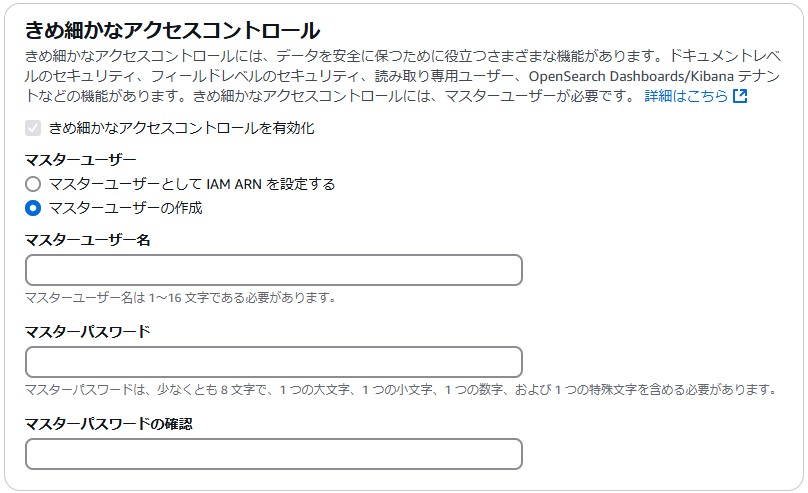
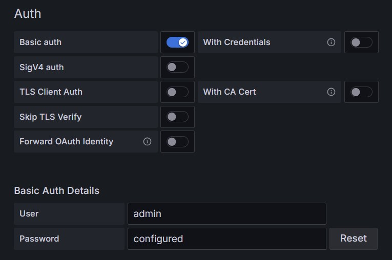

# DataSource登録
- https://grafana.com/grafana/plugins/grafana-opensearch-datasource/
## AWS Managed OpenSearch
- OpenSearchを内部データベースの「マスターユーザーの作成」で作成した場合、Grafana DataSourceで「SigV4 auth」ではなく、「**Basic auth**」を選択してユーザ名とパスワードを入力すること  
    
  