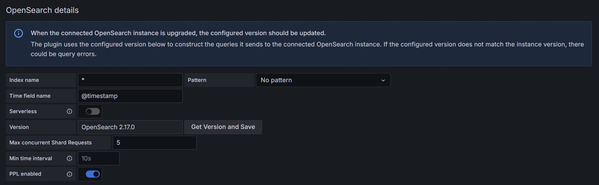
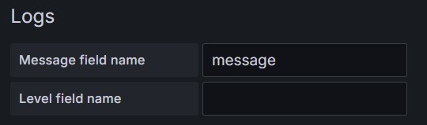
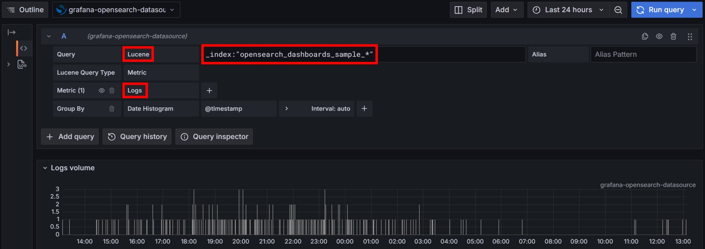

# DataSource登録
- https://grafana.com/grafana/plugins/grafana-opensearch-datasource/
## AWS Managed OpenSearch
- OpenSearchを内部データベースの「マスターユーザーの作成」で作成した場合、Grafana DataSourceで「SigV4 auth」ではなく、「**Basic auth**」を選択してユーザ名とパスワードを入力すること  
    
  
- 対象indexを指定する「OpenSearch details
」ブロックの「Index name」フィールドには`*`や`security-*`などワイルドカードが使える  
  

# GrafanaでOpenSearch上のログをログとして（メトリクスとかではなく）確認する方法
- DataSourceの設定で「Logs」ブロックの「Message field name」にログ本文が入っているフィールド名を入力。「Level field name」は必要に応じて入力(optional)  
    
  - ログ本文が入っているfield名はOpenSearch Dashboardなどで確認
- ExploreやDashboard設定でDataSourceとしてOpenSearchを選択後、Query Typeに「**Lucene**」を選択し、表示形式として**Logs**または**Raw Data**を選択後、クエリーに`*`や`__index:"<index名>"`など入力して実行  
  

# Lucene
Luceneクエリー文法（Query Syntax）は、検索エンジンとしてのElasticsearchやOpenSearchなどでよく使われるクエリー言語の1つです。Luceneクエリーを知っておくことで、ログやドキュメントの検索を的確に行うことができます。ここでは、Luceneクエリーの基本構文から応用的な書き方まで、例を交えて説明します。

---

# 1. 基本構文

## 1.1 単純なキーワード検索

```
ERROR
```

- 単純に「ERROR」という文字列を含むドキュメントを検索します。  
- デフォルトでは「OR 検索」にならず、1単語の場合は単純に含まれるかどうかを判定します。

## 1.2 フィールド指定

```
field_name:ERROR
```

- フィールド名を指定して、そのフィールドに「ERROR」という値が含まれるドキュメントを探します。  
- 一般的にはログのメッセージを格納しているフィールドが `message` であることが多いので、`message:ERROR` などと書きます。

## 1.3 キーワードの区切り（複数ワード）

```
message:memory leak
```

- Luceneクエリーでは、複数の単語を記述すると**AND**条件（すべての単語を含むドキュメント）として解釈されます（ElasticsearchやOpenSearchではデフォルトの解析が変わる場合もあるので注意が必要です）。
- より厳密にしたい場合は、明示的に論理演算子を入れるとよいです（後述）。

---

# 2. ブール（論理）演算子

Luceneクエリーでは、論理演算子（`AND`, `OR`, `NOT`）を使って検索条件を組み合わせることができます。  
（Elasticsearch や OpenSearch はバージョンによって `+`/`-` といったシンタックスが非推奨になる場合もあるため、ここでは文字列ベースの演算子をメインに紹介します。）

## 2.1 AND

```
message:ERROR AND message:CRITICAL
```

- `message` フィールドに「ERROR」と「CRITICAL」の両方の単語が含まれるドキュメントを返します。

## 2.2 OR

```
message:ERROR OR message:CRITICAL
```

- `message` フィールドに「ERROR」または「CRITICAL」のいずれか、もしくは両方を含むドキュメントを返します。

## 2.3 NOT

```
message:ERROR NOT message:CRITICAL
```

- `message` フィールドに「ERROR」を含むが「CRITICAL」は含まないドキュメントを返します。  
- `NOT` 単独よりも、後述の `-` 演算子（例: `message:ERROR -message:CRITICAL`）の方がわかりやすい場合も多いです。

## 2.4 `+` / `-` 演算子

```
+message:ERROR -message:CRITICAL
```

- Luceneでは、`+` 演算子は「必須（must）」を、`-` 演算子は「除外（must not）」を意味します。  
- この例では、「message に ERROR を含むが、CRITICAL は含まない」ドキュメントを返します。  
- Elasticsearch や OpenSearch では場合によっては非推奨になったりサポート継続されたりするので注意が必要です。

---

# 3. フレーズ検索と近接検索

## 3.1 フレーズ検索

```
"memory leak"
```

- ダブルクォートで囲んだフレーズを検索すると、単語の順序と空白を含む完全一致のテキストを探します。  
- フィールド指定と組み合わせる場合は `message:"memory leak"` のようにします。

## 3.2 近接検索（Proximity Search）

```
"memory leak"~5
```

- フレーズ内の単語同士が指定した単語数(ここでは5単語以内)の範囲に現れるものを検索します。  
- 例: `message:"memory leak"~5` は、`memory` と `leak` が5単語以内に現れるドキュメントを探します。
- 順序は関係なく、ある程度離れていても「近い」と見なして検索します。

---

# 4. ワイルドカード

## 4.1 `*` (任意の文字列)

```
memory*
```

- `memory` で始まる任意の文字列にマッチします（`memoryLeak`、`memory_error` など）。  
- Lucene のワイルドカード検索では、`*` は 0文字以上の任意の文字列を表します。

## 4.2 `?` (任意の1文字)

```
te?t
```

- `te` の後に1文字が入り、最後に `t` が来る文字列にマッチ。  
- 例: `text`, `test` などにヒットする。

## 4.3 注意点

- 先頭にワイルドカード（`*`、`?`）を付けることはパフォーマンスを大きく低下させる可能性があるため、推奨されない場合が多いです。どうしても必要な場合は `*memory` のように書くこともできますが、大規模環境では注意してください。

---

# 5. 範囲検索

Lucene では数値や日付、文字列の範囲検索を下記のように書くことができます。

## 5.1 数値（数値型フィールド）

```
response_time:[100 TO 200]
```

- `response_time` が 100 以上 200 以下のドキュメントを返します（境界を含む）。

```
response_time:{100 TO 200}
```

- `response_time` が 100 より大きく、200 未満のドキュメントを返します（境界を含まない）。

## 5.2 日付（タイムスタンプなど）

```
@timestamp:[2022-01-01 TO 2022-01-31]
```

- `@timestamp` が 2022/01/01 00:00:00 から 2022/01/31 23:59:59（厳密には日付パーサーによる）までのドキュメントを返します。

## 5.3 文字列範囲

```
hostname:[alpha TO omega]
```

- `hostname` が「alpha」から「omega」までの範囲に含まれる文字列を検索します。  
- 文字コード順に従うので、辞書順に近い動作をします。

---

# 6. グルーピング

複雑な条件を組み合わせるときは `( )` を使ってグループ化します。

```
(message:ERROR OR message:CRITICAL) AND host:prod*
```

- `message` が「ERROR または CRITICAL」のどちらかを含み、かつ `host` フィールドが `prod` で始まるものを返します。

---

# 7. エスケープ（特殊文字）

Luceneクエリーには、以下のような特殊文字があります。

```
+ - && || ! ( ) { } [ ] ^ " ~ * ? : \ /
```

これらを検索したい場合は `\` バックスラッシュでエスケープします。たとえば `(` を含む文字列を検索したい場合:

```
\(test
```

もしくは

```
\(test\)
```

- 例: `message:"\(test\)"` など、クエリ内で認識される特殊文字をそのまま文字列として検索したいときに使います。

---

# 8. ファジー検索 (Fuzzy Search)

単語の綴りが多少異なっていても検索したい場合はチルダ `~` を語尾につけます。

```
message:memory~2
```

- `memory` を元に、編集距離が2以内の文字列を検索します。たとえば `memori`, `memoery`, `momory` など多少スペルミスがあってもマッチしやすくなります。  
- デフォルトでは ~2 は使えず ~1 だけだったり、Elasticsearch のバージョンによって異なる場合があります。`memory~` だけの場合はデフォルトが編集距離 2 となるなど、実装依存の部分があるので注意してください。

---

# 9. ブースト (Boost)

特定の検索条件に対してスコアを高くしたい場合、ブースト演算子 `^` を使います。（Elasticsearch や OpenSearch のスコアリングに影響）

```
message:(memory^3 leak)
```

- `memory` に 3 倍の重み付けをしつつ `leak` も検索する、というイメージです。  
- `^` の右側の数値が大きいほど重みを強くします。

---

# 10. 正規表現検索 (Regex)

Luceneクエリーで正規表現検索を行うには、スラッシュ `/` で囲みます。

```
message:/mem.*leak/
```

- `message` フィールドに `mem` の後に任意の文字列、そして `leak` という文字列が続くパターンにマッチします。  
- 正規表現検索はパフォーマンスコストが高いため、広範囲に対して正規表現を使う場合は注意してください。

---

# 11. 実践的なサンプルクエリ集

以下、さまざまな条件を組み合わせた実用的な例を紹介します。

1. **複数条件で絞り込む**

   ```
   (message:ERROR OR message:WARN) AND host:("web-1" "web-2")
   ```
   - `message` フィールドに `ERROR` または `WARN` を含み、  
   - `host` フィールドが `web-1` または `web-2` のものを検索。

2. **範囲指定とワイルドカード**

   ```
   response_time:[200 TO 500] AND url.path:/api\/v[0-9]+\/.*/ AND status:5??
   ```
   - `response_time` が 200～500 の範囲  
   - `url.path` が `/api/v[数字]/` で始まる正規表現パターン  
   - `status` フィールドが 5 で始まる3桁 (例: 500, 501, 503 など)
   - ※正規表現検索を複合的に使うのはパフォーマンスに注意。

3. **近接検索でログメッセージの周辺単語を探す**

   ```
   message:"disk error"~3
   ```
   - `message` フィールドに「disk」と「error」が3単語以内で現れるログメッセージを検索。  
   - `"disk full error"` など、多少単語が入ってもヒットする。

4. **ファジー検索とブール演算子**

   ```
   message:(memor~1 leak~1) AND NOT environment:dev
   ```
   - `message` フィールドに `memor` (fuzzy1) と `leak` (fuzzy1) 両方を含み  
   - `environment` フィールドが `dev` ではないドキュメントを検索。

5. **特定文字列含むフィールドのログだけ絞り込み**

   ```
   tags:"production" AND message:"unhandled exception" AND @timestamp:[2023-01-01 TO 2023-12-31]
   ```
   - `tags` フィールドに `production` が含まれ  
   - `message` フィールドに「unhandled exception」が含まれる  
   - タイムスタンプが2023年内  
   - のログだけを探す。

6. **ワイルドカードとグルーピング**

   ```
   (env:prod* OR env:stage*) AND (message:ERROR OR message:WARN)
   ```
   - `env` フィールドが `prod` または `stage` で始まり  
   - `message` フィールドが `ERROR` または `WARN` を含む  
   - ドキュメントを検索する。

---

# 12. Luceneクエリーでの注意点

1. **大文字小文字の区別**  
   - Luceneクエリーは、標準のアナライザーを使っている場合は大文字小文字を区別しないことが多いです。キーワード型などで大文字小文字を区別する場合は、マッピング(フィールド定義)やアナライザーの設定によります。

2. **先頭ワイルドカードのパフォーマンス**  
   - 先頭に `*` や `?` を使ったワイルドカード検索（例: `*error`）は、非常に負荷が高くなる場合があります。可能な限り避けてください。

3. **エスケープが必要な文字**  
   - `+ - && || ! ( ) { } [ ] ^ " ~ * ? : \ /` は、検索テキストとして使いたいときには `\` でエスケープが必要です。

4. **スペースや特殊文字**  
   - Luceneクエリーではスペースでトークンが区切られます。スペースを含むフレーズや特殊文字を検索したいときはダブルクォートで囲むなどの対策が必要です。

5. **複雑な正規表現**  
   - Luceneの正規表現検索は `/.*/` のように記述できますが、巨大なインデックスに対して実行すると性能面で大きな影響が出ることがあります。

---

## まとめ

1. **フィールド名 + 値** で検索の基本形。  
2. **ブール演算子 (AND, OR, NOT)** や `+/-` を組み合わせて複雑なクエリを構築。  
3. **フレーズ検索** や **近接検索** (`"..."~N`) で単語の位置関係を指定。  
4. **ワイルドカード** (`*`, `?`) や **正規表現** (`/.../`) を使って柔軟なマッチング。  
5. **範囲検索** (`[ ]`, `{ }`) で数値・日付・文字列の範囲を指定。  
6. **グルーピング** (`( )`) で優先順位やOR/ANDを明確にする。  
7. **エスケープ** や **パフォーマンス** に注意しながら使い分ける。

これらを組み合わせることで、ログ検索や文書検索などあらゆるユースケースに対応できます。複数ワードの検索条件では常に `( )` で分かりやすくグループ化し、必要に応じて論理演算子を明示的に書くと読みやすく管理しやすくなります。