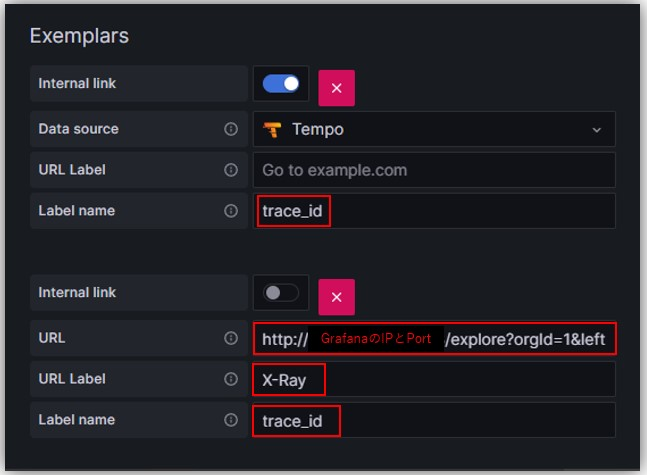
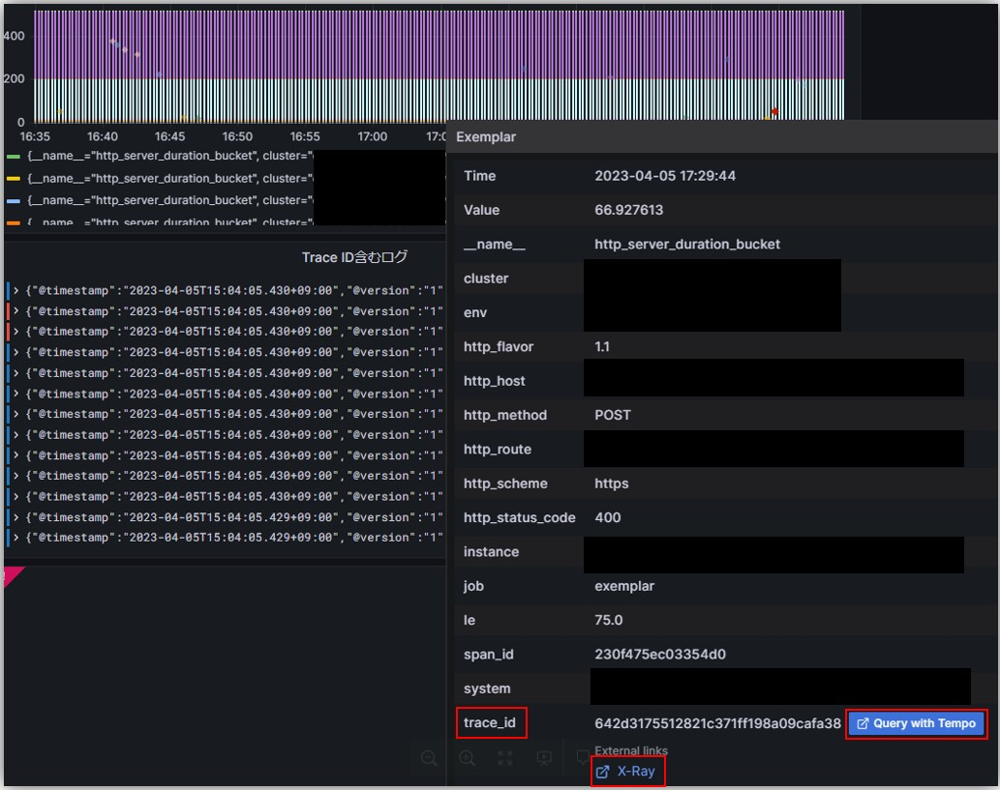
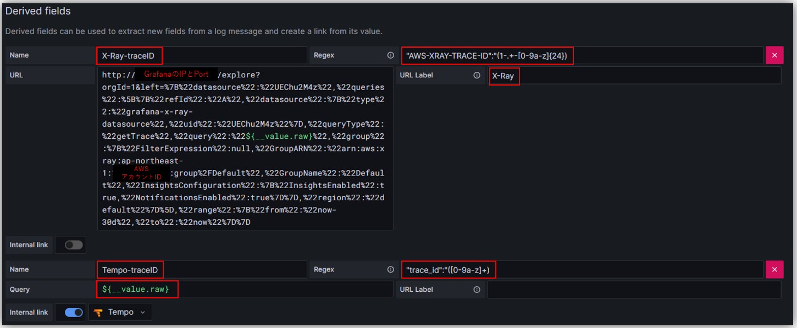
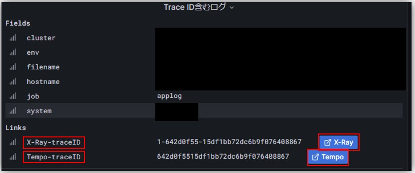

- PrometheusとLokiのDataSource設定でそれぞれ「Exemplars」と「Derived fields」のところでTraceIDをキーとしてトレーシングツールとの連携ができる

### Prometheus
- Prometheusデータソースの`Exemplars`セッションで設定
- Tempoなど、TraceIDなどをそのまま変換せずに検索できる場合は`Intenal link`で設定
  
  - `Label name`にExemplar内にTraceIDとして設定されているLabelを記載(上記の場合`trace_id`)
  - `URL`は以下のような形式で設定（ExploreでTraceIDをX-Rayのフォーマットに少し修正する必要がある）
    ~~~
    http://<GrafanaのIP:Port>/explore?orgId=1&left=%7B%22datasource%22:%22UEChu2M4z%22,%22queries%22:%5B%7B%22refId%22:%22A%22,%22datasource%22:%7B%22type%22:%22grafana-x-ray-datasource%22,%22uid%22:%22UEChu2M4z%22%7D,%22queryType%22:%22getTrace%22,%22query%22:%221-${\__value.raw}%22,%22group%22:%7B%22FilterExpression%22:null,%22GroupARN%22:%22arn:aws:xray:ap-northeast-1:<X-RayのあるAWSのアカウントID>:group%2FDefault%22,%22GroupName%22:%22Default%22,%22InsightsConfiguration%22:%7B%22InsightsEnabled%22:true,%22NotificationsEnabled%22:true%7D%7D,%22region%22:%22default%22%7D%5D,%22range%22:%7B%22from%22:%22now-30d%22,%22to%22:%22now%22%7D%7D
    ~~~
  - `URL Label`はリンク先の名前なので区別しやすい名前を記入

  
  - 設定の`URL Label`名がリンク先名として表示される

### Loki
- Lokiデータソースの`Derived fields`セッションで設定
- `Regex`の方でログ内のTraceIDを拾えるように設定
  - 以下例の場合、X-Rayは`AWS-XRAY-TRACE-ID:<TraceID>`のフォーマットで、  
    Tempoの場合は`trace_id:<TraceID>`のフォーマットでログにTraceIDが出力される
  
  

- `${__value.raw}`の書き方はGrafanaのvariablesの書き方
  - https://grafana.com/docs/grafana/latest/dashboards/variables/variable-syntax/