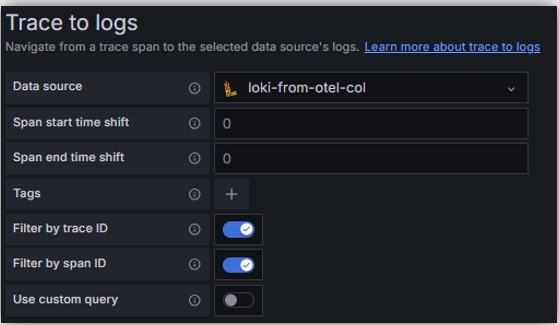
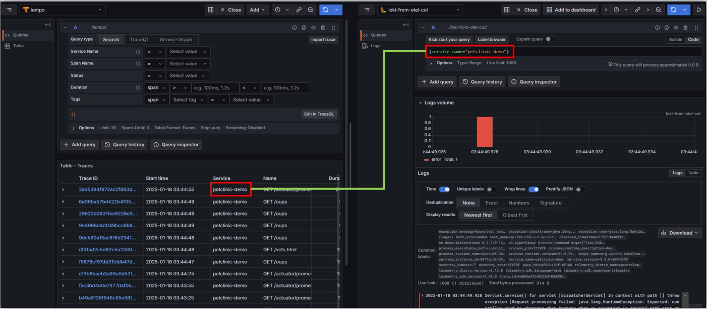
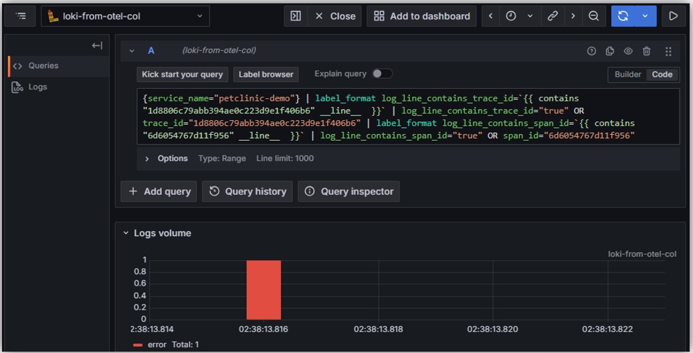
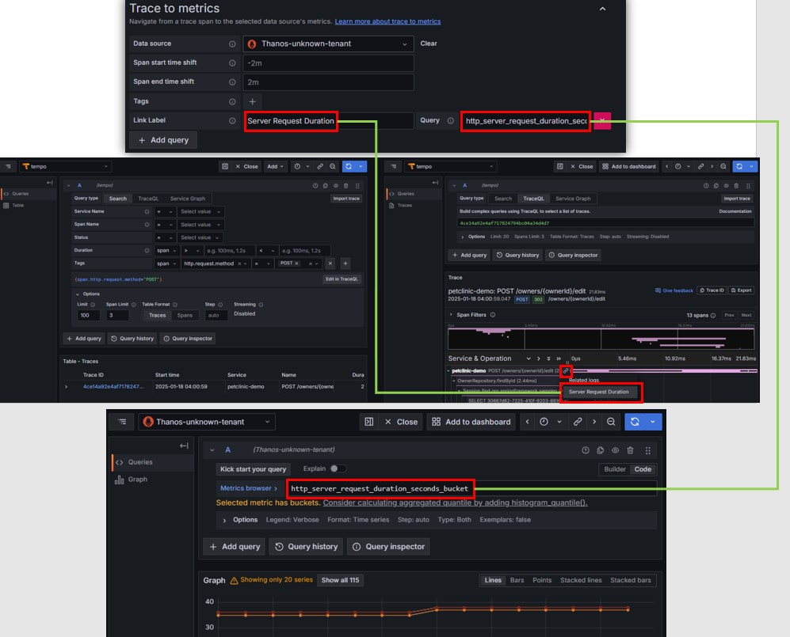
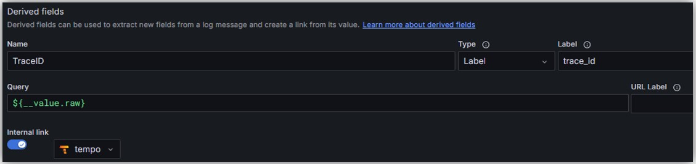
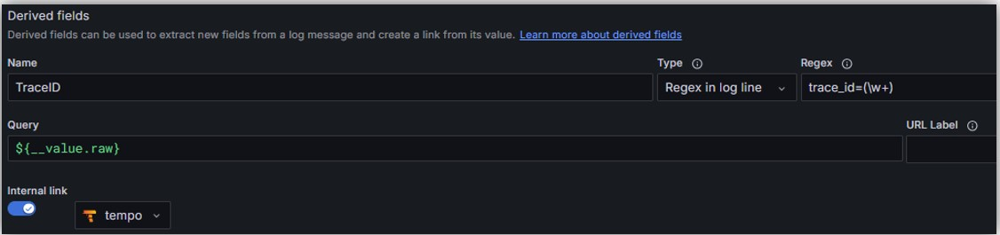

# Tempo
## Traces → Logs
- https://grafana.com/docs/grafana/next/datasources/tempo/configure-tempo-data-source/#trace-to-logs
- 設定例  
    
- TraceのService Name（`otel.service.name`等で設定する名前）がLogQLのラベルとして設定される  
  
- `Filter by trace ID`や`Filter by span ID`にチェックを入れると対象のTraceID、SpanIDに絞るようにLogQLが生成される  
  

## Traces → Metrics
- https://grafana.com/docs/grafana/next/datasources/tempo/configure-tempo-data-source/#trace-to-metrics
- `Link Label`に紐づけるメトリクスの概要が分かる名前を入れて、`Query`にPromQLを記述
- 設定例  
   

## Traces → Profiles
- https://grafana.com/docs/grafana/next/datasources/tempo/configure-tempo-data-source/#trace-to-profiles

# Loki
## Logs → Traces
- https://grafana.com/docs/grafana/next/datasources/loki/configure-loki-data-source/#derived-fields
- Typeが`Label`と`Regex in log line`の２つある
### `Label` Type
- ログのラベルにtrace id用のラベルがある場合
  - otlpでログを送信された場合など
- 設定例  
  
### `Regex in log line` Type
- ログの中身にtrace id項目が含まれている場合
- 設定例  
  