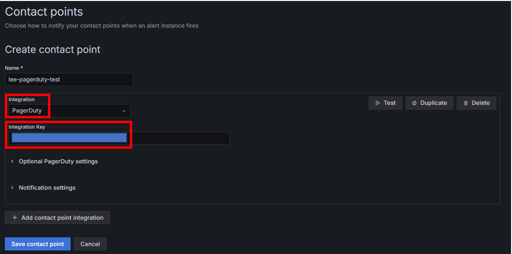

## GrafanaのアラートのPagerDutyへの連携
- 対象Serviceの「Integrations」タブで「＋ Add an Integration」を押下  
  
- Webhookを検索し、選択後、「Add」を押下  
  
- 作成されたWebhookから「Integration Key」を押さえておく  
  
- Grafanaの「Contact Points」でintegrationとしてPagerDutyを選択し、「Integration Key」に上で確認した値を入力して保存する  
  