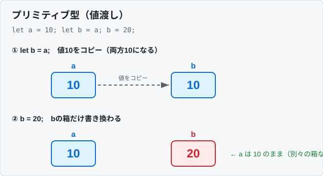
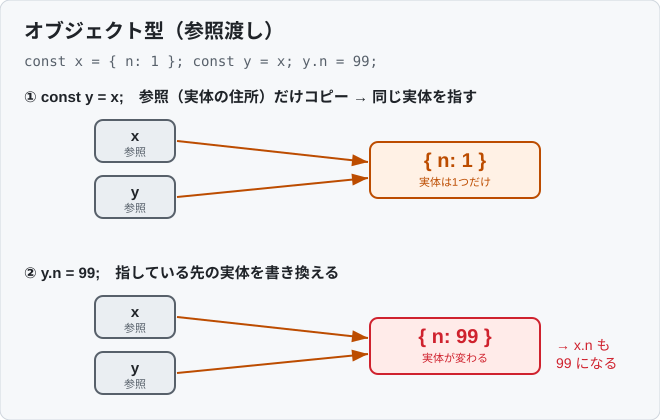

## 比較演算子
- 等しいか等しくないかを確認する時は基本`===`と`!==`を使うこと
  - `==`と`!=`は型の比較まではしてくれないため
- `==`と`===`、`!=`と`!==`の違い
  - `==`と`!=`
    - 値の比較だけして、型の比較はしない
  - `===`と`!==`
    - 値の比較だけではなく、型の比較もしてくれる

## `document.getElementById(<ID名>)`について
- `document.getElementById('id')`は、HTMLドキュメント内の指定した`id`属性を持つ要素を1つ取得するメソッド
- 取得した要素に対して、内容の変更・スタイルの変更などJavaScriptによる操作ができる
- `id`は文書内で一意である前提のため、常に単一の要素（見つからなければ`null`）を返す
- 例：以下の`<p>`要素があるとする
  ```html
  <p id="example">これはテストです。</p>
  ```
  この要素のテキストを変更する
  ```javascript
  // 'example'というIDを持つ要素を取得
  const element = document.getElementById('example');

  // 要素のテキスト内容を変更
  element.textContent = '内容が変更されました！';
  ```
  実行すると「これはテストです。」が「内容が変更されました！」に変わる
- 関連：CSSセレクタで柔軟に要素を取得したい場合は`document.querySelector('#example')`（最初の1つ）や`document.querySelectorAll('.item')`（複数）も使える

## `document.getElementsByName(<nameの値>)`について
- HTML内の特定の`name`属性を持つ要素を取得し、操作する
- **`<form>`タグでフォーム送信時にjavascriptの特定の関数を実行できる`onsubmit`イベント属性を使った例**
  - 検索ボタンを押した時に`validateSearchForm()`関数が実行され、何も入力されてなかったりスペースだけ入力されているとアラートを返す
  - **`onsubmit`で指定した関数が`false`を返すとフォームの送信処理は中止され、`true`を返すか何も返さない場合はフォーム送信処理が続行される**
    ```html
                          ・
                          ・
    <form action="/search" method="get" onsubmit="return validateSearchForm()">
      <input type="text" name="query" placeholder="Search post...">
      <button type="submit">検索</button>
    </form>
                          ・
                          ・
    <script>
    function validateSearchForm() {
      let query = document.getElementsByName("query")[0].value;
      if (query == null || query.trim() == "") {
        alert("検索語を入力してください");
        return false;
      }
      return true;
    }
    </script>
    ```


## `innerHTML`・`innerText`・`textContent`について
- 要素の内容を取得・設定するプロパティ。HTMLタグの扱いが異なる
- **`innerHTML`**：HTMLマークアップ（タグ）も含めた内容を取得・設定する
  - 例：内容が`<b>bold</b>`なら`innerHTML`は`"<b>bold</b>"`を返す
  - **⚠️ セキュリティ注意**：ユーザー入力など信頼できない文字列を`innerHTML`に代入するとXSS（クロスサイトスクリプティング）の脆弱性になる。テキストを入れるだけなら`textContent`を使う
- **`innerText`**：ブラウザ上で「見える」テキストだけを取得・設定する
  - CSSで非表示（`display:none`など）の部分は含まれない。表示状態を考慮するため、取得時にレイアウト計算が走り比較的重い
- **`textContent`**：要素内の全テキストを取得・設定する（タグは除くが、非表示要素のテキストも含む）
  - 表示状態を考慮しないので`innerText`より高速。単純にテキストを入れ替える用途ではこれが基本
- 例：次のHTML要素があるとする
  ```html
  <p id="example">これは<b>テスト</b>です。</p>
  ```
  ```javascript
  const element = document.getElementById('example');

  console.log(element.innerHTML);    // "これは<b>テスト</b>です。"（タグ込み）
  console.log(element.innerText);    // "これはテストです。"（見えるテキスト）
  console.log(element.textContent);  // "これはテストです。"（全テキスト）
  ```

## `window`と各メソッドについて
- `window`はブラウザウィンドウそのものを表すグローバルオブジェクト。ページ内のすべての要素（DOM要素・関数・変数など）は`window`の一部として存在する
- グローバルスコープで宣言したものは`window`のプロパティになるため、`window.`は省略できることが多い（`window.alert()` ≒ `alert()`）
- 主なメソッド・プロパティ

  1. **`window.onload`**：ページの全コンテンツ（画像・スクリプトなど）が読み込まれてから実行されるイベントハンドラ
     ```javascript
     window.onload = function() {
       alert("全てのコンテンツが読み込まれました！");
     };
     ```
     - ※現在はDOMの構築完了だけを待つ`DOMContentLoaded`（`document.addEventListener('DOMContentLoaded', ...)`）を使うことも多い。画像等の読み込みを待たない分、実行タイミングが早い

  2. **`window.location.href`**：現在のページのURLを取得・設定するプロパティ
     ```javascript
     console.log(window.location.href);  // 現在のページのURLを表示
     window.location.href = 'https://www.example.com';  // 指定URLへ遷移（リダイレクト）
     ```

  3. **`window.URL.createObjectURL`**：`Blob`/`File`オブジェクトを参照する一時URLを生成する。ダウンロードリンクや画像・動画のソースなどに使える
     ```javascript
     const blob = new Blob(["Hello, world!"], { type: 'text/plain' });
     const url = window.URL.createObjectURL(blob);
     console.log(url);  // "blob:https://example.com/xxxxxxxx-...."
     ```
     - ※不要になったら`URL.revokeObjectURL(url)`で解放しないとメモリリークになる

  4. **`window.addEventListener`**：指定イベント発生時に実行する関数（イベントハンドラ）を登録する
     ```javascript
     window.addEventListener('resize', function() {
       console.log('ウィンドウがリサイズされました！');
     });
     ```
     - `onload`のような`on〇〇`プロパティへの代入と違い、**同じイベントに複数のハンドラを登録できる**ため、こちらが推奨

- **⚠️ 廃止された`window.navigator.msSaveBlob`について**
  - かつてInternet Explorer / 旧Edge（EdgeHTML版）で`Blob`/`File`をローカル保存するために提供されていた非標準メソッド
  - **現在のChromium版Edgeを含む最新ブラウザでは削除されており使えない（`undefined`）**。使ってはいけない
  - 代替：`URL.createObjectURL()`で生成したURLを`<a download>`要素に設定してプログラムからクリックする方法が標準的
    ```javascript
    const blob = new Blob(["Hello"], { type: 'text/plain' });
    const a = document.createElement('a');
    a.href = URL.createObjectURL(blob);
    a.download = 'hello.txt';
    a.click();
    URL.revokeObjectURL(a.href);
    ```

## 配列と辞書について
### 配列
- 存在しないindexを参照してもエラーにはならず`undefined`が返ってくる

### 辞書
- 存在しないkeyを参照してもエラーにはならず`undefined`が返ってくる

## `confirm()`メソッド
- `confirm()`メソッドを使って"OK"と"キャンセル"ボタンを持つダイアログボックスを表示できて、それぞれのボタンを押した時の処理も実装可能
- 例  
  ```javascript
  let result = confirm("本当に続行しますか？");

  if (result) {
      // OKボタンが押された時の処理
      console.log("OKが押されました。処理を続行します。");
  } else {
      // キャンセルボタンが押された時の処理
      console.log("キャンセルされました。処理を中止します。");
  }
  ```

---

# JavaScript基礎文法まとめ

## 変数宣言（`var`・`let`・`const`）
- **`const`を基本とし、再代入が必要な場合のみ`let`を使う。`var`は原則使わない**
- 3つの違い

  | 宣言 | 再代入 | 再宣言 | スコープ | 巻き上げ(hoisting) |
  |------|--------|--------|----------|----------------------|
  | `var`   | 可 | 可 | 関数スコープ | される（`undefined`で初期化） |
  | `let`   | 可 | 不可 | ブロックスコープ | されるがTDZ（後述）で参照不可 |
  | `const` | 不可 | 不可 | ブロックスコープ | されるがTDZで参照不可 |

- **関数スコープ vs ブロックスコープ**
  - `var`は関数単位でしか変数を閉じ込められない（`if`や`for`の`{}`を無視する）
  - `let`/`const`は`{}`（ブロック）単位で変数が有効
  ```javascript
  if (true) {
    var a = 1;
    let b = 2;
  }
  console.log(a); // 1（ブロック外でも参照できてしまう）
  console.log(b); // ReferenceError（ブロック外では参照不可）
  ```
- **`const`は宣言と同時に必ず初期値を代入しないといけない**
  - 再代入できない変数なので、後から値を入れるチャンスが無い → 宣言時に値を確定させないと構文エラーになる
  ```javascript
  const a = 1;   // OK
  // const b;    // SyntaxError: Missing initializer in const declaration
  // b = 2;

  // let / var は初期値なしで宣言でき、後から代入できる
  let x;         // OK（この時点では undefined）
  x = 10;        // 後から代入OK
  ```
  - 「宣言時点では値が決まらないが、一度決めたら変えたくない」場合は、条件を式にして`const`に入れる
  ```javascript
  // letで書く
  let status1;
  if (score >= 60) {
    status1 = "合格";
  } else {
    status1 = "不合格";
  }

  // constで書く（三項演算子を使う）
  const status2 = score >= 60 ? "合格" : "不合格";
  ```
- **`const`は「再代入禁止」であって「不変(immutable)」ではない**
  - オブジェクトや配列の中身は変更できる
  ```javascript
  const arr = [1, 2];
  arr.push(3);      // OK（中身の変更は可能）
  // arr = [4, 5];  // Error（再代入は不可）
  ```
- **TDZ（Temporal Dead Zone / 一時的なデッドゾーン）**
  - `let`/`const`は宣言前に参照するとエラーになる（`var`は`undefined`になるだけ）
  ```javascript
  console.log(x); // ReferenceError（TDZ）
  let x = 10;
  ```

## データ型
- **プリミティブ型（7種類）**：`string` / `number` / `bigint` / `boolean` / `undefined` / `null` / `symbol`
  - プリミティブは**値そのものが渡される（値渡し）**
- **オブジェクト型**：`object`（配列・関数・`Object`など全て）
  - オブジェクトは**参照が渡される（参照渡し）**
- `typeof`で型を確認できる
  ```javascript
  typeof "hello"   // "string"
  typeof 123       // "number"
  typeof true      // "boolean"
  typeof undefined // "undefined"
  typeof null      // "object" ← JSの有名なバグ。nullだがobjectと返る
  typeof {}        // "object"
  typeof []        // "object" ← 配列もobject。Array.isArray()で判定する
  typeof function(){} // "function"
  ```
- **`undefined`と`null`の違い**
  - `undefined`：値が代入されていない（システムが自動的に設定する）
  - `null`：意図的に「空・なし」を表す（開発者が明示的に設定する）

### `null`の判定方法
- 用途によって使い分ける

  | やりたいこと | 書き方 |
  |--------------|--------|
  | `null`だけを判定 | `value === null` |
  | `null`と`undefined`両方を判定 | `value == null` |
  | 無ければデフォルト値 | `value ?? デフォルト` |
  | プロパティを安全にたどる | `obj?.prop` |

- **① `null`だけを厳密に判定 → `=== null`**
  - `typeof null`は`"object"`を返すため、`typeof`は判定に使えない
  ```javascript
  if (value === null) {
    // valueがちょうどnullの時だけtrue（undefinedは含まない）
  }
  typeof null === "object"  // true ← nullの判定には使えない
  ```
- **② `null`と`undefined`をまとめて判定 → `== null`**
  - 「値が無い（null または undefined）」をまとめて扱いたい時の慣用句
  - `==`は基本避けるべきだが、`== null`だけは`null == undefined`が`true`になる性質を利用した例外的によく使われる書き方
  ```javascript
  if (value == null) {
    // value === null || value === undefined と同じ意味
  }
  ```
- **③ 「値が無ければデフォルト値」→ `??`（Nullish coalescing）**
  ```javascript
  const name = user.name ?? "ゲスト"; // null/undefinedの時だけ "ゲスト"
  ```
- **④ プロパティを安全にたどる → `?.`（Optional chaining）**
  ```javascript
  user.profile?.name  // profileがnull/undefinedならエラーにせずundefinedを返す
  ```
- **⚠️ `if (value)` / `if (!value)`での判定に注意**
  - falsyな値（`0` / `""` / `false` / `NaN`）も一緒に引っかかる。`null`（と`undefined`）だけを見たいなら`== null`や`=== null`を使う
  ```javascript
  if (!value) { ... }  // null以外に 0, "", false, NaN も引っかかってしまう
  ```

### 値のコピー・上書き時の注意（値渡し vs 参照渡し）
> [!IMPORTANT]
> プリミティブ型とオブジェクト型では、変数に代入したり関数に渡したりしたときの挙動が違う。ここを理解していないと「知らないうちに元のデータが書き換わっていた」というバグになる
- **プリミティブ型は値そのものがコピーされる**ので、片方を変えても他方に影響しない
  ```javascript
  let a = 10;
  let b = a;   // 値10がコピーされる（別物）
  b = 20;
  console.log(a); // 10（影響なし）
  ```
  - 図：変数ごとに別々の箱を持つ。`let b = a`で値10がコピーされ、その後`b = 20`しても`a`は影響を受けない

    
- **オブジェクト型は参照（実体の置き場所）がコピーされる**ので、`a`と`b`は同じ実体を指す。片方を変更すると両方に反映される
  ```javascript
  const x = { n: 1 };
  const y = x;   // 同じオブジェクトを指す参照がコピーされる
  y.n = 99;
  console.log(x.n); // 99 ← xも変わってしまう！
  ```
  - 図：コピーされるのは「実体の置き場所（参照）」だけで、実体は1つしかない。`y.n = 99`で共有している実体が変わるので`x.n`も`99`になる

    
- **関数にオブジェクトを渡した場合も同じ**。関数の中で中身を変更すると、呼び出し元のオブジェクトも変わる
  ```javascript
  function update(obj) { obj.n = 0; }
  const x = { n: 1 };
  update(x);
  console.log(x.n); // 0 ← 元のxが書き換わる
  ```
- 元を変えたくない場合は**コピーを作ってから変更する**
  ```javascript
  const x = { n: 1 };
  const z = { ...x };  // 浅いコピー（別の実体になる）
  z.n = 99;
  console.log(x.n);    // 1（元は影響を受けない）
  ```
  - ただし`{ ...x }`は**浅いコピー**なので、ネストした中身は参照が共有されたまま。完全に切り離したい場合は`structuredClone(x)`（深いコピー）を使う（スプレッド構文セクション参照）
    - **「浅いコピー」＝一番外側（トップレベル）のプロパティだけをコピーする**という意味。中にオブジェクトが入れ子（ネスト）になっている場合、その中身までは複製されず、参照だけがコピーされるので元と共有されてしまう
      ```javascript
      const original = {
        name: "太郎",
        address: { city: "東京" }   // ← ネストしたオブジェクト
      };
      const copy = { ...original };  // 浅いコピー

      // ① トップレベル（name）は独立している
      copy.name = "次郎";
      console.log(original.name);        // "太郎"（元は影響なし）

      // ② ネストしたオブジェクト（address）は共有されたまま
      copy.address.city = "大阪";
      console.log(original.address.city); // "大阪" ← 元まで変わってしまう！
      ```
      - `name`はプリミティブなので値がコピーされ独立するが、`address`はオブジェクトなので**参照だけがコピー**され、`copy.address`と`original.address`は同じ実体を指す
    - **`structuredClone()`（深いコピー）なら、ネストした中身まで丸ごと複製する**ので完全に切り離せる
      ```javascript
      const copy = structuredClone(original);
      copy.address.city = "大阪";
      console.log(original.address.city); // "東京"（元は影響を受けない）
      ```

## 文字列（String）
- シングルクォート`'`、ダブルクォート`"`、テンプレートリテラル`` ` ``のいずれも使える
- **テンプレートリテラル（バッククォート）**
  - `${}`で変数や式を埋め込める。複数行もそのまま書ける
  ```javascript
  const name = "太郎";
  const age = 25;
  const msg = `${name}さんは${age}歳です。
  改行もそのまま書けます。`;
  ```
- よく使う文字列メソッド
  ```javascript
  "Hello".length            // 5
  "Hello".toUpperCase()     // "HELLO"
  "Hello".toLowerCase()     // "hello"
  "  hi  ".trim()           // "hi"（前後の空白削除）
  "a,b,c".split(",")        // ["a", "b", "c"]
  "Hello".includes("ell")   // true
  "Hello".startsWith("He")  // true
  "Hello".endsWith("lo")    // true
  "Hello".replace("l", "L") // "HeLlo"（最初の1つだけ）
  "Hello".replaceAll("l","L")// "HeLLo"（全て）
  "Hello".indexOf("l")      // 2（見つからなければ-1）
  "Hello".slice(1, 3)       // "el"
  "Hello".charAt(0)         // "H"
  "5".padStart(3, "0")      // "005"
  ```

## 数値（Number）とMathオブジェクト
```javascript
Number("123")       // 123（文字列→数値変換）
parseInt("123px")   // 123（整数として解釈）
parseFloat("1.5em") // 1.5
(3.14159).toFixed(2)// "3.14"（小数点以下2桁、文字列で返る）
Number.isNaN(NaN)   // true
Number.isInteger(5) // true

Math.floor(3.7)  // 3（切り捨て）
Math.ceil(3.2)   // 4（切り上げ）
Math.round(3.5)  // 4（四捨五入）
Math.max(1,2,3)  // 3
Math.min(1,2,3)  // 1
Math.abs(-5)     // 5
Math.random()    // 0以上1未満の乱数
Math.pow(2, 3)   // 8（2の3乗）。 2 ** 3 でも可
Math.sqrt(9)     // 3
```
- **`NaN`（Not a Number）**：数値変換に失敗した時などに返る特殊な値。`NaN === NaN`は`false`なので判定は`Number.isNaN()`を使う

## 演算子
- **算術演算子**：`+` `-` `*` `/` `%`（剰余） `**`（べき乗）
- **論理演算子**：`&&`（AND） `||`（OR） `!`（NOT）
- **Nullish coalescing（`??`）**
  - **左辺が`null`または`undefined`の時だけ右辺を返す**（`||`との違いに注意）
  ```javascript
  0 || "default"   // "default"（0はfalsyなので右辺）
  0 ?? "default"   // 0（0はnull/undefinedではないので左辺）
  null ?? "default"// "default"
  ```
- **Optional chaining（`?.`）**
  - プロパティが`null`/`undefined`の場合にエラーにせず`undefined`を返す
  ```javascript
  const user = { profile: { name: "太郎" } };
  user.profile?.name       // "太郎"
  user.account?.id         // undefined（エラーにならない）
  user.getName?.()         // メソッドが無ければundefined
  ```
- **三項演算子**：`条件 ? 真の時 : 偽の時`
  ```javascript
  const result = age >= 20 ? "成人" : "未成年";
  ```
- **falsyな値**（`if`などで`false`扱いになる値）：`false` / `0` / `""`（空文字） / `null` / `undefined` / `NaN`
  - これ以外は全て`truthy`（`"0"`、`[]`、`{}`もtruthy）

## 条件分岐（if / else if / else / switch）
```javascript
// if / else if / else
if (score >= 80) {
  console.log("A");
} else if (score >= 60) {
  console.log("B");
} else {
  console.log("C");
}

// switch（breakを忘れると次のcaseに流れる=フォールスルー）
switch (fruit) {
  case "apple":
    console.log("りんご");
    break;
  case "banana":
    console.log("バナナ");
    break;
  default:
    console.log("その他");
}
```
- **`default`** はどの`case`にもマッチしなかったときに実行される（`if`でいう`else`にあたる）
  - 省略可能。省略した場合、マッチする`case`が無ければ`switch`は何もせず終わる
  - 慣例的に最後に書くが、位置は任意。ただし最後以外に置く場合はフォールスルーを防ぐため`break`が必要

> [!CAUTION]
> `switch`は各`case`の最後に`break`を書かないと、**マッチした`case`以降の処理が次々に実行されてしまう**（これをフォールスルーと呼ぶ）。`break`の書き忘れは典型的なバグなので注意する。
> ```javascript
> switch (fruit) {
>   case "apple":
>     console.log("りんご");  // breakが無いと…
>   case "banana":
>     console.log("バナナ");  // ここまで実行されてしまう
>     break;
> }
> // fruit が "apple" のとき → "りんご" と "バナナ" の両方が出力される
> ```
> - なお、複数の`case`をまとめて同じ処理にしたい場合は、あえて`break`を書かずに並べる書き方もある（意図的なフォールスルー）
> ```javascript
> switch (day) {
>   case "土":
>   case "日":
>     console.log("週末");  // 土・日どちらでもここが実行される
>     break;
>   default:
>     console.log("平日");
> }
> ```

## 繰り返し（ループ）（for / while）
```javascript
// for
for (let i = 0; i < 5; i++) { console.log(i); }

// for...of（配列などの「値」を回す）
for (const item of ["a", "b", "c"]) { console.log(item); }

// for...in（オブジェクトの「キー」を回す。配列には非推奨）
for (const key in {x:1, y:2}) { console.log(key); } // "x", "y"

// while
let n = 0;
while (n < 3) { n++; }

// do...while（最低1回は実行される）
do { console.log("once"); } while (false);
```
- `break`：ループを抜ける
- `continue`：その回だけスキップして次へ

## 関数
- **関数宣言（function declaration）**：巻き上げされるので定義前に呼び出せる
  ```javascript
  function add(a, b) {
    return a + b;
  }
  ```
- **関数式（function expression）**：変数に代入。巻き上げされない
  ```javascript
  const add = function(a, b) {
    return a + b;
  };
  ```
- **アロー関数（arrow function）**：短く書ける。`this`を束縛しない（後述）
  ```javascript
  const add = (a, b) => a + b;      // 1行なら{}とreturn省略可
  const square = x => x * x;         // 引数1つなら()も省略可
  const greet = () => { console.log("hi"); }; // 引数なしは()必須
  const makeObj = () => ({ a: 1 });  // オブジェクトを返す時は()で囲む
  ```
- **デフォルト引数**
  ```javascript
  function greet(name = "ゲスト") { return `こんにちは、${name}`; }
  greet();       // "こんにちは、ゲスト"
  ```
- **残余引数（rest parameters）**：可変長の引数を配列で受け取る
  ```javascript
  function sum(...nums) { return nums.reduce((a, b) => a + b, 0); }
  sum(1, 2, 3, 4); // 10
  ```

## スコープ・クロージャ・巻き上げ
### スコープ（変数の有効範囲）とグローバル変数・ローカル変数
- **スコープ** とは、変数が参照できる（有効な）範囲のこと
- **グローバル変数** は関数やブロックの外で宣言した変数。プログラムのどこからでも参照できる
- **ローカル変数** は関数やブロックの中で宣言した変数。その中でしか参照できない
  ```javascript
  const g = "グローバル";   // グローバル変数（一番外側で宣言）

  function foo() {
    const local = "ローカル"; // ローカル変数（この関数の中だけで有効）
    console.log(g);      // "グローバル"（外側の変数は見える）
    console.log(local);  // "ローカル"
  }

  foo();
  console.log(local);    // ReferenceError（外からローカル変数は見えない）
  ```
- **スコープチェーン**：内側のスコープからは外側の変数が見えるが、外側から内側の変数は見えない（内→外の一方向）
  - 変数を参照すると、まず自分のスコープを探し、無ければ1つ外側、さらに外側…とたどっていく。最終的にグローバルまで無ければエラーになる
  ```javascript
  const a = 1;
  function outer() {
    const b = 2;
    function inner() {
      const c = 3;
      console.log(a, b, c); // 1 2 3（内側から外側a・bも参照できる）
    }
    inner();
    // console.log(c);      // ReferenceError（外側からは内側のcは見えない）
  }
  ```
> [!CAUTION]
> **グローバル変数は最小限にする**のが原則。どこからでも書き換えられるため、大規模になるほど「どこで変わったか分からない」バグの原因になる。変数はできるだけ使う場所に近い狭いスコープ（関数・ブロックの中）で宣言する

### クロージャ・巻き上げ
- **クロージャ（closure）**：関数が定義された時のスコープの変数を、関数の外に出た後も覚えている仕組み
  ```javascript
  function counter() {
    let count = 0;
    return function() {
      count++;
      return count;
    };
  }
  const c = counter();
  c(); // 1
  c(); // 2（countが保持され続けている）
  ```
- **巻き上げ（hoisting）とは**
  - JavaScriptは、コードを実行する前にそのスコープ内の**宣言だけを先に読み取る**という動きをする。その結果、**変数や関数が「宣言より前の行」でも認識されている**ように見える挙動を巻き上げ（hoisting）と呼ぶ
  - イメージ：「宣言部分がスコープの先頭に自動で持ち上げられる」と考えると分かりやすい（実際にコードが移動するわけではない）
  - **重要なのは「宣言」だけが巻き上げられ、「代入（値）」は元の行のまま**という点

  - **① `function`宣言：中身ごと巻き上げられる → 定義より前で呼べる**
    ```javascript
    greet();  // "こんにちは" ← 定義より前なのに呼べる

    function greet() {
      console.log("こんにちは");
    }
    ```

  - **② `var`：宣言だけ巻き上げられ、値は`undefined`になる**
    - 「宣言前でもエラーにはならないが、値はまだ入っていない」状態になり、バグの原因になりやすい
    ```javascript
    console.log(x);  // undefined ← エラーにはならないが値は未定義
    var x = 10;
    console.log(x);  // 10

    // JavaScriptが内部的にこう解釈しているイメージ ↓
    // var x;           ← 宣言だけ先頭に持ち上げられる
    // console.log(x);  → undefined
    // x = 10;          ← 代入は元の位置のまま
    ```

  - **③ `let`/`const`：巻き上げはされるが、宣言前に使うとエラー（TDZ）**
    - `var`と違い`undefined`にはならず、`ReferenceError`になる。この「宣言前は触れない区間」がTDZ（前述）
    ```javascript
    console.log(y);  // ReferenceError ← varと違いエラーになる
    let y = 20;
    ```
    - この挙動により`let`/`const`は「宣言前にうっかり使う」バグを防いでくれる。`var`を避けるべき理由の一つ

  - **関数式・アロー関数は巻き上げされない**（中身が巻き上げられるのは`function`宣言だけ）
    ```javascript
    add(1, 2);                    // Error（addはまだ undefined / TDZ）
    const add = (a, b) => a + b;
    ```

## `this`
- **`this`は「関数がどう呼ばれたか」で決まる**（定義場所ではない）
  - 通常の関数：呼び出し方によって変わる（メソッド呼び出しならそのオブジェクト、単独呼び出しなら`undefined`(strict)またはグローバル）
  - **アロー関数：自身の`this`を持たず、外側のスコープの`this`を引き継ぐ**
  ```javascript
  const obj = {
    name: "太郎",
    normalFn: function() { return this.name; }, // "太郎"
    arrowFn: () => this.name,                    // 外側のthis（objではない）
  };
  ```
- コールバック内で`this`を維持したい場合はアロー関数が便利

## オブジェクト（Object）
```javascript
const user = {
  name: "太郎",
  age: 25,
  greet() { return `${this.name}です`; }, // メソッドの短縮記法
};

user.name          // "太郎"（ドット記法）
user["age"]        // 25（ブラケット記法。動的なキーに使う）
user.email = "x@y" // プロパティ追加
delete user.age    // プロパティ削除

// よく使うObjectメソッド
Object.keys(user)    // ["name", "greet", "email"]（キーの配列）
Object.values(user)  // 値の配列
Object.entries(user) // [["name","太郎"], ...] キーと値のペア配列
Object.assign({}, user)      // 浅いコピー
{ ...user, age: 30 }         // スプレッドでコピー＋上書き
```
### `const`で宣言してもプロパティの追加・変更・削除はできる
- `const`で宣言したオブジェクトでも、プロパティの追加・変更・削除はできる。一方で`user = {}`のような**再代入はできない**
  ```javascript
  const user = { name: "太郎" };

  user.name = "次郎";   // OK（変更）
  user.age = 25;        // OK（追加）
  delete user.age;      // OK（削除）

  // user = {};         // Error: Assignment to constant variable.（再代入は不可）
  ```
- **理由：`const`が固定するのは「変数と値の結びつき」だけで、オブジェクトの中身ではないから**
  - オブジェクトを変数に入れると、変数はオブジェクト本体そのものではなく、本体の置き場所を指す **参照（アドレスのようなもの）** を持つ
  - `const`はこの「変数が指す参照」を固定する。だから別のオブジェクトを指し直す再代入（`user = {}`）は禁止される
  - 一方、プロパティの追加・変更・削除は、参照先のオブジェクトの中身をいじっているだけで、変数が指す参照そのものは変わらない。よって`const`でも許される
  ```javascript
  const user = { name: "太郎" };
  user.name = "次郎";   // 参照先(同じオブジェクト)の中身を変えただけ → OK
  user = {};            // 変数に別のオブジェクトを指し直す → const違反でError
  ```
- 中身も変更できないよう完全に固定したい場合は`Object.freeze()`を使う
  ```javascript
  const user = Object.freeze({ name: "太郎" });
  user.name = "次郎";   // 変更されない（strictモードではError）
  user.name             // "太郎"（元のまま）
  ```

- **プロパティの短縮記法**：変数名とキー名が同じなら省略できる
  ```javascript
  const name = "太郎";
  const obj = { name }; // { name: "太郎" } と同じ
  ```
- **プロパティ（キー）が存在するか確認する**
  ```javascript
  const user = { name: "太郎", age: 25 };

  "name" in user               // true（プロパティがあるか。継承したキーも含む）
  "email" in user              // false

  Object.hasOwn(user, "name")  // true（そのオブジェクト自身のキーだけを見る／最新の推奨）
  user.hasOwnProperty("name")  // true（同上だが古い書き方）

  Object.keys(user).includes("name") // true（キー一覧に含まれるか）
  ```
  - `undefined`との比較（`user.name !== undefined`）でも判定できるが、値が`undefined`のプロパティを見分けられないため非推奨
    ```javascript
    const obj = { a: undefined };
    obj.a !== undefined    // false（キーは存在するのに「無い」と誤判定）
    "a" in obj             // true（正しく存在を判定できる）
    ```

#### `in`と`Object.hasOwn`の違い
- どちらも「プロパティが存在するか」を調べるが、**どこまでを「存在する」とみなすか**が違う
- 前提として、JavaScriptのオブジェクトは自分で書いたキー以外に、大元の`Object`から`toString`などの機能を自動的に受け継いでいる（これを継承／プロトタイプと呼ぶ）
- `in`は、その受け継いだプロパティも「存在する」とみなして`true`を返す
- `Object.hasOwn`は、そのオブジェクト自身に直接書いたキーだけを見て、受け継いだものは`false`を返す
  ```javascript
  const user = { name: "太郎" };

  // 自分で書いたキー → どちらも同じ結果
  "name" in user                  // true
  Object.hasOwn(user, "name")     // true

  // 大元のObjectから受け継いだ toString → ここで結果が分かれる
  "toString" in user              // true  ← 継承したものも拾ってしまう
  Object.hasOwn(user, "toString") // false ← user自身には無いのでfalse
  ```
- 通常「そのオブジェクトが持っているキーか」を知りたいだけなので、**基本は`Object.hasOwn`を使うのが安全**

## 配列（Array）
### 要素数の取得（`length`）
- `length`プロパティで要素の数を取得できる。メソッドではないので`()`は付けない
  ```javascript
  const arr = ["a", "b", "c"];
  arr.length     // 3（要素の数）
  [].length      // 0（空配列）

  // arr.length() // TypeError（()を付けるとエラー）
  ```
- インデックスは0始まりなので、末尾の有効なインデックスは`length - 1`
  ```javascript
  arr[arr.length - 1] // "c"（末尾の要素）
  arr[arr.length]     // undefined（範囲外）
  ```
- `length`に代入すると配列の長さを変更でき、短くすると要素が削除される
  ```javascript
  const nums = [1, 2, 3, 4, 5];
  nums.length = 2;    // [1, 2]（3以降が切り捨てられる）
  nums.length = 0;    // []（配列を空にできる）
  ```

### 要素へのアクセス
- インデックス（添字）でアクセスする。**インデックスは0から始まる**
  ```javascript
  const arr = ["a", "b", "c"];

  arr[0]              // "a"（最初の要素）
  arr[2]              // "c"
  arr[99]             // undefined（存在しないindexはエラーにならずundefined）
  ```
- 末尾の要素を取る
  ```javascript
  arr[arr.length - 1] // "c"（従来の書き方）
  arr.at(-1)          // "c"（末尾から数える新しい書き方。at(-2)は後ろから2番目）
  ```
- 分割代入で先頭からまとめて取り出す
  ```javascript
  const [first, second] = arr; // first="a", second="b"
  ```
- 全要素をループで回す
  ```javascript
  for (const item of arr) { console.log(item); }          // 値を順に取り出す
  arr.forEach((item, index) => console.log(index, item)); // indexも一緒に取れる
  ```

### 主なメソッド
```javascript
const arr = [1, 2, 3, 4, 5];
arr.length          // 5
arr.push(6)         // 末尾に追加 → [1,2,3,4,5,6]
arr.pop()           // 末尾を削除して返す
arr.unshift(0)      // 先頭に追加
arr.shift()         // 先頭を削除して返す
arr.slice(1, 3)     // [2,3] 元配列は変更しない（非破壊）
arr.splice(1, 2)    // index1から2個削除（破壊的）
arr.indexOf(3)      // 2
arr.includes(3)     // true
arr.concat([6,7])   // 結合
arr.join("-")       // "1-2-3-4-5"（文字列化）
arr.reverse()       // 反転（破壊的）
[3,1,2].sort()      // [1,2,3]（デフォルトは文字列比較に注意）
[3,1,2].sort((a,b) => a - b) // 数値の昇順
```
- **高階関数（配列の反復メソッド）** ※`for`より頻用
  ```javascript
  // map：各要素を変換して新しい配列を返す
  [1,2,3].map(x => x * 2)          // [2,4,6]

  // filter：条件に合う要素だけの新しい配列
  [1,2,3,4].filter(x => x % 2===0) // [2,4]

  // reduce：畳み込み（合計など）。第2引数は初期値
  [1,2,3,4].reduce((acc, x) => acc + x, 0) // 10

  // forEach：各要素に処理（戻り値なし）
  [1,2,3].forEach(x => console.log(x));

  // find：条件に合う最初の「要素」を返す
  [1,2,3].find(x => x > 1)         // 2

  // findIndex：条件に合う最初のindex
  [1,2,3].findIndex(x => x > 1)    // 1

  // some：1つでも条件を満たせばtrue
  [1,2,3].some(x => x > 2)         // true

  // every：全て条件を満たせばtrue
  [1,2,3].every(x => x > 0)        // true
  ```
- `map`/`filter`/`slice`などは**非破壊**（新しい配列を返す）、`push`/`splice`/`sort`/`reverse`などは**破壊的**（元を変更）
- **要素が存在するか確認する**
  ```javascript
  const arr = [1, 2, 3];

  // 値そのものがあるか（true/false）
  arr.includes(2)            // true ← 存在確認はこれが基本
  arr.includes(9)            // false

  // 値の位置を調べる（無ければ -1）
  arr.indexOf(2)             // 1
  arr.indexOf(9)             // -1
  arr.indexOf(9) !== -1      // false（includesが使える前の古い書き方）

  // 条件に合う要素があるか
  arr.some(x => x > 2)       // true（1つでも条件を満たせばtrue）
  arr.find(x => x > 2)       // 3（条件に合う最初の「要素」。無ければundefined）
  arr.findIndex(x => x > 2)  // 2（条件に合う最初のindex。無ければ-1）

  // 特定の「index」が有効な範囲か
  arr[5] === undefined       // true（存在しないindexはundefined）
  ```
  - **`indexOf`は`NaN`を見つけられない**（`NaN === NaN`が`false`のため）。`NaN`の有無を調べたい時は`includes`を使う
    ```javascript
    [NaN].indexOf(NaN)   // -1（見つからない）
    [NaN].includes(NaN)  // true（見つかる）
    ```

## 分割代入（destructuring）
```javascript
// 配列の分割代入
const [a, b, c] = [1, 2, 3]; // a=1, b=2, c=3
const [first, ...rest] = [1, 2, 3, 4]; // first=1, rest=[2,3,4]

// オブジェクトの分割代入
const { name, age } = { name: "太郎", age: 25 };
const { name: n } = user; // 別名を付ける（n=user.name）
const { city = "東京" } = user; // デフォルト値

// 関数の引数で分割代入
function greet({ name, age }) { return `${name}(${age})`; }
```

## スプレッド構文（`...`）
```javascript
// 配列のコピー・結合
const arr2 = [...arr];          // 浅いコピー
const merged = [...a, ...b];    // 結合

// オブジェクトのコピー・マージ
const obj2 = { ...obj };
const merged2 = { ...obj1, ...obj2 }; // 後ろが優先で上書き

// 関数呼び出しで配列を展開
Math.max(...[1, 2, 3]);         // 3
```
- ※スプレッドは**浅いコピー（shallow copy）**。ネストしたオブジェクト/配列は参照が共有される。深いコピーは`structuredClone(obj)`を使う

## 例外処理（try / catch / finally）
```javascript
try {
  throw new Error("エラー発生");
} catch (error) {
  console.error(error.message); // "エラー発生"
} finally {
  console.log("必ず実行される");
}
```

## 非同期処理
### Promise
- 非同期処理の結果（成功/失敗）を表すオブジェクト
```javascript
const promise = new Promise((resolve, reject) => {
  if (成功) resolve(値);
  else reject(new Error("失敗"));
});

promise
  .then(value => console.log(value))  // 成功時
  .catch(err => console.error(err))   // 失敗時
  .finally(() => console.log("完了")); // 成否問わず
```
- `Promise.all([...])`：全て成功で解決（1つでも失敗なら即reject）
- `Promise.race([...])`：最初に決着したもの
- `Promise.allSettled([...])`：全ての結果（成否問わず）を待つ

### async / await
- Promiseを同期的な見た目で書ける（`await`はPromiseの解決を待つ）
- `await`は`async`関数の中でのみ使える
```javascript
async function fetchData() {
  try {
    const res = await fetch("https://api.example.com/data");
    const data = await res.json();
    return data;
  } catch (error) {
    console.error(error);
  }
}
```

## モジュール（import / export）
```javascript
// export（named export：複数可）
export const PI = 3.14;
export function add(a, b) { return a + b; }

// export（default export：1ファイル1つ）
export default function main() {}

// import
import main, { PI, add } from "./module.js";
import * as utils from "./module.js"; // 全部まとめて
```

## クラス（class）
```javascript
class Animal {
  constructor(name) {
    this.name = name;       // インスタンスプロパティ
  }
  speak() {                 // メソッド
    return `${this.name}が鳴く`;
  }
  static create(name) {     // 静的メソッド（インスタンス不要）
    return new Animal(name);
  }
}

// 継承
class Dog extends Animal {
  constructor(name) {
    super(name);            // 親のconstructorを呼ぶ
  }
  speak() {                 // オーバーライド
    return `${this.name}がワンと鳴く`;
  }
}

const dog = new Dog("ポチ");
dog.speak(); // "ポチがワンと鳴く"
```

## 等価比較の補足（`==` と `===`）
- 冒頭の「比較演算子」参照。**基本は`===`/`!==`（厳密等価）を使う**
- `==`は暗黙の型変換が行われ直感に反する結果になりやすい
  ```javascript
  0 == ""        // true（型変換される）
  0 == "0"       // true
  null == undefined // true
  1 == "1"       // true
  1 === "1"      // false（型が違う）
  NaN === NaN    // false（NaNは何とも等しくない）
  ```

## `===`でもオブジェクトは参照比較になる点に注意
```javascript
{} === {}            // false（別々のオブジェクト）
[1] === [1]          // false
const a = {}; const b = a;
a === b              // true（同じ参照）
```