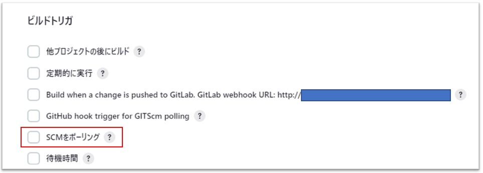
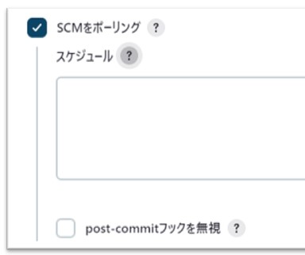
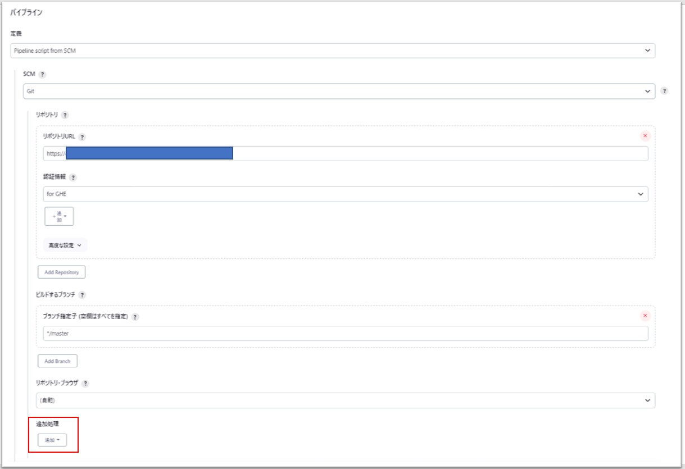
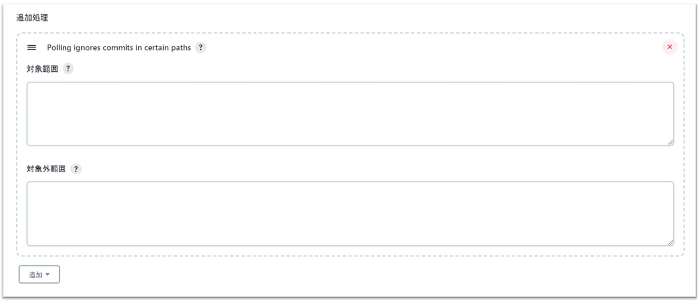

- ジョブの設定で`ビルドトリガ`の`SCMをポーリング`にチェックを入れて、スケジュールの方にpollingする日時(間隔)をCron形式に記述
  - `?`マークを押すとフォーマットや設定例などを確認できる  
    
  
- 対象リポジトリは`パイプライン`の方で指定  
  
- `追加処理`の`Polling ignores commits in certain paths`で特定のパスorファイル(以外)が更新された場合のみジョブが実行されるようにすることもできそう。  
  → **まだ未検証。試してみる！**  
  