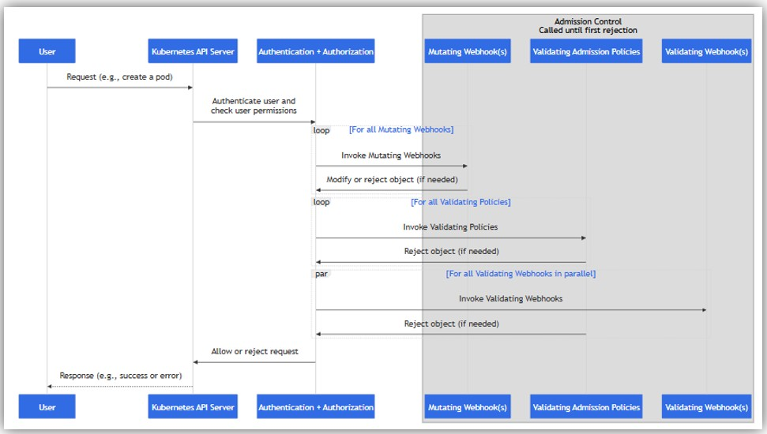
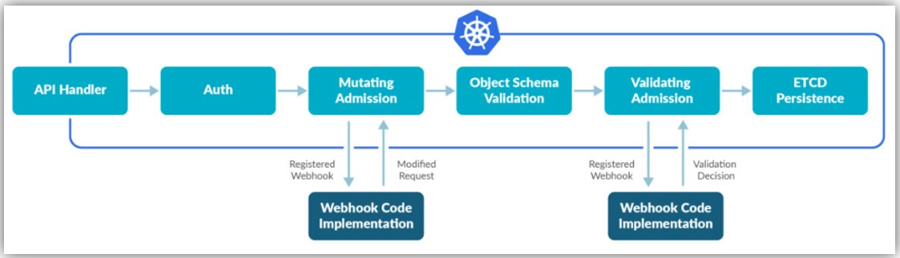

## Admission Controllerとは
- https://kubernetes.io/docs/reference/access-authn-authz/admission-controllers/  
  
- https://sysdig.jp/blog/kubernetes-admission-controllers/  
  
- API Serverへのリクエストをinterceptして、オブジェクト(e.g. Pod, Deployments)をetcdに登録する前に、そのリクエストを**検証** (検証で通らなかったらリクエストがrejectされる) および**変更** (リクエスト内容を変える) する仕組み
  - Authentication、Authorizationの次に行われる
- Admission Conrollerで次のようなことができる
  - Podをrootuserとして実行することを禁止(ブロック)する
  - 特定の`securityContext.capabilities`を禁止(ブロック)する
  - コンテナイメージにlatestタグの仕様を禁止(ブロック)する
- Admission controllers do not (and cannot) block requests to read (get, watch or list) objects.
- kube-apiserverの`--enable-admission-plugins`フラグに有効化するAdmission Controllerをコンマ区切りで指定する
  - e.g. `--enable-admission-plugins=NamespaceLifecycle,LimitRanger,ImagePolicyWebhook`
- **プラグイン型のAdmission Controllerは上記のようにkube-apiserver内に組み込まれていてkube-apiserver起動時に指定しないといけないため、拡張性や柔軟性に欠ける。そこでk8s v1.9で _Admission Webhook_ というkube-apiserver外部で動作し、WebhookでMutattingとValidatingを行えるものが追加され、kube-apiserverの再起動なしに、動的かつ柔軟にAdmission Controlの追加/修正が可能になった**

### Admission ControllerのType
- Admission Controllerには[`Validating Admission Webhook`](https://kubernetes.io/docs/reference/access-authn-authz/admission-controllers/#validatingadmissionwebhook)と[`Mutating Admission Webhook`](https://kubernetes.io/docs/reference/access-authn-authz/admission-controllers/#mutatingadmissionwebhook)２つのTypeがある
  - `Mutating`と`Validating`両方を持つものもある
    - `Mutating`と`Validating`両方を持つTypeは、先に`Mutating`をした後に`Validating`をする

##### `Mutating`
- リクエスト内容に過不足があった場合、リクエスト内容を変更したり、ある処理を実行する
- 例えば、`NamespaceAutoProvision` Admission Controllerの場合、リクエストに指定されているnamespaceが存在しない場合、そのnamespaceを作成する

##### `Validating`
- リクエスト内容を検証し、リクエストを拒否/許可する
- 例えば、`NamespaceExists` Admission Controllerの場合、リクエストに指定されているnamespaceが存在しない場合、リクエストを拒否する(エラーを返す)