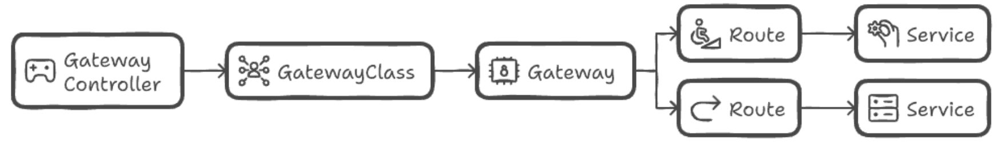

# Gateway APIについて
- 参考URL
  - https://gateway-api.sigs.k8s.io/
  - **https://www.cncf.io/blog/2025/05/02/understanding-kubernetes-gateway-api-a-modern-approach-to-traffic-management/**
  - https://dev.classmethod.jp/articles/aws-gateway-api-controller-eks-vpc-lattice/
  - https://www.gateway-api-controller.eks.aws.dev/latest/concepts/concepts/
  - https://aws.amazon.com/jp/blogs/containers/kubernetes-gateway-api-in-action/

- Ingressの後継として開発されたKubernetesのAPI仕様
- IngressはL7ロードバランサーに特化しているのに対し、Gateway APIはL4/L7両方をサポートし、より柔軟で拡張性の高いトラフィック管理が可能

## Gateway APIの主要コンポーネント

- **GatewayClass**: Gatewayのテンプレート。管理者が定義し、利用者は参照するだけ。どのGatewayがどのControllerに管理されるかを指定（例えば、AというnameのGatewayClassがIstio Controllerに対応するなど）
  - 例  
    ```yaml
    apiVersion: gateway.networking.k8s.io/v1beta1
    kind: GatewayClass
    metadata:
      name: amazon-vpc-lattice
    spec:
      controllerName: application-networking.k8s.aws/gateway-api-controller
    ```
- **Gateway**: 実際のロードバランサーで、ここでトラフィックのハンドリングが行われる。GatewayClassを参照し、リスナーやルーティング設定を持つ。
  > It defines how traffic enters the cluster and which listeners will handle the traffic (e.g., HTTP, HTTPS).
  - 例  
    ```yaml
    apiVersion: gateway.networking.k8s.io/v1beta1
    kind: Gateway
    metadata:
      name: my-hotel
    spec:
      gatewayClassName: amazon-vpc-lattice # 使うGatewayClassを指定
      listeners:
        - name: http
          protocol: HTTP
          port: 80
    ```
- **Route**: トラフィックのルーティングルールを定義。HTTPRoute、TCPRoute、UDPRouteなどの種類がある
  - 例 (HTTPRoute)  
    ```yaml
    apiVersion: gateway.networking.k8s.io/v1beta1
    kind: HTTPRoute
    metadata:
      name: inventory
    spec:
      parentRefs: # このRouteが紐づくGatewayを指定
      - name: my-hotel # 紐づけるGateway名を指定
        sectionName: http # Gatewayの対象のlistener名を指定（省略時は該当Gatewayのすべてのlistenerに紐づく）
      rules:
      - backendRefs: # トラフィックの送信先を指定
        - name: inventory-ver1
          kind: Service
          port: 8090
          weight: 50
        - name: inventory-ver2
          kind: Service
          port: 8090
          weight: 50
    ```

## Ingressとの比較

| Features | Gateway API | Ingress |
|----------|-------------|---------|
| Protocol Support | gRPC、HTTP/2、WebSocketなど多くのプロトコルをサポートし、複雑なトラフィック管理が可能 | 主にHTTPとHTTPSトラフィックをサポート |
| Routing Complexity | 重み付けトラフィック分割や、異なるサービス・プロトコル向けの高度なルールなど、複雑なルーティングが可能 | HTTP/HTTPSトラフィック向けの基本的なルーティングルールをサポート |
| Ease of Management | クラスター管理者が複数のGatewayクラスの作成・管理、新しいGatewayのデプロイ、本番デプロイ前の設定テストを容易に行える | シンプルだが、複数のGatewayや複雑な設定を管理する高度な機能がない |
| Extensibility | 新しいプロトコルやルーティングルールを定義でき、複雑なネットワークシナリオに適している | 拡張性が限定的で、主にHTTPベースのユースケースに焦点を当てている |
| Use Case | 複雑なネットワークシナリオや多様な要件を持つ複数のサービスの管理に最適 | 基本的なHTTP/HTTPSルーティングが必要なシンプルなアプリケーションに最適 |

## AWS（EKS）でのGateway API
- AWSからAWS Gateway API ControllerがOSSとして提供されていて、これを使う場合は、VPC Latticeが使用される
- AWS Gateway API Controller以外にも、IstioやEnvoy Gateway、TraefikなどのGateway API Controllerが存在する
