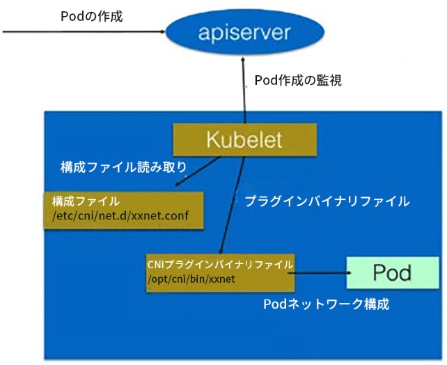
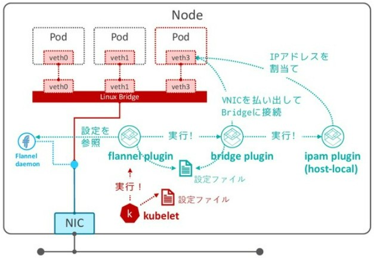
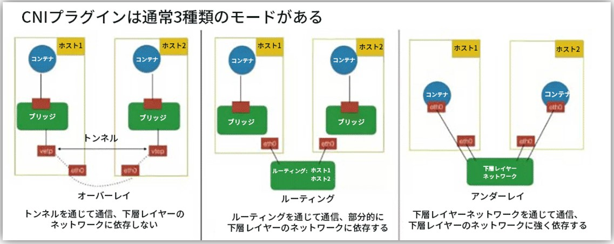
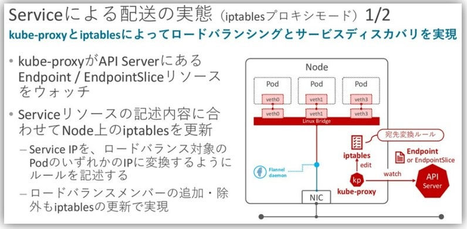
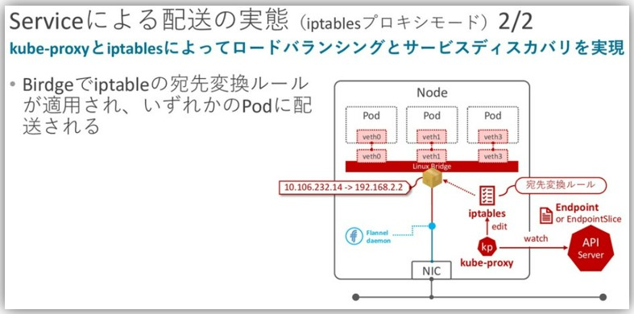

- 参考URL
  - https://opensource.com/article/22/6/kubernetes-networking-fundamentals
  - https://speakerdeck.com/hhiroshell/kubernetes-network-fundamentals-69d5c596-4b7d-43c0-aac8-8b0e5a633fc2
  - https://zenn.dev/taisho6339/books/fc6facfb640d242dc7ec
  - https://github.com/containernetworking/cni/blob/main/SPEC.md
  - https://blog.devops.dev/networking-in-kubernetes-55dcf794b9cd

# 概要
- すべてのPodはそれぞれ異なるIPアドレスが割り当てられる
- 同じPod内のコンテナ間は(IPアドレスを共有し)`localhost`で通信できる
- すべてのPodはクラスタ内のすべてのPodとNATなしで通信できる
- Node上のすべてのAgent(e.g. kubelet)は同じNode上のすべてのPodと通信できる

# CNI (Container Network Interface)
- Podが通信できる状態にするためのInterface
- Add-onでPodとして作成される
  - EKSでは`aws-node`という名前でDaemonSetのPodとして作成される
  - https://aws.github.io/aws-eks-best-practices/networking/vpc-cni/
- CNI PluginがPod作成時に(Kubeletにより)実行され、以下の処理を実施する
  - PodのネットワークにNICの割当
  - PodのNICへIPアドレスの割り当て
  - ホスト側のネットワーク設定(bridgeとの接続やRouting Tableの設定など)
    > CNI Pluginの中でもIPレイヤに纏る仕事(IPの割当、Routing Tableの設定など)はIP Address Management Plugin(通称IPAM)という形で切り出されていて、CNI Pluginの中でさらにIPAM Pluginを呼び出すような構造になっています。

    https://zenn.dev/taisho6339/books/fc6facfb640d242dc7ec/viewer/9187c6

  
  https://www.netstars.co.jp/kubestarblog/k8s-3/#:~:text=CNI%E3%81%AF%E3%80%81%E3%82%B3%E3%83%B3%E3%83%86%E3%83%8A%E3%81%8C%E4%BD%9C%E6%88%90,%E3%82%A4%E3%83%B3%E3%82%BF%E3%83%BC%E3%83%95%E3%82%A7%E3%83%BC%E3%82%B9%E3%82%92%E6%84%8F%E5%91%B3%E3%81%97%E3%81%BE%E3%81%99%E3%80%82

  
  https://speakerdeck.com/hhiroshell/kubernetes-network-fundamentals-69d5c596-4b7d-43c0-aac8-8b0e5a633fc2?slide=34
- Podごとにveth(VNIC)を割り当てられるのはLinuxのNetwork namespaceのおかげ
- 代表的なCNI PluginにはAWSのVPC CNIやCilium、Flannelなどがある

# vethについて
- veth(Virtual Ethernet Device)はVNICのこと
- vethは必ずペアで作成され、2つのnetwork namespace同士にそれぞれを片方ずつvethを配置することで、２つのnetwork間で通信することができるようになる。
- ２つのNICをそれぞれ２つの異なる端末に取り付けて、LANケーブルでそれぞれの端子を接続して直接通信しているような感じ

# 同一Node上のPod間の通信
- Bridge方式とNode上ルートテーブルを使ったL3ルーティング方式がある
  - Bridge方式はDockerのBridgeと同様

# 異なるNode上のPod間の通信
- 3つのTypeが存在する
  
  https://www.netstars.co.jp/kubestarblog/k8s-3/#:~:text=CNI%E3%81%AF%E3%80%81%E3%82%B3%E3%83%B3%E3%83%86%E3%83%8A%E3%81%8C%E4%BD%9C%E6%88%90,%E3%82%A4%E3%83%B3%E3%82%BF%E3%83%BC%E3%83%95%E3%82%A7%E3%83%BC%E3%82%B9%E3%82%92%E6%84%8F%E5%91%B3%E3%81%97%E3%81%BE%E3%81%99%E3%80%82
1. Overlay Network
   - NodeとPodが別々のNetwork segmentに所属し(異なるIPレンジを持ち)、異なるNode上のPod間の通信ではVXLANでカプセル化を行う
2. Underlay Network
   - NodeとPodがNetwork namespaceを共有し、同じNetwork segmentに所属
   - AWSのVPC CNIがUnderlay Network
     - https://aws.github.io/aws-eks-best-practices/networking/index/
       > Amazon EKS officially supports Amazon Virtual Private Cloud (VPC) CNI plugin to implement Kubernetes Pod networking. **The VPC CNI provides native integration with AWS VPC and works in underlay mode. In underlay mode, Pods and hosts are located at the same network layer and share the network namespace. The IP address of the Pod is consistent from the cluster and VPC perspective.** 
3. Nodeのルートテーブルを使ってルーティングする方式
   - Podの通信をルーティングテーブルを使って制御する方式
   - 各ノードがBGPを使ってPodのルーティング情報を交換
   - **具体的な流れ**
     1. 各ワーカーノードには、そのノード上で動作するPodのIPアドレスとルーティング情報が登録されたルーティングテーブルがある。
     2. ワーカーノード間でBGPを使ってルーティング情報を交換する。これにより、各ノードは他のノード上のPodのIPアドレスとそれらのPodへの到達方法を学習する。
     3. あるPodから他のPodへ通信を行う際、送信元ノードのルーティングテーブルを参照して、宛先PodのIPアドレスに基づいて適切なワーカーノードへパケットを転送する。
     4. パケットが宛先のワーカーノードに到達すると、そのノードのルーティングテーブルを参照して、該当するPodへパケットを配送する。
   - **ワーカーノード内でのルーティング処理の流れ**
     1. 各Podには、ホストのネットワーク名前空間とは別に、独自のネットワーク名前空間が割り当てられている。
     2. ワーカーノード上では、各Podに対して仮想的なネットワークインターフェース（veth）が作成され、Podのネットワーク名前空間とホストのネットワーク名前空間を接続する。
     3. ワーカーノード内のルーティングテーブルには、各Podの IPアドレスとそれに対応する veth インターフェースへのルーティング情報が登録されている。
     4. これにより、ワーカーノードに到達したパケットは、ルーティングテーブルに基づいて適切な veth インターフェースへ転送され、最終的に目的のPodに到達する。
   - https://zenn.dev/taisho6339/books/fc6facfb640d242dc7ec/viewer/0d112c#calico%E6%96%B9%E5%BC%8F

# Podと外部との通信、Pod間通信
- 2つのProxy modeがある
  - iptablesプロキシモード
  - IPVSプロキシモード
## ■ kube-proxy
- `Service`リソースを監視し、`NodePort`など外部通信のためのTypeが作成されたら(iptablesプロキシモードの場合)、iptablesのIPマスカレードのルールを作成する。
- `ClusterIP`の場合もkube-proxyによるiptablesのルールは作成される
    
  - `Service`リソースが作成されると自動的に`Endpoints`リソースが作成され、kube-proxyが`Endpoints`に合わせてiptablesのルールを作成してくれる

  
  https://speakerdeck.com/hhiroshell/kubernetes-network-fundamentals-69d5c596-4b7d-43c0-aac8-8b0e5a633fc2?slide=39
  https://speakerdeck.com/hhiroshell/kubernetes-network-fundamentals-69d5c596-4b7d-43c0-aac8-8b0e5a633fc2?slide=40

### `ClusterIP`タイプの`Service`
`ClusterIP`タイプの`Service`が作成されると、kube-proxyは以下のようなiptablesルールを作成する

- **KUBE-SERVICES** チェーンにルール追加：  
  `Service`の`ClusterIP`宛てのトラフィックを **KUBE-SVC-XXX** チェーン（`Service`固有のチェーン）にリダイレクト

- **KUBE-SVC-XXX** チェーン（ロードバランシング用）：  
  複数のPodがある場合、確率的に各Podに振り分けるためのルール  
  例えば3つのPodがある場合、各Podに33%の確率でトラフィックを送るルール  
  各Podのルールは **KUBE-SEP-XXX** チェーンにリダイレクト  

  **このルールは特殊な確率ベースのルールを含んでいる**  
  以下は３つのPodがある場合の実際の例で、これらのルールはトラフィックを統計的に分散させる
  - 最初のルールは33.33%の確率で最初のPod（KUBE-SEP-MX23SORTH2LOBGTI）にトラフィックを送る  
  - 残りの66.67%のトラフィックのうち、50%（全体の33.33%）が2番目のPod（KUBE-SEP-EN5RZLZH5CFD7WTB）に送られる  
  - 残りのトラフィック（全体の33.33%）が3番目のPod（KUBE-SEP-I6WUMIMMYPOHWED7）に送られる  
    ```bash
    root@workernode01:~# iptables -t nat -L KUBE-SVC-DNGND57GJIDW2NIJ -n
    Chain KUBE-SVC-DNGND57GJIDW2NIJ (1 references)
    target     prot opt source               destination
    KUBE-SEP-MX23SORTH2LOBGTI  0    --  0.0.0.0/0            0.0.0.0/0            /* monitoring/loki-distributor:http-metrics -> 172.16.246.240:3100 */ statistic mode random probability 0.33333333349
    KUBE-SEP-EN5RZLZH5CFD7WTB  0    --  0.0.0.0/0            0.0.0.0/0            /* monitoring/loki-distributor:http-metrics -> 172.16.52.171:3100 */ statistic mode random probability 0.50000000000
    KUBE-SEP-I6WUMIMMYPOHWED7  0    --  0.0.0.0/0            0.0.0.0/0            /* monitoring/loki-distributor:http-metrics -> 172.16.52.177:3100 */
    ```
    - つまり、最初に KUBE-SERVICES もしくは KUBE-NODEPORTS チェーンにトラフィックが来たら、次に KUBE-SERVICESもしくは KUBE-NODEPORTS チェーンに紐づいている KUBE-SVC-XXX チェーンにトラフィックがリダイレクトされ、１つの KUBE-SVC-XXX チェーンに紐づいている複数の KUBE-SEP-XXX チェーンの中からランダムで（一定の確率で）１つの KUBE-SEP-XXX チェーンにトラフィックがリダイレクトされ、最終的にその KUBE-SEP-XXX チェーンに登録されているPodのIPに転送される、という流れ

- **KUBE-SEP-XXX** チェーン（各`Endpoint`用）：  
  特定のPod IPに対するDNATルールを設定
  送信元アドレスを保持しつつ、宛先をServiceのIPからPodの実際のIPに変換

#### 確認方法
```bash
# KUBE-SERVICES チェーンを確認
sudo iptables -t nat -L KUBE-SERVICES -n

# 特定のServiceに関連するルールを確認（例：my-service）
MY_SERVICE_IP=$(kubectl get svc my-service -o jsonpath='{.spec.clusterIP}')
sudo iptables -t nat -L KUBE-SERVICES -n | grep $MY_SERVICE_IP

# Service固有のチェーン（KUBE-SVC-XXX）を確認
# 上記の出力から特定のKUBE-SVC-XXXチェーン名を見つけて確認
sudo iptables -t nat -L KUBE-SVC-XXXXXXXX -n  # XXXXXXXXは実際のハッシュ値に置き換え

# Endpointごとの処理チェーン（KUBE-SEP-XXX）を確認
sudo iptables -t nat -L KUBE-SEP-XXXXXXXX -n  # XXXXXXXXは実際のハッシュ値に置き換え
```

### `NodePort`タイプの`Service`
`NodePort`タイプの`Service`は、`ClusterIP`の機能すべてを含み、さらに以下のルールが追加される

- **KUBE-NODEPORTS** チェーンにルール追加：  
  指定された`NodePort`（例：30000-32767の範囲内のポート）宛てのトラフィックを **KUBE-EXT-XXX** チェーンにリダイレクト
  - **KUBE-EXT-XXX** チェーンから **KUBE-SVC-XXX** チェーンにリダイレクト（以降はClusterIPタイプと同様）
  - **KUBE-EXT-XXX** チェーンには **KUBE-MARK-MASQ** チェーンもある

- `ClusterIP`の場合と同様に、**KUBE-SVC-XXX** と **KUBE-SEP-XXX** チェーンを作成  
  ただし、ノード上の特定ポートに到着したトラフィックも処理対象になる

- **KUBE-MARK-MASQ** チェーンでのマーキング：  
  外部からのトラフィックに対してSNATを行うためのマーキング  
  これにより、Podからの応答が正しく外部クライアントに戻る

#### 確認方法
```bash
# NodePortsのルールを確認
sudo iptables -t nat -L KUBE-NODEPORTS -n

# 特定のNodePortに関連するルールを確認（例：my-nodeport-service）
NODE_PORT=$(kubectl get svc my-nodeport-service -o jsonpath='{.spec.ports[0].nodePort}')
sudo iptables -t nat -L KUBE-NODEPORTS -n | grep $NODE_PORT

sudo iptables -t nat -L KUBE-EXT-XXXXXXXX -n

# Service固有のチェーン（KUBE-SVC-XXX）を確認
# 上記の出力から特定のKUBE-SVC-XXXチェーン名を見つけて確認
sudo iptables -t nat -L KUBE-SVC-XXXXXXXX -n  # XXXXXXXXは実際のハッシュ値に置き換え

# Endpointごとの処理チェーン（KUBE-SEP-XXX）を確認
sudo iptables -t nat -L KUBE-SEP-XXXXXXXX -n  # XXXXXXXXは実際のハッシュ値に置き換え

# NodePortサービスのマスカレードルールを確認
sudo iptables -t nat -L KUBE-MARK-MASQ -n
```

## iptablesの基礎
- 参考URL
  - **https://christina04.hatenablog.com/entry/iptables-outline?utm_source=pocket_saves**
  - https://zenn.dev/kanehori/articles/4c1212c0ba477e
- パケットフィルタリングとNATを実現するためのコマンドラインツール
- `Chain` -> `Table` -> `Target`の順番に処理される
- iptablesコマンドで良く使うパラメータ
  - `-n`: Portなどを数字で表示
  - `-L`: テーブル内のすべてのチェーンとそのルールの一覧を表示
  - `-v`: 詳細な情報を表示

### Table
- ５つのテーブルがある（ほとんどのケースでは`filter`と`nat`のテーブル）
- `iptables`コマンドの`-t`パラメータで指定


|Table|用途|Chain|説明|
|---|---|---|---|
|`filter`|デフォルトのTableであり、フィルタリングに使用される|INPUT、FORWARD、OUTPUT|すべてのパケットが必ず通過し、主にパケットの許可または拒否を決定|
|`nat`|ネットワークアドレス変換を行うためのTable|PREROUTING、OUTPUT、POSTROUTING|パケットの送信元または宛先アドレスを変更するために使用される。**PREROUTING**では**DNAT**を、**POSTROUTING**で**SNAT**を実施|
|`mangle`|パケットの変更（マーキングや変更）を行うためのTable|PREROUTING、INPUT、FORWARD、OUTPUT、POSTROUTING|特殊なパケット処理（TOSフィールドの変更、マーキングなど）に使用される|
|`raw`|パケットをトラッキングする前に設定を行うためのTable|PREROUTING、OUTPUT|パケットトラッキングの無効化など、特定の処理を行うために使用される|
|`security`|SELinuxのポリシーに基づいてパケットを処理するためのTable|INPUT、OUTPUT、FORWARD|セキュリティコンテキストの設定や変更に使用される|

### Chain