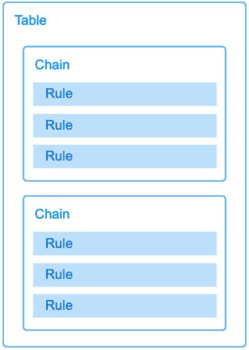
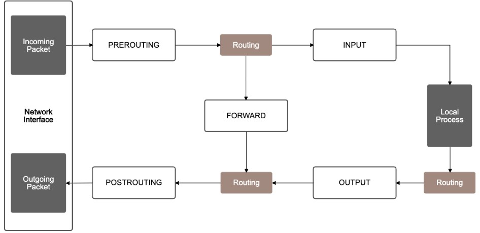

- 参考URL
  - https://opensource.com/article/22/6/kubernetes-networking-fundamentals
  - https://speakerdeck.com/hhiroshell/kubernetes-network-fundamentals-69d5c596-4b7d-43c0-aac8-8b0e5a633fc2
  - https://zenn.dev/taisho6339/books/fc6facfb640d242dc7ec
  - https://github.com/containernetworking/cni/blob/main/SPEC.md
  - https://blog.devops.dev/networking-in-kubernetes-55dcf794b9cd

# 概要
- すべてのPodはそれぞれ異なるIPアドレスが割り当てられる
- 同じPod内のコンテナ間は(IPアドレスを共有し)`localhost`で通信できる
- すべてのPodはクラスタ内のすべてのPodとNATなしで通信できる
- Node上のすべてのAgent(e.g. kubelet)は同じNode上のすべてのPodと通信できる

# CNI (Container Network Interface)
- Podが通信できる状態にするためのInterface
- Add-onでPodとして作成される
  - EKSでは`aws-node`という名前でDaemonSetのPodとして作成される
  - https://aws.github.io/aws-eks-best-practices/networking/vpc-cni/
- CNI PluginがPod作成時に(Kubeletにより)実行され、以下の処理を実施する
  - Podのネットワーク（netns）にNICの割当
  - PodのNICへIPアドレスの割り当てとルーティングの設定  
    > CNI Pluginの中でもIPレイヤに纏る仕事(IPの割当、Routing Tableの設定など)はIP Address Management Plugin(通称IPAM)という形で切り出されていて、CNI Pluginの中でさらにIPAM Pluginを呼び出すような構造になっている。
    - このIPAM Pluginを呼び出す責任もCNI Pluginが持つ
  - ホスト側のネットワーク設定(bridgeとの接続やRouting Tableの設定など)

    https://zenn.dev/taisho6339/books/fc6facfb640d242dc7ec/viewer/9187c6  
    **https://github.com/containernetworking/cni/blob/main/SPEC.md#overview-1** (🌟CNI仕様)

  
  https://www.netstars.co.jp/kubestarblog/k8s-3/#:~:text=CNI%E3%81%AF%E3%80%81%E3%82%B3%E3%83%B3%E3%83%86%E3%83%8A%E3%81%8C%E4%BD%9C%E6%88%90,%E3%82%A4%E3%83%B3%E3%82%BF%E3%83%BC%E3%83%95%E3%82%A7%E3%83%BC%E3%82%B9%E3%82%92%E6%84%8F%E5%91%B3%E3%81%97%E3%81%BE%E3%81%99%E3%80%82

  
  https://speakerdeck.com/hhiroshell/kubernetes-network-fundamentals-69d5c596-4b7d-43c0-aac8-8b0e5a633fc2?slide=34
- Podごとにveth(VNIC)を割り当てられるのはLinuxのNetwork namespaceのおかげ
- 代表的なCNI PluginにはAWSのVPC CNIやCilium、Flannelなどがある

# vethについて
- veth(Virtual Ethernet Device)は仮想NICの一種
- vethは必ずペアで作成され、2つのnetwork namespaceに
  それぞれ片方ずつ配置することで、2つのnamespace間で
  通信できるようになる
- 2つのNICをそれぞれ異なる端末に取り付けて、LANケーブルで
  直接接続して通信しているようなイメージ

## なぜvethが必要なのか
- Podは独自のnetwork namespaceを持つため、Pod内の
  コンテナとホストのネットワーク名前空間は分離されていて、
  そのままではPodとホストは直接通信できない
- vethペアの片方をPodのnamespaceに、もう片方をホストの
  namespaceに配置することで、両者を仮想的なLANケーブルで
  直結するように接続する

# 同一Node上のPod間の通信
- Bridge方式とNode上ルートテーブルを使ったL3ルーティング方式がある
  - Bridge方式はDockerのBridgeと同様

# 異なるNode上のPod間の通信
- 3つのTypeが存在する
  
  https://www.netstars.co.jp/kubestarblog/k8s-3/#:~:text=CNI%E3%81%AF%E3%80%81%E3%82%B3%E3%83%B3%E3%83%86%E3%83%8A%E3%81%8C%E4%BD%9C%E6%88%90,%E3%82%A4%E3%83%B3%E3%82%BF%E3%83%BC%E3%83%95%E3%82%A7%E3%83%BC%E3%82%B9%E3%82%92%E6%84%8F%E5%91%B3%E3%81%97%E3%81%BE%E3%81%99%E3%80%82
1. Overlay Network
   - NodeとPodが別々のNetwork segmentに所属し(異なるIPレンジを持ち)、異なるNode上のPod間の通信ではVXLANでカプセル化を行う
2. Underlay Network
   - NodeとPodがNetwork namespaceを共有し、同じNetwork segmentに所属
   - AWSのVPC CNIがUnderlay Network
     - https://aws.github.io/aws-eks-best-practices/networking/index/
       > Amazon EKS officially supports Amazon Virtual Private Cloud (VPC) CNI plugin to implement Kubernetes Pod networking. **The VPC CNI provides native integration with AWS VPC and works in underlay mode. In underlay mode, Pods and hosts are located at the same network layer and share the network namespace. The IP address of the Pod is consistent from the cluster and VPC perspective.** 
3. Nodeのルートテーブルを使ってルーティングする方式
   - Podの通信をルーティングテーブルを使って制御する方式
   - 各ノードがBGPを使ってPodのルーティング情報を交換
   - **具体的な流れ**
     1. 各ワーカーノードには、そのノード上で動作するPodのIPアドレスとルーティング情報が登録されたルーティングテーブルがある。
     2. ワーカーノード間でBGPを使ってルーティング情報を交換する。これにより、各ノードは他のノード上のPodのIPアドレスとそれらのPodへの到達方法を学習する。
     3. あるPodから他のPodへ通信を行う際、送信元ノードのルーティングテーブルを参照して、宛先PodのIPアドレスに基づいて適切なワーカーノードへパケットを転送する。
     4. パケットが宛先のワーカーノードに到達すると、そのノードのルーティングテーブルを参照して、該当するPodへパケットを配送する。
   - **ワーカーノード内でのルーティング処理の流れ**
     1. 各Podには、ホストのネットワーク名前空間とは別に、独自のネットワーク名前空間が割り当てられている。
     2. ワーカーノード上では、各Podに対して仮想的なネットワークインターフェース（veth）が作成され、Podのネットワーク名前空間とホストのネットワーク名前空間を接続する。
     3. ワーカーノード内のルーティングテーブルには、各Podの IPアドレスとそれに対応する veth インターフェースへのルーティング情報が登録されている。
     4. これにより、ワーカーノードに到達したパケットは、ルーティングテーブルに基づいて適切な veth インターフェースへ転送され、最終的に目的のPodに到達する。
   - https://zenn.dev/taisho6339/books/fc6facfb640d242dc7ec/viewer/0d112c#calico%E6%96%B9%E5%BC%8F

# Podと外部との通信、Pod間通信
- 2つのProxy modeがある
  - iptablesプロキシモード
    - nftablesというiptablesの後継技術もあるが、2026/01時点ではあまり普及されれてないっぽい
  - IPVSプロキシモード
## ■ kube-proxy
- https://kubernetes.io/docs/concepts/architecture/#kube-proxy
- `Endpoints`/`EndpointSlices`リソースと`Service`リソースを監視し、PodやServiceが作成/更新されたら(iptablesプロキシモードの場合)、iptablesのIPマスカレードのルールを作成する。
  - Podの作成/削除などを監視して`EndpointSlices`リソースを更新するのはkube-controller-manager (EndpointSlice Controller)
- `ClusterIP`の場合もkube-proxyによるiptablesのルールは作成される
    
  - `Service`リソースが作成されると、kube-controller-managerが自動的に`Endpoints`リソースを作成し、kube-proxyがそれに合わせてiptablesのルールを作成する

  
  https://speakerdeck.com/hhiroshell/kubernetes-network-fundamentals-69d5c596-4b7d-43c0-aac8-8b0e5a633fc2?slide=39
  https://speakerdeck.com/hhiroshell/kubernetes-network-fundamentals-69d5c596-4b7d-43c0-aac8-8b0e5a633fc2?slide=40

> [!NOTE]  
> ### EndpointSlice Controllerの動作
> - EndpointSlice Controller（kube-controller-managerのコンポーネント）は Service と Pod の両方 を監視している
> ```
> Service作成（selector: app=nginx）
>        │
>        ▼
> EndpointSlice Controller
>  ├─ Serviceのselectorを確認
>  ├─ selectorに一致するPodを検索
>  └─ EndpointSlicesリソースを作成（一致するPodのIPを登録）
>
> Pod作成/削除/Ready状態変化
>        │
>        ▼
> EndpointSlice Controller
>  ├─ そのPodがどのServiceのselectorに一致するか確認
>  └─ 該当するEndpointSlicesを更新
> ```

> [!NOTE]  
> `Service`リソースはkube-proxyとEndpointSlice Controllerの両方から監視されている
> - **EndpointSlice Controller**: Serviceの `selector` を見て、どのPodを対象にするか判断
>   - https://kubernetes-docsy-staging.netlify.app/docs/concepts/services-networking/endpoint-slices/  
>     > The EndpointSlice controller watches **Services** and **Pods** to ensure corresponding EndpointSlices are up to date.
> - **kube-proxy**: Serviceの `ClusterIP` や `Port` を見て、iptablesのDNAT変換元を設定
>   - https://kubernetes.io/docs/reference/networking/virtual-ips/
>     > Each instance of kube-proxy watches the Kubernetes control plane for the addition and removal of **Service** and **EndpointSlice** objects. 

### `ClusterIP`タイプの`Service`
`ClusterIP`タイプの`Service`が作成されると、kube-proxyは以下のようなiptablesルールを作成する

- **KUBE-SERVICES** チェーンにルール追加：  
  `Service`の`ClusterIP`宛てのトラフィックを **KUBE-SVC-XXX** チェーン（`Service`固有のチェーン）にリダイレクト

> [!NOTE]  
> KUBE-SERVICESチェーンのマッチ条件は、パケットの**宛先IP（= ClusterIP）** と **宛先ポート（`tcp dpt:XXX`）** の2つ。  
> 例えば以下の出力では、`destination`列のClusterIPと`tcp dpt:`のポート番号が一致するパケットが該当する`KUBE-SVC-XXX`チェーンに送られる。  
> ```
> Chain KUBE-SERVICES (2 references)
> target                     prot opt source       destination
> KUBE-SVC-DNGND57GJIDW2NIJ tcp  --  0.0.0.0/0    10.100.45.132    /* monitoring/loki-distributor:http-metrics cluster IP */ tcp dpt:3100
> KUBE-SVC-NPX46M4PTMTKRN6Y tcp  --  0.0.0.0/0    10.100.0.1       /* default/kubernetes:https cluster IP */ tcp dpt:443
> ```

- **KUBE-SVC-XXX** チェーン（ロードバランシング用）：  
  複数のPodがある場合、確率的に各Podに振り分けるためのルール  
  例えば3つのPodがある場合、各Podに33%の確率でトラフィックを送るルール  
  各Podのルールは **KUBE-SEP-XXX** チェーンにリダイレクト  

  **このルールは特殊な確率ベースのルールを含んでいる**  
  以下は３つのPodがある場合の実際の例で、これらのルールはトラフィックを統計的に分散させる
  - 最初のルールは33.33%の確率で最初のPod（KUBE-SEP-MX23SORTH2LOBGTI）にトラフィックを送る  
  - 残りの66.67%のトラフィックのうち、50%（全体の33.33%）が2番目のPod（KUBE-SEP-EN5RZLZH5CFD7WTB）に送られる  
  - 残りのトラフィック（全体の33.33%）が3番目のPod（KUBE-SEP-I6WUMIMMYPOHWED7）に送られる  
    ```bash
    root@workernode01:~# iptables -t nat -L KUBE-SVC-DNGND57GJIDW2NIJ -n
    Chain KUBE-SVC-DNGND57GJIDW2NIJ (1 references)
    target     prot opt source               destination
    KUBE-SEP-MX23SORTH2LOBGTI  0    --  0.0.0.0/0            0.0.0.0/0            /* monitoring/loki-distributor:http-metrics -> 172.16.246.240:3100 */ statistic mode random probability 0.33333333349
    KUBE-SEP-EN5RZLZH5CFD7WTB  0    --  0.0.0.0/0            0.0.0.0/0            /* monitoring/loki-distributor:http-metrics -> 172.16.52.171:3100 */ statistic mode random probability 0.50000000000
    KUBE-SEP-I6WUMIMMYPOHWED7  0    --  0.0.0.0/0            0.0.0.0/0            /* monitoring/loki-distributor:http-metrics -> 172.16.52.177:3100 */
    ```
    - つまり、最初に KUBE-SERVICES もしくは KUBE-NODEPORTS チェーンにトラフィックが来たら、次に KUBE-SERVICESもしくは KUBE-NODEPORTS チェーンに紐づいている KUBE-SVC-XXX チェーンにトラフィックがリダイレクトされ、１つの KUBE-SVC-XXX チェーンに紐づいている複数の KUBE-SEP-XXX チェーンの中からランダムで（一定の確率で）１つの KUBE-SEP-XXX チェーンにトラフィックがリダイレクトされ、最終的にその KUBE-SEP-XXX チェーンに登録されているPodのIPに転送される、という流れ

- **KUBE-SEP-XXX** チェーン（各`Endpoint`用）：  
  特定のPod IPに対するDNATルールを設定
  送信元アドレスを保持しつつ、宛先をServiceのIPからPodの実際のIPに変換

#### 確認方法
```bash
# KUBE-SERVICES チェーンを確認
sudo iptables -t nat -L KUBE-SERVICES -n

# 特定のServiceに関連するルールを確認（例：my-service）
MY_SERVICE_IP=$(kubectl get svc my-service -o jsonpath='{.spec.clusterIP}')
sudo iptables -t nat -L KUBE-SERVICES -n | grep $MY_SERVICE_IP

# Service固有のチェーン（KUBE-SVC-XXX）を確認
# 上記の出力から特定のKUBE-SVC-XXXチェーン名を見つけて確認
sudo iptables -t nat -L KUBE-SVC-XXXXXXXX -n  # XXXXXXXXは実際のハッシュ値に置き換え

# Endpointごとの処理チェーン（KUBE-SEP-XXX）を確認
sudo iptables -t nat -L KUBE-SEP-XXXXXXXX -n  # XXXXXXXXは実際のハッシュ値に置き換え
```

### `NodePort`タイプの`Service`
`NodePort`タイプの`Service`は、`ClusterIP`の機能すべてを含み、さらに以下のルールが追加される

- **KUBE-NODEPORTS** チェーンにルール追加：  
  指定された`NodePort`（例：30000-32767の範囲内のポート）宛てのトラフィックを **KUBE-EXT-XXX** チェーンにリダイレクト
  - **KUBE-EXT-XXX** チェーンから **KUBE-SVC-XXX** チェーンにリダイレクト（以降はClusterIPタイプと同様）
  - **KUBE-EXT-XXX** チェーンには **KUBE-MARK-MASQ** チェーンもある

> [!NOTE]  
> KUBE-NODEPORTSチェーンのマッチ条件は **宛先ポート（`tcp dpt:XXX` = NodePort番号）のみ**。  
> `destination`が`0.0.0.0/0`（任意）になっており、どのNodeのIPに来ても受け付けるため、宛先IPは問わずポート番号だけで振り分ける。  
> ```
> Chain KUBE-NODEPORTS (1 references)
> target                     prot opt source       destination
> KUBE-EXT-DNGND57GJIDW2NIJ tcp  --  0.0.0.0/0    0.0.0.0/0        /* monitoring/loki-distributor:http-metrics */ tcp dpt:31234
> ```

- `ClusterIP`の場合と同様に、**KUBE-SVC-XXX** と **KUBE-SEP-XXX** チェーンを作成  
  ただし、ノード上の特定ポートに到着したトラフィックも処理対象になる

- **KUBE-MARK-MASQ** チェーンでのマーキング：  
  外部からのトラフィックに対してSNATを行うためのマーキング  
  これにより、Podからの応答が正しく外部クライアントに戻る

#### 確認方法
```bash
# NodePortsのルールを確認
sudo iptables -t nat -L KUBE-NODEPORTS -n

# 特定のNodePortに関連するルールを確認（例：my-nodeport-service）
NODE_PORT=$(kubectl get svc my-nodeport-service -o jsonpath='{.spec.ports[0].nodePort}')
sudo iptables -t nat -L KUBE-NODEPORTS -n | grep $NODE_PORT

sudo iptables -t nat -L KUBE-EXT-XXXXXXXX -n

# Service固有のチェーン（KUBE-SVC-XXX）を確認
# 上記の出力から特定のKUBE-SVC-XXXチェーン名を見つけて確認
sudo iptables -t nat -L KUBE-SVC-XXXXXXXX -n  # XXXXXXXXは実際のハッシュ値に置き換え

# Endpointごとの処理チェーン（KUBE-SEP-XXX）を確認
sudo iptables -t nat -L KUBE-SEP-XXXXXXXX -n  # XXXXXXXXは実際のハッシュ値に置き換え

# NodePortサービスのマスカレードルールを確認
sudo iptables -t nat -L KUBE-MARK-MASQ -n
```

### KUBE-MARK-MASQ（SNAT用マーキング）について
KUBE-MARK-MASQは`NodePort`と`ClusterIP`の両方のiptablesルールに登場するが、それぞれ用途が異なる。

#### そもそもKUBE-MARK-MASQとは
- KUBE-MARK-MASQは **2段階** で動作する
  1. **マーキング（PREROUTING段階）**：パケットにnetfilterのマーク（`0x4000`）を付けるだけ
  2. **SNAT実行（POSTROUTING段階）**：`KUBE-POSTROUTING`チェーンで、マークが付いたパケットに対して`MASQUERADE`（SNAT）を実行し、送信元IPをNodeのIPに書き換える
- なぜ2段階なのかというと、SNATはPOSTROUTINGでしか実行できないが、「SNATが必要かどうか」の判断はPREROUTINGの時点で行う必要があるため、一旦マークで印を付けておく必要がある

##### 実際のSNAT（MASQUERADE）ルールの確認：
```bash
  sudo iptables -t nat -L KUBE-POSTROUTING -n -v
```
```
  Chain KUBE-POSTROUTING (1 references)
   pkts bytes target      prot opt in  out  source       destination
      0     0 RETURN      0    --  *   *    0.0.0.0/0    0.0.0.0/0    mark match ! 0x4000/0x4000
     12   720 MARK        0    --  *   *    0.0.0.0/0    0.0.0.0/0    MARK xor 0x4000
     12   720 MASQUERADE  0    --  *   *    0.0.0.0/0    0.0.0.0/0    /* kubernetes service traffic requiring SNAT */ random-fully
```
  - 1行目（RETURN）：マーク`0x4000`が付いて**いない**パケットはここで処理終了（SNATしない）
  - 2行目（MARK xor）：マークを外す（後続処理に影響しないように）
  - 3行目（MASQUERADE）：**送信元IPをNodeのIPに書き換える（これが実際のSNAT）**
  - つまり、KUBE-MARK-MASQで`0x4000`マークが付いたパケットだけが1行目のRETURNをスキップし、3行目のMASQUERADEまで到達する
- なお、MASQUERADEルールには具体的なSNAT先IPが記載されていない。これは`MASQUERADE`が **パケットが出ていくネットワークインターフェースのIPアドレスを動的に使う** という動作をするため。明示的にIPを指定する`SNAT`（例：`SNAT --to-source 192.168.1.1`）とは異なり、NodeのIPが変わっても自動で追従できるメリットがある（クラウド環境ではIP変更の可能性があるため）
- 実際にどのIPでSNATされたかを確認したい場合は、iptablesルールではなく**conntrackテーブル**を参照する：
```bash
  sudo conntrack -L -n | grep 172.16.246.240
```
```
  tcp  6 117 TIME_WAIT src=203.0.113.10 dst=192.168.1.1 sport=54321 dport=31234 src=172.16.246.240 dst=192.168.1.1 sport=3100 dport=54321 [ASSURED] mark=0 use=1
```
  この出力から、元のパケット（`src=203.0.113.10 dst=192.168.1.1`）に対して、SNATで`192.168.1.1`（NodeのIP）が送信元として使われたことが確認できる

#### NodePort/LoadBalancerの場合：外部からのトラフィックの戻りパケット問題
- **KUBE-EXT-XXX** チェーン内のKUBE-MARK-MASQは、外部からのトラフィック全般にマーキングする
- **なぜ必要か**：外部クライアントからNodePortに来たトラフィックが、別NodeのPodに転送される場合に、SNATをしないと応答パケットがクライアントに正しく戻らない

- **SNATなしの場合（通信が壊れるケース）**
  ```
  ① 外部クライアント (203.0.113.10) → Node A (192.168.1.1:30080) にリクエスト送信
  ② Node A でDNAT: 宛先を Node B上のPod (172.16.52.171:3100) に変換して転送
  ③ Pod が応答を返す:
       src: 172.16.52.171 → dst: 203.0.113.10  ← PodのIPから直接クライアントへ

  ④ クライアントの視点：
       「192.168.1.1 に送ったのに、172.16.52.171 という知らないIPから返事が来た…破棄！」
       → TCPセッションが成立しない
  ```

- **SNATありの場合（正常動作）**
  ```
  ① 外部クライアント (203.0.113.10) → Node A (192.168.1.1:30080) にリクエスト送信
  ② Node A でDNAT（宛先変換）: 宛先を Pod (172.16.52.171:3100) に変換
     Node A でSNAT（送信元変換）: 送信元を Node A (192.168.1.1) に変換してからPodへ転送
  ③ Pod が応答を返す:
       src: 172.16.52.171 → dst: 192.168.1.1（Node A宛て）

  ④ Node A がconntrackテーブルで逆変換:
       送信元を Pod IP → Node A IP に戻す
       宛先を Node A IP → クライアント (203.0.113.10) に戻す
       → クライアントへ返送

  ⑤ クライアントの視点：
       「192.168.1.1 に送って、192.168.1.1 から返ってきた」→ 正常！
  ```

#### ClusterIP（KUBE-SEP-XXX）の場合：ヘアピン通信の問題
- **KUBE-SEP-XXX** チェーン内のKUBE-MARK-MASQは、NodePortとは異なり **送信元がそのPod自身のIPの場合のみ** マーキングする
- 実際のiptables出力を見ると、`source`に特定のPod IPが条件として設定されている：
  ```bash
  Chain KUBE-SEP-MX23SORTH2LOBGTI
  target          prot  source            destination
  KUBE-MARK-MASQ  0    172.16.246.240/32  0.0.0.0/0      ← sourceがPod自身のIPの場合のみ
  DNAT            tcp   0.0.0.0/0         0.0.0.0/0       tcp to:172.16.246.240:3100
  ```
- **なぜ必要か**：PodがService経由で自分自身にアクセスした場合（ヘアピン通信）に、SNATをしないとルーティングが破綻する
  ```
  Pod A (172.16.246.240) → Service ClusterIP → DNAT → Pod A (172.16.246.240) に戻る

  SNATなしだと：
    送信元: 172.16.246.240 → 宛先: 172.16.246.240（自分から自分へ）
    → ルーティングがおかしくなる（ループバック扱いになる等）

  SNATありだと：
    送信元: NodeのIP → 宛先: 172.16.246.240
    → 正常にPodに到達し、応答もNode経由で戻せる
  ```

#### まとめ

|シナリオ|KUBE-MARK-MASQの条件|目的|
|---|---|---|
|NodePort/LoadBalancer（KUBE-EXT-XXX内）|外部からのトラフィック全般|クライアントへの応答がNodePortを受けたNode経由で正しく戻るようにする|
|ClusterIP（KUBE-SEP-XXX内）|送信元が宛先Podと同一IPの場合のみ|ヘアピン通信（Pod→Service→同じPod）でのルーティング破綻を防ぐ|

### Headless Serviceはどうなのか
- Headless ServiceはCluster IPを持たないため、iptablesのKUBE-SVC-XXX チェーンも作成されない
- Headless Serviceのルーティングはiptablesではなく、主にDNSによって処理される
  - CoreDNSがHeadless Service用に各Podの個別のAレコードを返す

## iptablesの基礎
- 参考URL
  - **https://christina04.hatenablog.com/entry/iptables-outline?utm_source=pocket_saves**
  - https://zenn.dev/kanehori/articles/4c1212c0ba477e
- パケットフィルタリングとNATを実現するためのコマンドラインツール
- `Chain` → `Table`（優先順） → `Rule`（上から順） → `Target` の順に処理される 
  
- **Table**
  - **何をするのか（パケットフィルタリングか、NATか）**
- **Chain**
  - **どのタイミングでルールを適用（処理）するのか（パケットが入ってきたとき、出ていくときなど）**
- **コマンド**
  - **ルールをどうするのか（ルールを追加するのか、削除するのか、確認するのかなど）**
- iptablesコマンドで良く使うパラメータ
  - `-n`: Portなどを数字で表示
  - `-L`: テーブル内のすべてのチェーンとそのルールの一覧を表示
  - `-v`: 詳細な情報を表示

### Table
- 以下のテーブルがある（ほとんどのケースでは`filter`と`nat`のテーブル）
- `iptables`コマンドの`-t`パラメータでTableのタイプを指定

|Table|用途|Chain|説明|
|---|---|---|---|
|`filter`|デフォルトのTableであり、フィルタリングに使用される|INPUT、FORWARD、OUTPUT|すべてのパケットが必ず通過し、主にパケットの許可または拒否を決定|
|`nat`|ネットワークアドレス変換を行うためのTable|PREROUTING、OUTPUT、POSTROUTING|パケットの送信元または宛先アドレスを変更するために使用される。**PREROUTING**では**DNAT**を、**POSTROUTING**で**SNAT**を実施|
|`mangle`|パケットの変更（マーキングや変更）を行うためのTable|PREROUTING、INPUT、FORWARD、OUTPUT、POSTROUTING|特殊なパケット処理（TOSフィールドの変更、マーキングなど）に使用される|
|`raw`|パケットをトラッキングする前に設定を行うためのTable|PREROUTING、OUTPUT|パケットトラッキングの無効化など、特定の処理を行うために使用される|


### Chain
- TableはChainで構成され、Chainは順番に並べられたルールのリスト

|チェーン|用途|
|---|---|
|INPUT|OSプロセスに入ってくるすべてのパケットを処理|
|FORWARD|他のネットワークに転送されるパケットを処理|
|OUTPUT|システムから外に出ていくパケットを処理|
|PREROUTING|パケットがルーティングされる前に処理を行う|
|POSTROUTING|パケットがルーティングされた後に処理を行う|

- 各Chainが処理されるタイミング  
  