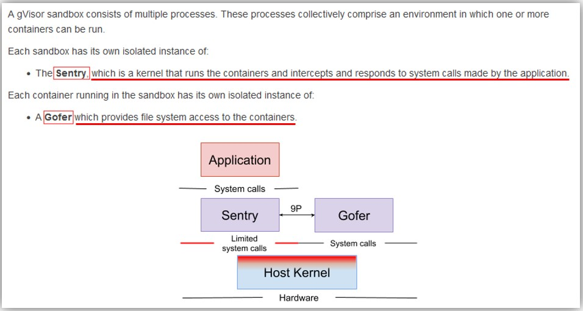

## gVisor
- https://gvisor.dev/docs/
- User Spaceで動くソフトフェアレベルのKernelで、コンテナ(化されたアプリ)からのsystem callをinterceptし、Linux Kernelにsystem callを流さず自分で処理してアプリにレスポンスを返す。
- gVisorは _**Sentry**_ と _**Gofer**_ の２つのコンポーネントで構成される
  
  - **Sentry**
    - コンテナ化されたアプリからのsystem callをinterceptし、responseを返す
      > The Sentry is the largest component of gVisor. It can be thought of as a application kernel. The Sentry implements all the kernel functionality needed by the application, including: system calls, signal delivery, memory management and page faulting logic, the threading model, and more.
      >
      > When the application makes a system call, the Platform redirects the call to the Sentry, which will do the necessary work to service it. It is important to note that the Sentry does not pass system calls through to the host kernel. As a userspace application, the Sentry will make some host system calls to support its operation, but it does not allow the application to directly control the system calls it makes. For example, the Sentry is not able to open files directly; file system operations that extend beyond the sandbox (not internal /proc files, pipes, etc) are sent to the Gofer, described below.
  - **Gofer**
    - Sentryはfile systemに直接アクセスできず、Goferを経由してfile操作を行う
      > The Gofer is a standard host process which is started with each container and communicates with the Sentry via the 9P protocol over a socket or shared memory channel. The Sentry process is started in a restricted seccomp container without access to file system resources. The Gofer mediates all access to these resources, providing an additional level of isolation.