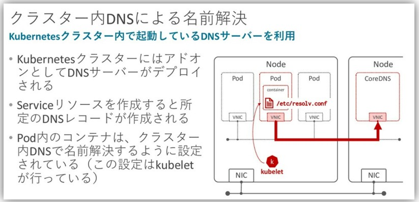
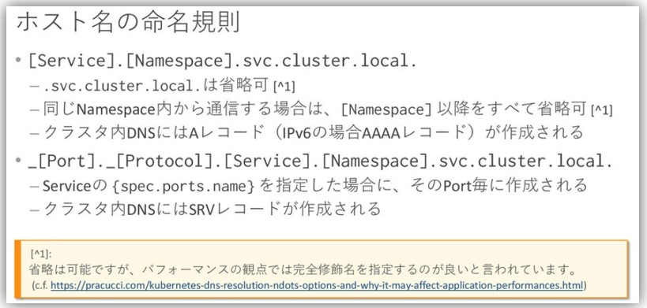

# 概要


https://speakerdeck.com/hhiroshell/kubernetes-network-fundamentals-69d5c596-4b7d-43c0-aac8-8b0e5a633fc2?slide=42
https://speakerdeck.com/hhiroshell/kubernetes-network-fundamentals-69d5c596-4b7d-43c0-aac8-8b0e5a633fc2?slide=44

# Pod内の`/etc/resolv.conf`の設定
- EKSの場合はPod内の`/etc/resolv.conf`は以下のようになっている
  ```bash
  search <Podが所属するnamespace>.svc.cluster.local svc.cluster.local cluster.local <<EKSが存在するRegion(e.g. ap-northeast-1)>>.compute.internal>
  nameserver <CoreDNSのClusterIP>
  options ndots:5
  ```

## search について
- `search`はDNSクエリの名前解決を行う際に、指定されたドメイン名を補完するためのドメインサフィックスのリストを定義する
- 例えば、Pod内から`my-service`という名前でServiceにアクセスしようとした場合、`search`に基づいて以下の順番で名前解決が試みられる
  1. `my-service.<Podが所属するnamespace>.svc.cluster.local`
  2. `my-service.svc.cluster.local`
  3. `my-service.cluster.local`
  4. `my-service.<<EKSが存在するRegion>>.compute.internal`
  5. `my-service`
- これにより、Pod内から短縮されたサービス名でアクセスできるようになる

## ndots について
- `ndots`はDNSクエリに含まれるドット（`.`）の数を指定するオプション
- `ndots:5`の場合、クエリ名に5つ以上のドットが含まれている場合、その名前は完全修飾ドメイン名（FQDN）として扱われて、`search`リストに基づく補完は行われない
  - `www.example.com.`のように末尾にドットがある場合もFQDNとして扱われるため、`search`リストは適用されない
- 逆に、ドットが5つ未満の場合は、上記の「searchについて」に書いた通り、`search`リストに基づいて補完が試みられる

### ndotsのパフォーマンスへの影響
- `ndots:5`はKubernetesのデフォルト値だが、外部ドメイン（例：`api.example.com`）へのアクセス時にsearchリストの補完が先に試されるため、不要なDNSクエリが発生する
- 例えば`api.example.com`（ドット2つ）を解決する場合、最大4回の無駄なクエリが発生してから本来のクエリが行われる
- 外部通信が多いPodでは、FQDNの末尾にドット（`.`）を付ける（例：`api.example.com.`）ことで不要なクエリを回避できる