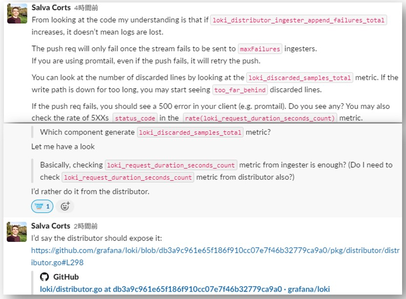

## Observability
- Loki/promtailも自身に関するメトリクスを開示している
  - https://grafana.com/docs/loki/latest/operations/observability/
- Lokiのmetricsを収集するためのPrometheus設定
  - 以下はLokiと同じcluster内にPrometheusが存在する時の設定例
    ~~~yaml
    scrape_configs:
      - job_name: 'sos-loki'
        kubernetes_sd_configs:
        - role: endpoints
        relabel_configs:
        - source_labels: [__meta_kubernetes_pod_name]
          regex: ^sos-loki-distributed-(distributor|ingester|quer).+
          action: keep
        - source_labels: [__meta_kubernetes_pod_name]
          target_label: pod
        - source_labels: [__meta_kubernetes_pod_ip]
          regex: (.+)
          target_label: __address__
          replacement: ${1}:3100
    ~~~
- 役に立つメトリクス[^1]
  [^1]: https://taisho6339.gitbook.io/grafana-loki-deep-dive/monitoring
  - __Distributor__
    - `loki_distributor_lines_received_total` (counter)  
      → Distributorが受け付けたログ数(per tanant)
    - `loki_distributor_bytes_received_total` (counter)  
      → Distributorが受信した圧縮前のlogのbytes  
      → **Lokiに連携されるlogのsizeを確認する時はこのmetric(すべてのdistributorのsum)から確認できそう**
      > The total number of uncompressed bytes received per both tenant and retention hours.  
      - **例えば1ヶ月(30日)分のログ(データ)量を確認したい場合は`sum(loki_distributor_bytes_received_total)`でGrafanaのTimeRangeを30日に設定して増加値を確認する**
    - `loki_distributor_ingester_append_failures_total` (counter)  
      → The total number of failed batch appends sent to ingesters.  
        > **Note**  
        > このMetricsはLogの喪失を意味しているわけではない
        > その他の必要最低限数のIngesterにPushできていればLogは喪失されない
        > 万が一必要最低限数のIngesterにPushできなかった場合はPromtailが再送する
        

      　→ githubのソースコード[pkg/distributor/distributor.go](https://github.com/grafana/loki/blob/db3a9c961e65f186f910cc07e7f46b32779ca9a0/pkg/distributor/distributor.go)から確認できる  
        - **`sendStreamsErr`Methodの`d.ingesterAppendFailures.WithLabelValues(ingester.Addr).Inc()`で`loki_distributor_ingester_append_failures_total`Metricsをカウントしている  
          `sendStreams`Methodのコメントに書いてある通り、`loki_distributor_ingester_append_failures_total`が発生しても必要最低限のingesterにpushできれば問題なさそう**
          ~~~go
          func (d *Distributor) sendStreams(ctx context.Context, ingester ring.InstanceDesc, streamTrackers []*streamTracker, pushTracker *pushTracker) {
              err := d.sendStreamsErr(ctx, ingester, streamTrackers)

              // If we succeed, decrement each stream's pending count by one.
              // If we reach the required number of successful puts on this stream, then
              // decrement the number of pending streams by one.
              // If we successfully push all streams to min success ingesters, wake up the
              // waiting rpc so it can return early. Similarly, track the number of errors,
              // and if it exceeds maxFailures shortcut the waiting rpc.
              //
              // The use of atomic increments here guarantees only a single sendStreams
              // goroutine will write to either channel.
              for i := range streamTrackers {
                  if err != nil {
                      if streamTrackers[i].failed.Inc() <= int32(streamTrackers[i].maxFailures) {
                          continue
                      }
                      if pushTracker.streamsFailed.Inc() == 1 {
                          pushTracker.err <- err
                      }
                  } else {
                      if streamTrackers[i].succeeded.Inc() != int32(streamTrackers[i].minSuccess) {
                          continue
                      }
                      if pushTracker.streamsPending.Dec() == 0 {
                          pushTracker.done <- struct{}{}
                      }
                  }
              }
          }

          func (d *Distributor) sendStreamsErr(ctx context.Context, ingester ring.InstanceDesc, streams []*streamTracker) error {
              c, err := d.pool.GetClientFor(ingester.Addr)
              if err != nil {
                  return err
              }

              req := &logproto.PushRequest{
                  Streams: make([]logproto.Stream, len(streams)),
              }
              for i, s := range streams {
                  req.Streams[i] = s.stream
              }

              _, err = c.(logproto.PusherClient).Push(ctx, req)
              d.ingesterAppends.WithLabelValues(ingester.Addr).Inc()
              if err != nil {
                  d.ingesterAppendFailures.WithLabelValues(ingester.Addr).Inc()
              }
              return err
          }
          ~~~
          
  - __Ingester__
    - `loki_ingester_chunks_flushed_total` (counter)  
      → どの要因でflushされたか、以下の`reason`ごとにflushされた件数  
       ・`full` → `chunk_target_size`の条件を満たしてflushされたもの  
       ・`idle` → `chunk_idle_period`の条件を満たしてflushされたもの  
       ・`max_age` → `max_chunk_age`の条件を満たしてflushされたもの  
  - __promtail__
    - `promtail_sent_entries_total` (counter)  
      → promtailがingesterに送ったログ数
    - `promtail_dropped_entries_total` (counter)  
      → promtailが設定されているすべてのretry回数内にingesterへの送信に失敗した(dropされた)ログ数