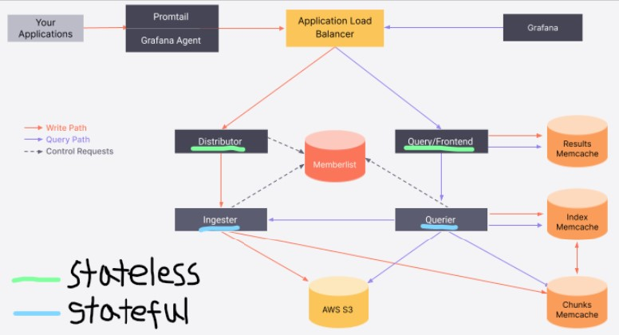
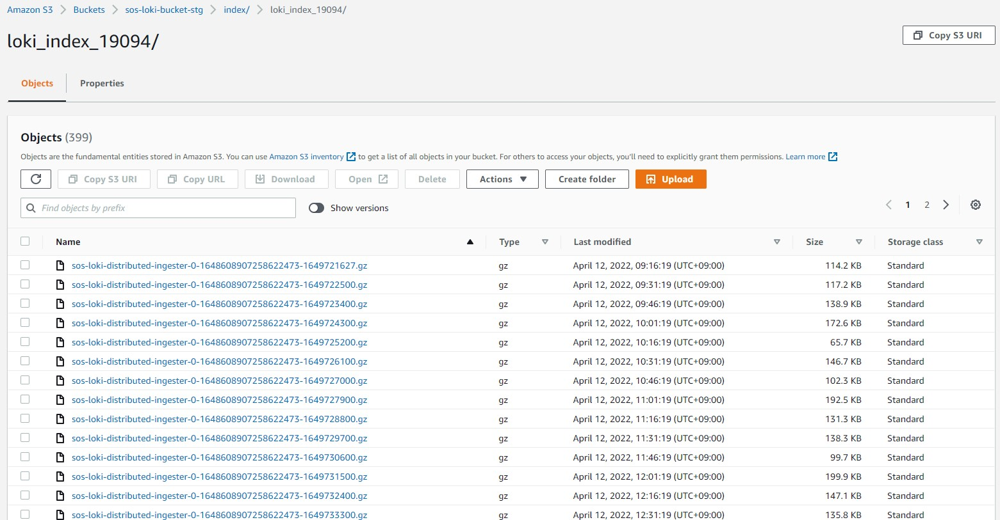
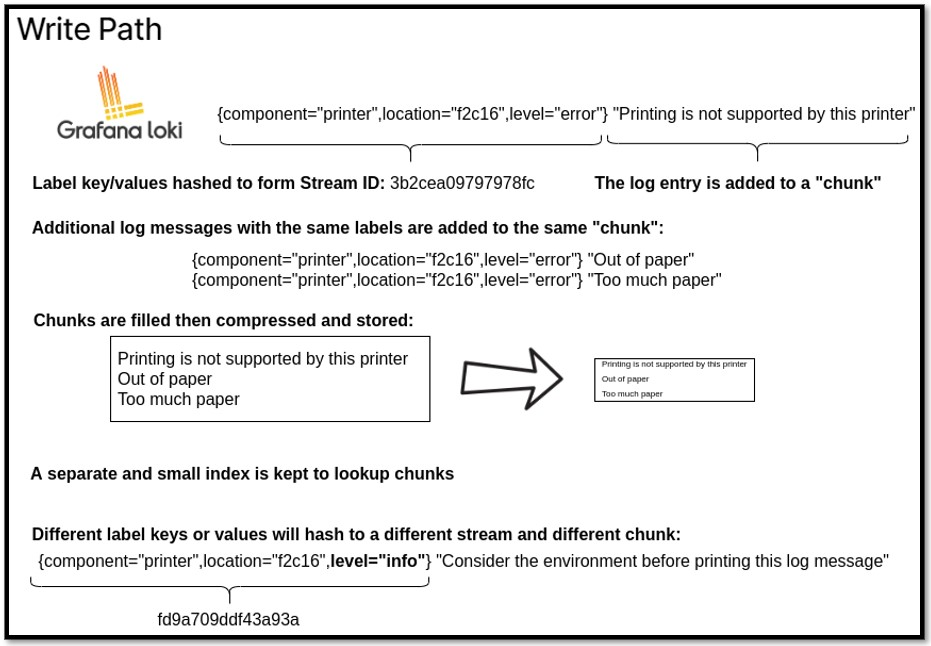

## 参考URL
- https://taisho6339.hatenablog.com/entry/2021/05/26/104449
- https://taisho6339.gitbook.io/grafana-loki-deep-dive/
- https://speakerdeck.com/line_developers/grafana-loki-deep-dive

## Architecture
  
出典: https://grafana.com/blog/2021/08/11/a-guide-to-deploying-grafana-loki-and-grafana-tempo-without-kubernetes-on-aws-fargate/

## Components
### Write path
- __Distributor__
- __Ingester__
  - それぞれのIngesterの中にindexとwalが存在する
    
    
    

  

### Read path
- __Query Frontend__
  - Grafana等からのクエリーを最初に受け付ける
  - 広い範囲のデカいクエリーを小さく分割して複数のQuerierにパラレルに実行させてQuerierから帰ってきた結果をaggregationする
    - Query frontendが内部でqueueを持っていてそこに分割したクエリーを入れて、Querierがそこからqueueを取り出してクエリーを実行して結果をQuery frontendに返す
    - どの単位でクエリーを分割するかは`split_queries_by_interval`(defaultは30m)で設定できる  
    → 例えばデフォルト(30m)で2h範囲のクエリーを実行したら、4つのクエリーに分割してパラレルにQuerierに実行させる
  - クエリー結果をResult cacheにキャッシュする
  - クエリーrequestが失敗したら`max_retries`に設定された回数(defaultは5回)リトライする
  - 参考URL
    - https://grafana.com/docs/loki/latest/fundamentals/architecture/components/#query-frontend
    - https://grafana.com/docs/loki/latest/configuration/query-frontend/
    - https://github.com/taisho6339/loki-book/tree/main/query-process
- __Querier__
  - Query Frontendから連携されたクエリーをIngesterとBackend(S3)に投げて処理する
  - [Querier](https://grafana.com/docs/loki/latest/fundamentals/architecture/components/#querier)はデータのdeduplicationを行う
    > Queriers query all ingesters for in-memory data before falling back to running the same query against the backend store. Because of the replication factor, it is possible that the querier may receive duplicate data. To resolve this, the querier internally deduplicates data that has the same nanosecond timestamp, label set, and log message.
  - QuerierがStateful？
    - 検索時に使うindexを保持するためStateful
    - [Querier](https://grafana.com/docs/loki/latest/operations/storage/boltdb-shipper/#queriers)はObject storageからBoltDBファイルを`cache_location`で設定したディレクトリに非同期でダウンロード(lazily loads)する。read requestを受けた時にcache(index memcache)やダウンロードしたBoltDBファイルに該当indexが存在しない場合はObject storageから同様に`cache_location`で設定したディレクトリにダウンロードし、cache(index memcache)にindexを保存する。
    - ただ、Read Performanceに影響するもので[Querier](https://grafana.com/docs/loki/latest/operations/storage/boltdb-shipper/#queriers)が落ちても再度indexをObject storageからダウンロードして終わりの話の気がする。。  
    → つまりQueriorがStatefulであることはそこまで気にしなくて良いのでは？  
      >  When a querier receives a read request, the query range from the request is resolved to period numbers and all the files for those period numbers are downloaded to cache_location, if not already.   

      しかもQueriorにも専用のEBSをProvisioningするので再起動を気にせず、QueriorにMemoryのLimitsを設定して良さそう
      > Within Kubernetes, if you are not using an Index Gateway, we recommend running Queriers as a StatefulSet with persistent storage for downloading and querying index files. This will obtain better read performance, and it will avoid using node disk.
    - [Index Gateway](https://grafana.com/docs/loki/latest/operations/storage/boltdb-shipper/#queriers)という別コンポーネントをデプロイすればQueriorをStatelessにすることができる。
  - 参考URL
    - https://grafana.com/docs/loki/latest/fundamentals/architecture/components/#querier
    - https://grafana.com/docs/loki/latest/operations/storage/boltdb-shipper/

  

### その他
- [__Compactor__](https://grafana.com/docs/loki/latest/operations/storage/boltdb-shipper/#compactor)
  - 複数のindexを重複排除して1つのファイルとしてまとめる
  - query latencyの改善につながる
  - Compactorは1つだけ動かさないといけない
    - 複数動かすとdata lossにつながる問題を起こす恐れがある
      > Note: There should be only 1 compactor instance running at a time that otherwise could create problems and may lead to data loss.
  - compact前
      
  - compact後
      

## BoltDB Shipper
- __背景__
  - Lokiは`index`と`chunk`2種類のデータを保存する必要がある
    > Grafana Loki needs to store two different types of data: chunks and indexes.
    > Loki receives logs in separate streams, where each stream is uniquely identified by its tenant ID and its set of labels. As log entries from a stream arrive, they are compressed as “chunks” and saved in the chunks store. 
    - `index`  
      → labelとtenant IDの組合せから生成されるchunkを検索するためのindex
    - `chunk`  
      → logデータが圧縮されたもの
      
  - v1.5前まではindex(ex. DynamoDB)とchunk(ex. S3)を別々のところに保存していた
  - v1.5からindexもchunkと同じObject Storageに保存できるようにするためにBoltDB Shipperが登場した
- __仕組み__
  - BoltDB[^1]という組み込み型KVSにindexを保存し、それをObject Storageに送信したり、逆にObject Storageから別のIngesterから生成されたindexを受信して同期する
    [^1]: https://grafana.com/docs/loki/latest/storage/#boltdb、https://github.com/boltdb/bolt
  - BoltDBとBoltDB Shipperが使われるのはIngesterとQuerior
    - [Ingesters](https://grafana.com/docs/loki/latest/operations/storage/boltdb-shipper/#ingesters)
      > Ingesters keep writing the index to BoltDB files in active_index_directory and BoltDB Shipper keeps looking for new and updated files in that directory every 1 Minutes to upload them to the shared object store. When running Loki in clustered mode there could be multiple ingesters serving write requests hence each of them generating BoltDB files locally.
      > 
      > Note: To avoid any loss of index when Ingester crashes it is recommended to run Ingesters as statefulset(when using k8s) with a persistent storage for storing index files.
      > 
      > Another important detail to note is when chunks are flushed they are available for reads in object store instantly while index is not since we only upload them every 15 Minutes with BoltDB shipper. Ingesters expose a new RPC for letting Queriers query the Ingester’s local index for chunks which were recently flushed but its index might not be available yet with Queriers. For all the queries which require chunks to be read from the store, Queriers also query Ingesters over RPC for IDs of chunks which were recently flushed which is to avoid missing any logs from queries.
    - [Querior](https://grafana.com/docs/loki/latest/operations/storage/boltdb-shipper/#queriers)については上の ***QuerierがStateful？*** を参照
- 参考URL
  - https://grafana.com/docs/loki/latest/operations/storage/boltdb-shipper/
  - https://grafana.com/docs/loki/latest/fundamentals/architecture/

## LogがDropされるのを防ぐための仕組み
1. __Replication factor__
   - Distributorから
   - 
2. __WAL (Write Ahead Log)__
   - ingesterが書き込みを受け付ける前にまず先にログをDiskに全部書き込んでからメモリに書き込む。  
    そして、ingesterが何らかの理由で落ちたら、起動時にメモリにあったすべてのログをWALから読み込んで修復する。
      > This is a new feature, available starting in the 2.2 release, which helps ensure Loki doesn’t drop logs by writing all incoming data to disk before acknowledging the write. If an ingester dies for some reason, it will replay this log upon startup, safely ensuring all the data it previously had in memory has been recovered.
   - WALから読み込む(replay)時にWALサイズがingesterが利用可能な(割り当てられている)メモリサイズより大きい場合、幸いにメモリが制限されている状態でもbackpressureの形でreplayが実行されるけど、`replay_memory_ceiling`の設定でreplayデータ量が設定値に達したらreplayを一旦止めてflushさせてから再開させることができる
      > replay_memory_ceiling It’s possible that after an outage scenario, a WAL is larger than the available memory of an ingester. Fortunately, the WAL implements a form of backpressure, allowing large replays even when memory is constrained. This replay_memory_ceiling config is the threshold at which the WAL will pause replaying and signal the ingester to flush its data before continuing. Because this is a less efficient operation, we suggest setting this threshold to a high, but reasonable, bound, or about 75% of the ingester’s normal memory limits. 
- 参考URL
  - https://grafana.com/blog/2021/02/16/the-essential-config-settings-you-should-use-so-you-wont-drop-logs-in-loki/
  - https://grafana.com/docs/loki/latest/design-documents/2020-09-write-ahead-log/
  - https://grafana.com/docs/loki/latest/operations/storage/boltdb-shipper/#queriers

## Consistent Hash Rings
- 参考URL
  - **https://grafana.com/docs/loki/latest/fundamentals/architecture/rings/**
- Ingester Ring Statusは「http://Ingester_IP:3100/ring」から確認できる
- Distributor Ring Statusは「http://Distributor_IP:3100/distributor/ring」から確認できる
- ringのstatusについて`cortex_ring_members`metricsで確認できる

## chunkの圧縮
- 転送速度向上およびストレージコスト削減のため、ログはgzip[^3]で圧縮されてchunkとして保存される
  [^3]: defaultではgzipだけどingesterの設定`chunk_encoding`にてsnappy(圧縮率は低いけどその分検索が早い)などに変えることもできる
  > gzip is the default and has the best compression ratio, but we suggest snappy for its faster decompression rate, which results in better query speeds.
- 参考URL
  - https://grafana.com/docs/loki/latest/operations/storage/boltdb-shipper/#operational-details
  - https://grafana.com/docs/loki/latest/configuration/#ingester
  - https://grafana.com/blog/2021/02/16/the-essential-config-settings-you-should-use-so-you-wont-drop-logs-in-loki/

## HelmによるMicroServices Modeのデプロイ
- githubリポジトリ
  - https://github.com/grafana/helm-charts/tree/main/charts/loki-distributed
- Volumesは`/var/loki`にマウントされるので、各設定上のdirectoryは`/var/loki`配下(e. g. `/var/loki/index`, `/var/loki/cache`)に設定すること
