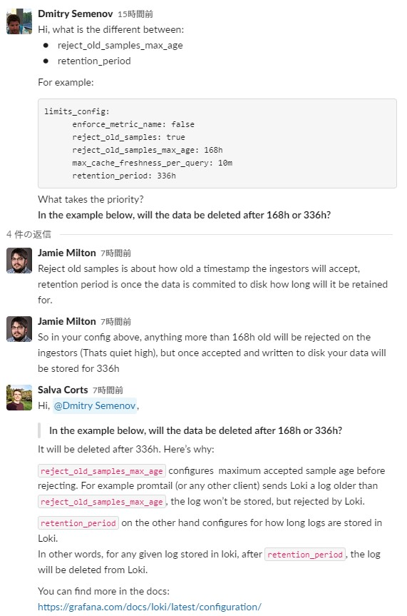

## ingester
- 参考URL
  - https://grafana.com/docs/loki/latest/configuration/#ingester
  - https://grafana.com/docs/loki/latest/best-practices/#use-chunk_target_size
- 以下の3つがingesterからBackend(S3等)にflushされるタイミングに影響する設定  
  → この3つの値を大きくするとメモリ使用量も上がるので要注意
  - `chunk_target_size`
    - chunkがここに設定したsizeに達したらingesterがBackend(S3)にchunkをflushする
  - `max_chunk_age`
    - ここに指定した時間が経過したchunkをflushする
  - `chunk_idle_period`
    - ここに指定した時間の間、chunkに更新がない場合flushする
## `limit_config` block
- https://grafana.com/docs/loki/latest/configuration/#limits_config
- **`reject_old_samples_max_age`と`retention_period`の違いについて**

## `analytics` block
- defaultではLokiは利用状況と設定情報をGrafana Labsに送るようになっている
  - https://grafana.com/docs/loki/latest/configuration/#common
- `reporting_enabled`を`false`にすることでGrafana Labsへの情報転送を無効にすることができる
- 上記Grafanaドキュメントを見るとcommonブロックで指定しているように見えるが`analytics`ブロックで設定する必要がある  
  → https://sbcode.net/grafana/install-loki-service/
  ~~~yaml
  analytics:
    reporting_enabled: false
  ~~~