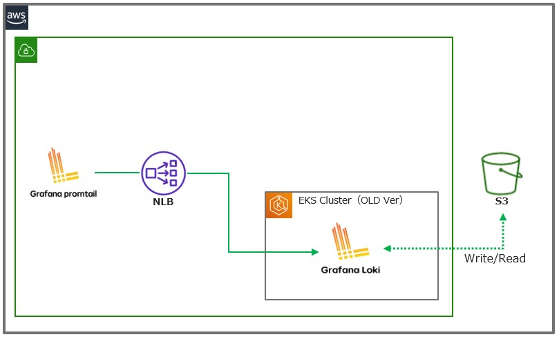
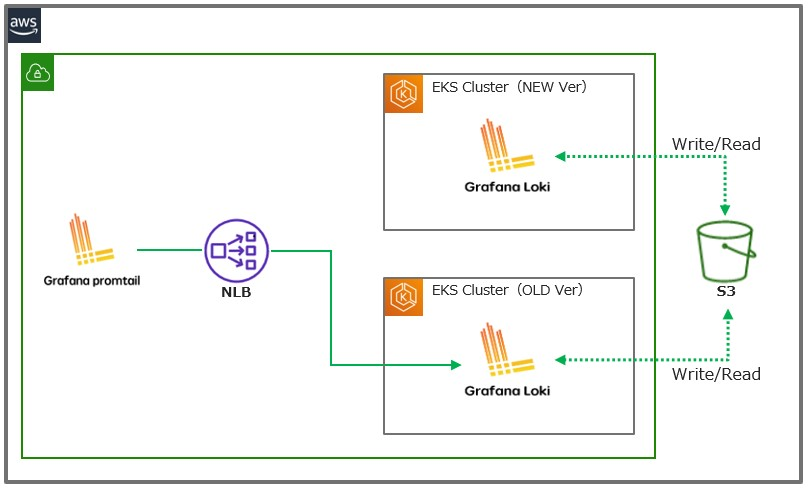
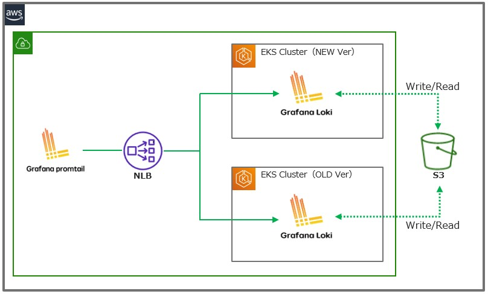
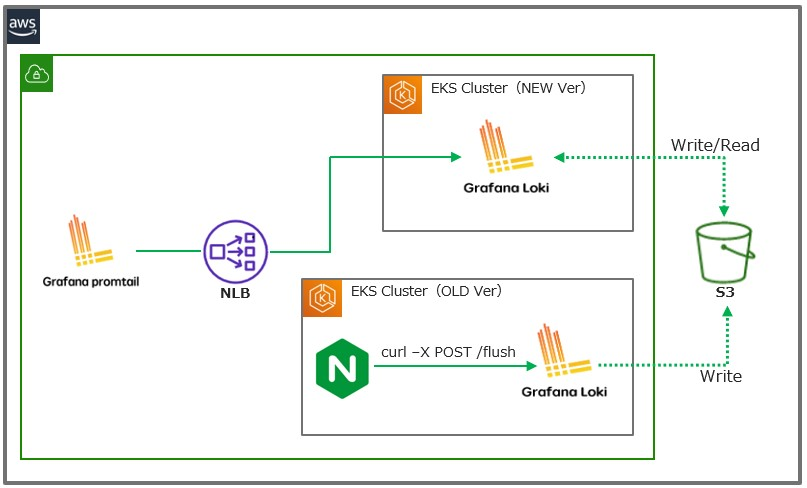
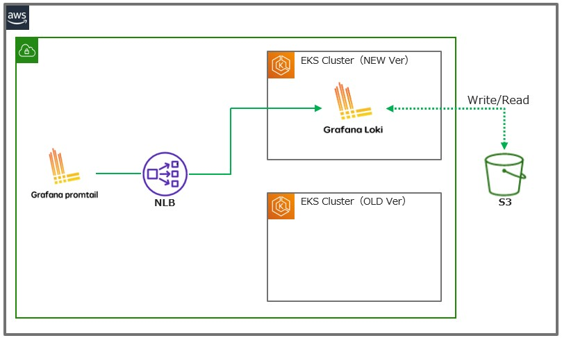
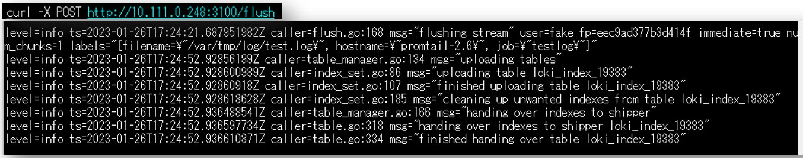
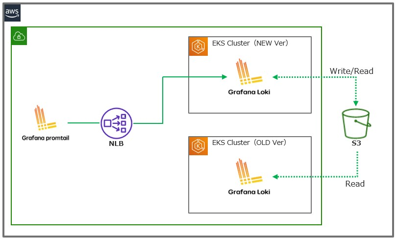

## Migration between k8s clusters (for k8s cluster VerUp)
### 背景
- AWS EKS上にLokiをmicroservice modeとして動かしていて、  
  EKSバージョンアップ(1.22 → 1.24)のためLokiの移行方法を確認する必要があった

### 構成
- Lokiバージョンは2.7.1
- Helmでmicroservice modeとしてインストール
  - https://github.com/grafana/helm-charts/tree/main/charts/loki-distributed
- EKSバージョンアップに備えてEKSクラスターと独立したNLBを利用
- cacheはElastiCache(redis)を利用

### 最初に考えた方法
0. Cluster VerUp前  

1. 新EKSクラスターにLokiをデプロイ

2. NLB Target Groupに新EKSクラスター上のLokiを登録

3. NLB Target Groupから旧EKSクラスター上のLokiを解除

4. Ingesterのメモリにあるflushされてないindexとchunkをflush

5. 旧EKSクラスター上のLokiを削除

> **Note**
> Ingesterにindexとchunkをflushするエンドポイント`/flush`がある
> https://grafana.com/docs/loki/latest/api/#flush-in-memory-chunks-to-backing-store
> 以下は`/flush`エンドポイントにPOSTを投げた時のingesterのログ
> 

### 上記の方法で起きたこと
- あｓｄ
  - Ingesterにindexとchunkをflushするエンドポイント`/flush`がある
  - https://grafana.com/docs/loki/latest/api/#flush-in-memory-chunks-to-backing-store

## 最終的に行った方法

> **Warning**  
> 検証中！  
1. Cluster VerUp前  

1. 新Ver Cluster作成  

1. NLB Target Groupに新Ver Cluster上のLokiを登録

1. NLB Target Groupから旧Ver Cluster上のLokiを削除

1. 旧Ver Cluster上のLoki(ingester)に対してflushを実行

1. 新クラスター上のLokiから旧Lokiにあったログがすべて見えることを確認[^4]

[^4]: 数十分～1時間くらいかかる
1. 旧クラスター上のLokiを削除（EBSも明示的に削除）
