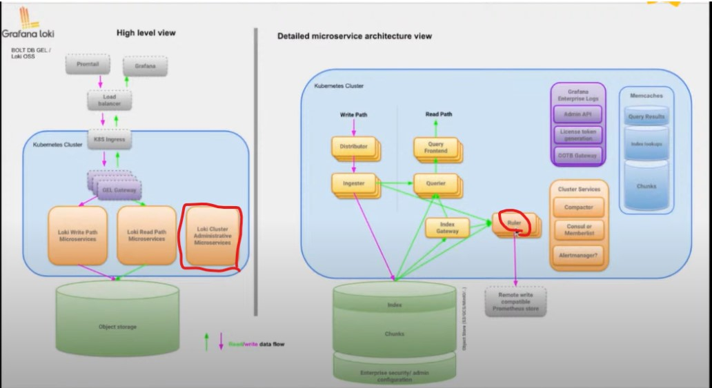

- Simple scalable deployment modeは途中から追加されたものだけど、現在は推奨されているModeらしい
  - https://grafana.com/blog/2022/12/19/the-only-helm-chart-you-need-for-grafana-loki-is-here/  
    

## Helm Chart
#### Helmを使ったInstall
- https://grafana.com/docs/loki/next/setup/install/helm/install-scalable/

#### HelmのValues.yml
- https://grafana.com/docs/loki/next/setup/install/helm/reference/

#### Backendコンポーネント
- Simple scalable deployment modeは`Write`と`Read`、２つのコンポーネントだったが、  
  現在は`Backend`も追加されている（`Read`から分離）
- `Backend`の実体は`Ruler`と`Administrative Process`らしい  
  
- https://www.youtube.com/watch?v=OLebNPLIJMI&t=2045s