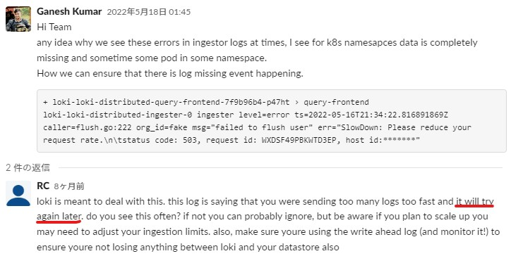

## LokiのRateLimitによるpromtailからのError
- 事象
  - promtailのlogに以下のようなErrorが出る
    > level=warn ts=2022-11-30T06:59:03.853947325Z caller=client.go:369 component=client host=LOKI-NLB-******.elb.ap-northeast-1.amazonaws.com msg="error sending batch, will retry" status=429 error="server returned HTTP status 429 Too Many Requests (429): Ingestion rate limit exceeded for user fake (limit: 1310720 bytes/sec) while attempting to ingest '1154' lines totaling '1048548' bytes, reduce log volume or contact your Loki administrator to see if the limit can be increased"
- 原因
  - logに書いてある通りLokiの`limits_config.ingestion_rate_mb`と`limits_config.ingestion_burst_size_mb`で設定するRateLimitに引っかかっている
- 対処
  - Lokiの`limits_config.ingestion_rate_mb`と`limits_config.ingestion_burst_size_mb`の値を大きくする

## S3 ThrottlingによるIngesterからのError
- 事象
  - Ingesterのlogから以下のようなErrorが出る
    > "level=error ts=2023-01-04T16:35:24.514624173Z caller=flush.go:146 org_id=fake msg="failed to flush user" err="store put chunk: SlowDown: Please reduce your request rate.\n\tstatus code: 503, request id: K2HMP2637CPR01G5, host id: HNJwYGlLYO7AspzFdK8ik1UtmQrsgn43liboEzbyqIWcznqdOnZglxJ2SqOJvTAG+B04Mq/w+S4="\n"
- 原因
  - S3への書き込みが多すぎたため、S3のRateLimit(3,500 PUT/COPY/POST/DELETE requests per second per partitioned prefix)に引っかかって出るError  
   *※prefixはS3のサブディレクトリのこと(Lokiがsingle tenantの場合は`fake`)*  

- 対処
  - 頻繁に発生しない限りQueueに戻され、再実行されるので無視して良い
      
    - 下記Lokiのコード(コメント)にも記載されている
      > If we're exiting & we failed to flush, out the failed operation back in the queue at a later point.
      - https://github.com/grafana/loki/blob/776ee95a00cc64592171fa3c25f0d63ea39dbb67/pkg/ingester/flush.go
  - have fewer chunks (make them bigger or have less streams)
    1. labelの数を減らす(labelのcardinalityを低くする)  
      → https://grafana.com/blog/2020/04/21/how-labels-in-loki-can-make-log-queries-faster-and-easier/
    2. ingesterの`chunk_target_size`を1MBまたは1.5MBに設定する
    3. ingesterの`chunk_idle_period`と`max_chunk_age`を1h以上に設定する
  - use more tenants (tenants will go into folders (prefix) in the bucket which will each get separate limits)

- *S3のRateLimit関連URL*
  - https://docs.aws.amazon.com/AmazonS3/latest/userguide/optimizing-performance.html
  - https://aws.amazon.com/jp/premiumsupport/knowledge-center/emr-s3-503-slow-down/
  - https://repost.aws/ja/knowledge-center/http-5xx-errors-s3

- *この事象に関連するLokiのURL*
  - https://community.grafana.com/t/getting-throttled-by-s3/42441/2
  - **https://grafana.slack.com/archives/CEPJRLQNL/p1605809265098700**
  - https://grafana.slack.com/archives/CEPJRLQNL/p1603798598093300