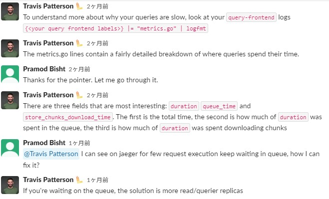
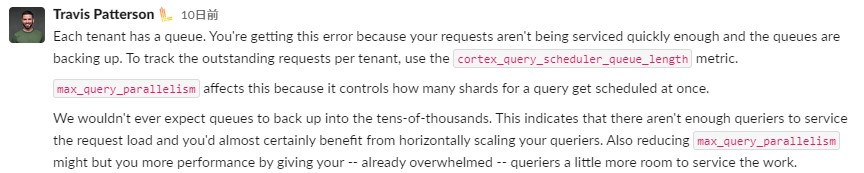
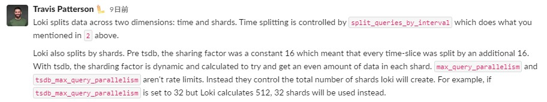

## query-frontendのログから確認すべきもの
- `duration`
  - the total time
- `queue_time`
  - how much of duration was spent in the queue
- `store_chunks_download_time`
  - how much of duration was spent downloading chunks  

- **queueで待機されているrequestがある場合はquerierを増やす必要がある**

## `501 too many outstanding requests`エラーについて
- requestsが裁かれておらず、queuesが溜まっているのため、発生するエラー  
    
- **`cortex_query_scheduler_queue_length`メトリクスで各テナントごとのquery状況が分かる**  
  → 多分query-schedulerを別途デプロイしている必要がある 

## queryの分割
- Lokiは**時間**と**Shards**でqueryを分割する
  - 先に時間で分割して、さらにShardsで分割するらしい  
  