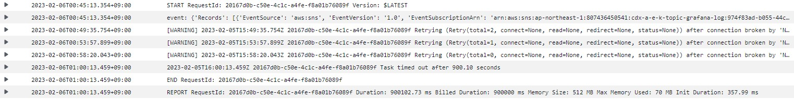
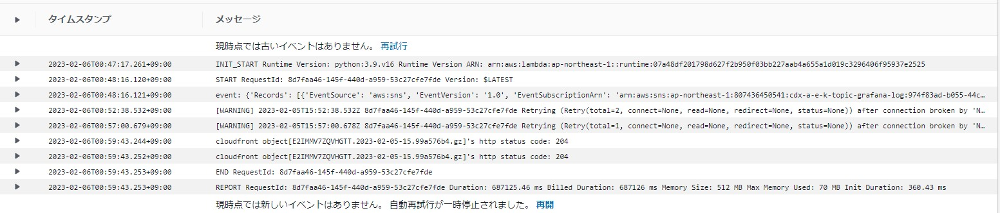

- Distributorが公開している`/loki/api/v1/push`にPOSTを投げることでPromtailを経由せず直接ログをLokiに送ることもできる
  - https://grafana.com/docs/loki/latest/api/#push-log-entries-to-loki
  > The default behavior is for the POST body to be a snappy-compressed protobuf message. Alternatively, if the Content-Type header is set to application/json, a JSON post body can be sent in the following format.
## JSONフォーマットでS3上のALB/CloudFrontログをLokiに送るLambdaの例  
- `retries=None`にすることでResponseを受け取るまでリトライし続ける。  
  → https://urllib3.readthedocs.io/en/stable/reference/urllib3.connectionpool.html#urllib3.HTTPConnectionPool  
- 合わせてLambdaのタイムアウトもMAXの15分にすることで15分間リトライし続ける。 
~~~python
  import json
  import urllib.parse
  import os
  import ast
  import boto3
  import time
  import gzip
  import re
  import urllib3
    
  http = urllib3.PoolManager()
  s3 = boto3.client('s3')
    
  def lambda_handler(event, context):
    
      unixtime = str(time.time_ns())
      loki_url = os.environ['WRITE_ADDRESS']
      alb_log_s3 = os.environ['ALB_LOG_S3']
      cloudfront_log_s3 = os.environ['CLOUDFRONT_LOG_S3']
    
      print("event:", event)
    
      ## event sourceによって大文字・小文字が異なる
      if "eventSource" in event['Records'][0]:
          event_source = event['Records'][0]['eventSource']
      elif "EventSource" in event['Records'][0]:
          event_source = event['Records'][0]['EventSource']
    
      if "s3" in event_source:
          s3_bucket = event['Records'][0]['s3']['bucket']['name']
          key = urllib.parse.unquote_plus(event['Records'][0]['s3']['object']['key'], encoding='utf-8')
    
      if "sns" in event_source:
          body = event['Records'][0]['Sns']['Message']
          body_dict=ast.literal_eval(body)
        
          s3_bucket = body_dict['Records'][0]['s3']['bucket']['name']
          key = urllib.parse.unquote_plus(body_dict['Records'][0]['s3']['object']['key'], encoding='utf-8')
    
      object_file = re.split('/',key)[-1]
      download_dir = "/tmp/" + object_file
        
      try:
          response = s3.download_file(s3_bucket, key, download_dir)
      except Exception as e:
          print(e)
          print('Error getting object {} from bucket {}. Make sure they exist and your bucket is in the same region as this function.'.format(key, s3_bucket))
          raise e
    
      with gzip.open(download_dir, "r", "utf_8") as f:
          for logline in f:
              url = loki_url
              logline = logline.decode()
              if alb_log_s3 in key or alb_log_s3 in s3_bucket:
                  source = "alb"
                  line = re.split(' ',logline)
                  status_code = line[8]
              elif cloudfront_log_s3 in key or cloudfront_log_s3 in s3_bucket:
                  source = "cloudfront"
                  if "#Version: 1.0" in logline or "#Fields: date time x-edge-location" in logline:
                      continue
                  line = re.split(r'\t',logline)
                  status_code = line[8]
              else:
                  source = "Unknown"
                  status_code = "Unknown"
   
              header = {
                  'Content-type': 'application/json',
                  'X-Scope-OrgID': '<テナントID>'
              }
    
              payload = {
                  "streams": [
                      {
                          "stream": {
                              "source": source,
                              "status_code": status_code
                          },
                          "values": [ [ unixtime , logline ] ]
                      }
                  ]
              }
    
              data = json.dumps(payload)
              r = http.request(
                      'POST',
                      url,
                      body=data,
                      headers=header,
                      retries=None
                  )              
   
              print("%s object[%s]'s http status code: %d" %(source, object_file, r.status))
~~~
- 実際のログ
  - 15分間送信できずLmabdaがタイムアウトで終了したパターン
    
  - リトライで救われたパターン
    

## Lambda-Promtail
- LambdaでCloudWatch LogsをLokiに送るためのもので、Lokiが正式にサポートしている
  - https://github.com/grafana/loki/tree/main/tools/lambda-promtail
- TerraformやCloudFormationを使う方法が書いてあるが、一番簡単なのはLokiリポジトリをgit cloneして、`loki/tools/lambda-promtail/`ディレクトリに移動し、Makefileに書いてある通り`GOOS=linux CGO_ENABLED=0 go build -o ./main lambda-promtail/*.go`でビルド → `zip function.zip main`でzip化した後にLambdaにZipを上げればOK
- Lmabdaの環境変数で設定できるもの
  | 環境変数 | 値 | 必須/任意 |
  | ---- | ---- | ---- |
  | WRITE_ADDRESS | http://＜Loki Distributor IP＞:3100/loki/api/v1/push | 必須 |
  | TENANT_ID | テナントID | 任意 (Multi-tenant modeの場合は必須) |
  | EXTRA_LABELS | 追加するラベル(name1,value1,name2,value2,・・・) | 任意 |
- defaultではminBackoff＝0.1秒、maxBackoff＝30秒で10回リトライされるけど、promtail.goの以下の部分の値を修正すればリトライ回数やリトライ間隔も調整できる
  - https://github.com/grafana/loki/blob/main/tools/lambda-promtail/lambda-promtail/promtail.go
    ~~~go
    const (
        timeout    = 5 * time.Second
        minBackoff = 100 * time.Millisecond
        maxBackoff = 30 * time.Second
        maxRetries = 10

        reservedLabelTenantID = "__tenant_id__"

        userAgent = "lambda-promtail"
    )
    ~~~
  - backoffについては以下ソースコードを参照
    - https://github.com/grafana/dskit/blob/main/backoff/backoff.go