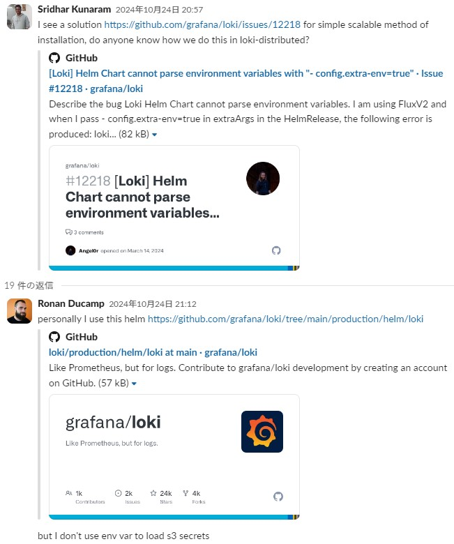
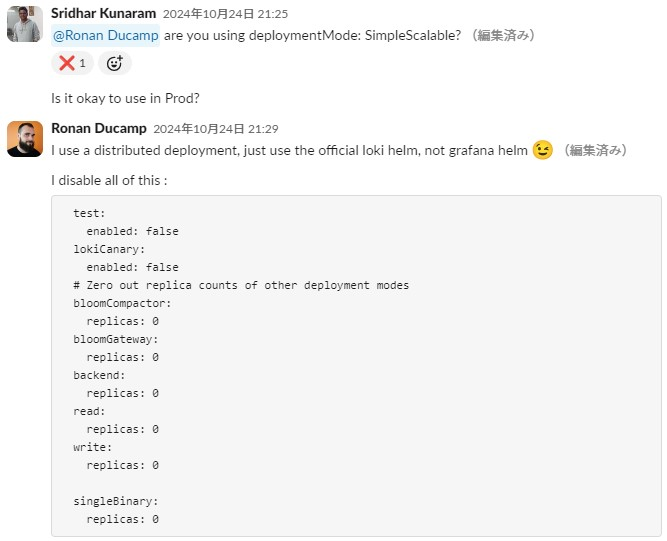

- 手順
  - https://grafana.com/docs/loki/latest/setup/install/helm/

# *Update!* LokiのHelm Chart
- すべてのModeで以下の共通の１つのHelmチャートを使うようになった模様
  - https://grafana.github.io/helm-charts の`grafana/loki`
- 以下で確認できる  
  ```shell
  helm repo add grafana https://grafana.github.io/helm-charts
  helm repo update
  helm search repo grafana/loki --versions
  ```

# MicroServices Mode
- 以下でHelmリポジトリを追加する  
  ```shell
  helm repo add grafana https://grafana.github.io/helm-charts
  helm repo update
  helm search repo grafana/loki --versions
  ```
- **MicroServices Modeでデプロイする場合は`deploymentMode`を`Distributed`にして、以下のように`backend`や`read`、`write`などを`0`にする必要がある**  
  ```yaml
  test:
    enabled: false
  lokiCanary:
    enabled: false
  # Zero out replica counts of other deployment modes
  bloomCompactor:
    replicas: 0
  bloomGateway:
    replicas: 0
  backend:
    replicas: 0
  read:
    replicas: 0
  write:
    replicas: 0

  singleBinary:
    replicas: 0
  ```  
    
  
- Helm chart valuesの一覧
  - https://grafana.com/docs/loki/latest/setup/install/helm/reference/

## （旧）MicroServices Mode
> [!CAUTION]
> 以下のHelmチャートはアップデートされなくなった。  
> `grafana/loki`チャートを使うこと！
- githubリポジトリ
  - https://github.com/grafana/helm-charts/tree/main/charts/loki-distributed
- Volumesは`/var/loki`にマウントされるので、各設定上のdirectoryは`/var/loki`配下(e. g. `/var/loki/index`, `/var/loki/cache`)に設定すること
- Gateway、Ingester以外は個別(e.g. IndexGateway)に変数化されてなくて`livenessProbe`の設定ができない  
  `loki.livenessProbe`のようにLoki全体に設定する必要がある