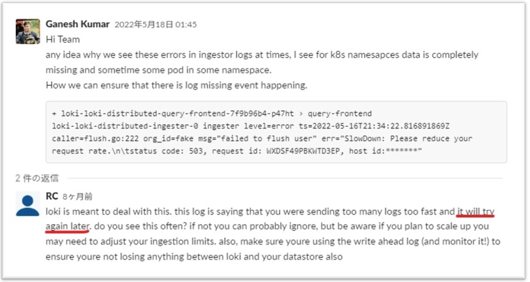
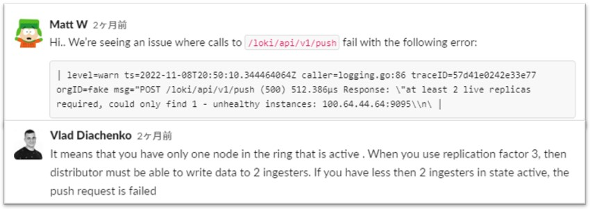
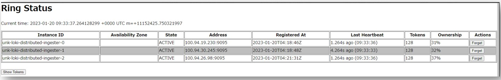
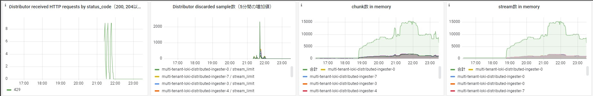

- **https://grafana.com/docs/loki/latest/operations/troubleshooting/**

## LokiのRateLimitによるpromtailからのError
- 事象
  - promtailのlogに以下のようなErrorが出る
    > level=warn ts=2022-11-30T06:59:03.853947325Z caller=client.go:369 component=client host=LOKI-NLB-******.elb.ap-northeast-1.amazonaws.com msg="error sending batch, will retry" status=429 error="server returned HTTP status 429 Too Many Requests (429): Ingestion rate limit exceeded for user fake (limit: 1310720 bytes/sec) while attempting to ingest '1154' lines totaling '1048548' bytes, reduce log volume or contact your Loki administrator to see if the limit can be increased"
- 原因
  - logに書いてある通りLokiの`limits_config.ingestion_rate_mb`と`limits_config.ingestion_burst_size_mb`で設定するRateLimitに引っかかっている
- 対処
  - Lokiの`limits_config.ingestion_rate_mb`と`limits_config.ingestion_burst_size_mb`の値を大きくする

---

## S3 ThrottlingによるIngesterからのError
- 事象
  - Ingesterのlogから以下のようなErrorが出る
    > "level=error ts=2023-01-04T16:35:24.514624173Z caller=flush.go:146 org_id=fake msg="failed to flush user" err="store put chunk: SlowDown: Please reduce your request rate.\n\tstatus code: 503, request id: K2HMP2637CPR01G5, host id: HNJwYGlLYO7AspzFdK8ik1UtmQrsgn43liboEzbyqIWcznqdOnZglxJ2SqOJvTAG+B04Mq/w+S4="\n"
- 原因
  - S3への書き込みが多すぎたため、S3のRateLimit(3,500 PUT/COPY/POST/DELETE requests per second per partitioned prefix)に引っかかって出るError  
   *※prefixはS3のサブディレクトリのこと(Lokiがsingle tenantの場合は`fake`)*  
- 対処
  - 頻繁に発生しない限りQueueに戻され、再実行されるので無視して良い
      
    - 下記Lokiのコード(コメント)にも記載されている
      > If we're exiting & we failed to flush, out the failed operation back in the queue at a later point.
      - https://github.com/grafana/loki/blob/776ee95a00cc64592171fa3c25f0d63ea39dbb67/pkg/ingester/flush.go
  - have fewer chunks (make them bigger or have less streams)
    1. labelの数を減らす(labelのcardinalityを低くする)  
      → https://grafana.com/blog/2020/04/21/how-labels-in-loki-can-make-log-queries-faster-and-easier/
    2. ingesterの`chunk_target_size`を1MBまたは1.5MBに設定する
    3. ingesterの`chunk_idle_period`と`max_chunk_age`を1h以上に設定する
  - use more tenants (tenants will go into folders (prefix) in the bucket which will each get separate limits)

- *S3のRateLimit関連URL*
  - https://docs.aws.amazon.com/AmazonS3/latest/userguide/optimizing-performance.html
  - https://aws.amazon.com/jp/premiumsupport/knowledge-center/emr-s3-503-slow-down/
  - https://repost.aws/ja/knowledge-center/http-5xx-errors-s3

- *この事象に関連するLokiのURL*
  - https://community.grafana.com/t/getting-throttled-by-s3/42441/2
  - **https://grafana.slack.com/archives/CEPJRLQNL/p1605809265098700**
  - https://grafana.slack.com/archives/CEPJRLQNL/p1603798598093300

---

## unhealthy instances(Ingester)によるDistributorからのError
- 事象
  - Distributorから以下のようなErrorが出る
    > level=warn ts=2023-01-20T02:37:18.55702584Z caller=logging.go:86 traceID=681cc3a4f50ce191 orgID=fake msg="POST /loki/api/v1/push (500) 278.729μs Response: \"at least 2 live replicas required, could only find 1 - unhealthy instances: 100.94.21.166:9095\\n\" ws: false; Connection: close; Content-Length: 3574; Content-Type: application/x-protobuf; User-Agent: promtail/2.6.0; "
  - 複数のunhealthy instancesがある場合はGrafana等で`too many unhealthy instances in the ring`がエラーが出る
- 原因
  - 前提としてIngesterは`replication_factor`の値に基づいて必要最低限の数が変わる。(ex. `replication_factor`が3の時は2つのActiveなIngesterが必要)  
    ringにjoinしているIngesterのうちunhealthy状態になっているものがあり、Active状態のIngesterが必要最低限の数より少なく、Ingesterへのpushが失敗して出るError
    
- 対処
  - Ingesterの数を(2→3)増やしたら直った
    - Ingesterが増えたことで既存のIngesterもRingへの再参加することで状態が直った??
  - ring status GUIでUnhealthyになっているIngesterを「Forget」ボタンを押せば直るはず？  
    → ring status GUIではACTIVEに戻ったけどDistributorからErrorが出続けた
    > 『Loki: Internal Server Error. 500. too many unhealthy instances in the ring』
I encountered this. You could see your ring status through (replace with your host):
http://loki:3100/ring
There you can "forget" the unhealthy instance and it should work.
Having said that, you could have this option in your loki config under:
    ~~~
    common:
      ring:
        autoforget_unhealthy: true
    ingester:
      lifecycler:
        readiness_check_ring_health: false
    ~~~
- **Ingester ringの状態を確認する方法**
  - Ingester ringのstatusは「http://IngesterのIPアドレス:3100/ring」から確認できる
    
  - HelmからLokiをデプロイした場合、クラスター外からIngesterへ接続できないため`kubectl expose pod <Ingester POD名> --type=NodePort --name=<Service名>`でNodePortのServiceを作成して接続すること
    - **AWS EKSの場合、PODがVPCのIPを持っているためPODのIPでブラウザからアクセスできる**

---

## High CardinalityによるChunk/Stream数急増によるDistributorからのStream Limitエラー
- 事象
  - High Cardinalityの値をLabelに設定したらIngesterメモリ内のChunk/Streamが急増し、DistributorからStream Limitエラー(`loki_discarded_samples_total`メトリクス)が出た

- 原因
  - カーディナリティの高い値をLabelに設定したため、大量にChunk/Streamが生成され、Stream Limitを超過した
- 対処
  - カーディナリティの高い値をLabelから外した

---

## Metric queriesで `maximum of series (500) reached for a single query` エラーが出る
- 事象
  - **https://github.com/grafana/loki/issues/3045**
  - GrafanaでMetric queries（e.g. `count_over_time`）を実行したら `maximum of series (500) reached for a single query`エラーが出る
- 原因
  - defaultでは、Lokiの1回のクエリーで返せるtime series（＝ streams）数の上限が500に設定されているため
  - つまり、対象ログのLabelの組み合わせ（＝ streams）が500を超えるとこのエラーが出る
- 対処
  - `limits_config`ブロックの`max_query_series`の値を500より大きい値に設定する
  - 以下のように`Keep`や`Drop`を使って、必要なLabelだけに絞る
    ```logql
    count_over_time({job="example"} | trace_id="0242ac120002" | keep job  [5m])
    ```

> [!CAUTION]  
> https://grafana.com/docs/loki/latest/get-started/labels/structured-metadata/#querying-structured-metadata
> Labelだけではなく、Structured metadataも結果的にLabelとして返されるため、Structured metadataの組み合わせの数が多い場合もこのエラーが出る可能性がある
> > Note that since structured metadata is extracted automatically to the results labels, some metric queries might return an error like maximum of series (500) reached for a single query. You can use the Keep and Drop stages to filter out labels that you don’t need. For example:
> > ```logql
> > count_over_time({job="example"} | trace_id="0242ac120002" | keep job  [5m])
> > ```

---

## Python等から直接Lokiのエンドポイント(/loki/api/v1/push)にAPIでlogをpushした際に出るDistributorからのError
- 事象
  - Distributorから以下のようなErrorが出る
    > "level=warn ts=2023-01-05T11:50:24.072282964Z caller=logging.go:86 traceID=2a11931ed1f9897a orgID=fake msg="POST /loki/api/v1/push (500) 2.01997ms Response: \\\"context canceled\\\\n\\\" ws: false; Accept-Encoding: identity; Connection: close; Content-Length: 1045; Content-Type: application/json; User-Agent: python-urllib3/1.26.9; "\n"
- 原因
  - ???

---

## Index GatewayがReady(1/1)にならず、約5分間隔でrestartを繰り返す
- 事象
  - Index Gatewayが再起動された時、Podが`Ready 0/1`の状態(`Ready 1/1`にならず)でrestartを繰り返す
- 原因
  - MicroService modeのHelmチャートでは共通の`livenessProbe.initialDelaySeconds`として300(s)が設定されており、Index Gatewayが300秒以内にすべてIndexをPVからLoadすることができなかったため
    - Index GatewayはIndexをすべてLoadする前にStartしない(Readyにならない)
- 対処
  - Helmチャートの`loki.livenessProbe.initialDelaySeconds`の数値を600などに上げる
    - HelmチャートでindexGateway個別のlivenessProbeは変数化されておらず、loki共通の`livenessProbe.initialDelaySeconds`を上げる必要がある

---

## Lokiのバージョンを2.8系から2.9系にupgradeしたらcompactorがcompactionに失敗する
- 事象
  - Lokiのバージョンを2.8系から2.9系に上げたらcompactorから以下のエラーが出て、compactionできなくなった  
    - `msg="failed to run compaction" err="index store client not found for aws"`
- 原因
  - v2.9からcompactorがmulti-storeをsupportするようになった影響
    - https://github.com/grafana/loki/issues/10554
- 対処
  - `schema_config`下の`object_store`を`compactor.shared_store`に合わせて`s3`に変更
    - 変更前  
      ~~~yaml
      schema_config:
        configs:
          - from: 2023-01-20
            store: boltdb-shipper
            object_store: aws
            schema: v12
            index:
              prefix: loki_index_
              period: 24h
          - from: 2023-08-30
            store: tsdb
            object_store: aws
            schema: v12
            index:
              prefix: loki_tsdb_index_
              period: 24h
      ~~~
    - 変更後  
      ~~~yaml
      schema_config:
        configs:
          - from: 2023-01-20
            store: boltdb-shipper
            object_store: s3 ----> ここ！
            schema: v12
            index:
              prefix: loki_index_
              period: 24h
          - from: 2023-08-30
            store: tsdb
            object_store: s3 ----> ここ！
            schema: v12
            index:
              prefix: loki_tsdb_index_
              period: 24h
      ~~~

---

## GrafanaでLokiのログをクエリーしたら`context deadline exceeded (Client.Timeout exceeded while awaiting headers)`エラーが出る
- 事象
  - GrafanaでLokiのログをクエリーしたら以下のようなエラーが出る  
    ```shell
    Get "http://multi-tenant-loki-gateway.monitoring.svc/loki/api/v1/query_range?direction=backward&end=1771224937378000000&limit=1000&query=%7Bservice_name%3D%22backend%22%7D%0A++++%7C+json%0A++++%7C+level%3D~%22%28%3Fi%29%5Eerror%24%22&start=1771223137378000000&step=1000ms": context deadline exceeded (Client.Timeout exceeded while awaiting headers)
    ```
  - Querierからは以下のようなエラーが出ていた  
    ```shell
    level=error ts=2026-02-16T07:34:58.226233423Z caller=scheduler_processor.go:254 component=querier org_id=mrpopo traceID=5d70b6750bf991f5 frontend=172.22.28.148:9095 msg="error notifying frontend about finished query" err="rpc error: code = ResourceExhausted desc = grpc: received message larger than max (6698514 vs. 4194304)"
    ```
- 原因
  - Lokiのquerierがクエリ結果をfrontend（scheduler）に返そうとした際、レスポンスサイズがgRPCのデフォルトの最大値の4MB（4194304 bytes）を超えていたため、gRPCのResourceExhaustedエラーが出ていた
- 対処
  - https://github.com/grafana/loki/issues/2271
  - `server`ブロックの`grpc_server_max_recv_msg_size`と`grpc_server_max_send_msg_size`の値をクエリ結果のサイズに合わせて大きくする（以下は`values.yml`の例）  
    ```yaml
    loki:
      server:
        grpc_server_max_recv_msg_size: 10485760 # default is 4194304 (4MB)
        grpc_server_max_send_msg_size: 10485760 # default is 4194304 (4MB)
    ```