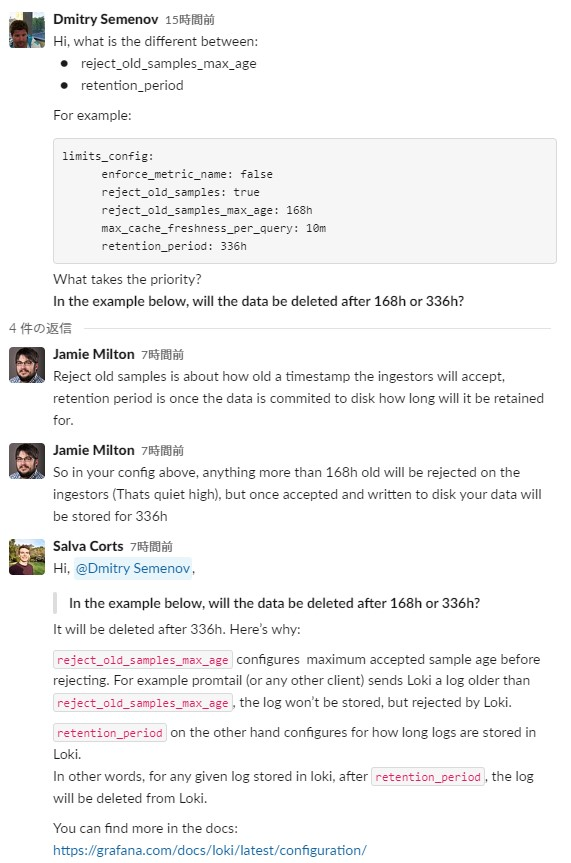
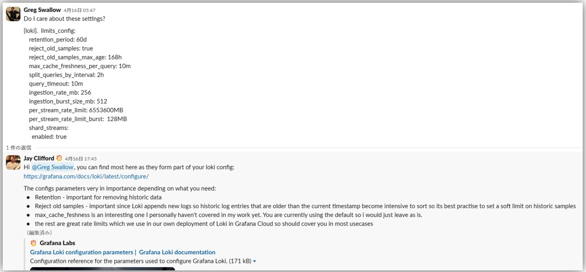
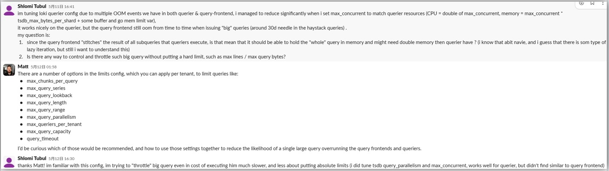

## Configuration best practice
- https://grafana.com/docs/loki/latest/configure/bp-configure/

---

## ingester
- 参考URL
  - https://grafana.com/docs/loki/latest/configuration/#ingester
  - https://grafana.com/docs/loki/latest/best-practices/#use-chunk_target_size
- 以下の3つがingesterからBackend(S3等)にflushされるタイミングに影響する設定  
  → この3つの値を大きくするとメモリ使用量も上がるので要注意
  - `chunk_target_size`
    - chunkがここに設定したsizeに達したらingesterがBackend(S3)にchunkをflushする
  - `max_chunk_age`
    - ここに指定した時間が経過したchunkをflushする
  - `chunk_idle_period`
    - ここに指定した時間の間、chunkに更新がない場合flushする

---

## `limit_config` block
- https://grafana.com/docs/loki/latest/configuration/#limits_config
- **`reject_old_samples_max_age`と`retention_period`の違いについて**


- `retention_period`はdefaultでは`0s`（期限なし）になっている
- `cardinality_limit`（defaultは 100000）は、a limit on the number of unique series (streams) that can be queried in index queries. In other words, `cardinality_limit` controls the maximum number of unique streams that can be returned by an index query, helping to prevent queries that would otherwise return an extremely large number of streams and potentially impact performance
  - seriesごとのラベル数の制限は`max_label_names_per_series`で設定
> [!TIP]  
> In the context of Loki, "an index query" refers specifically to a query that looks up data from the index, rather than scanning the raw log data itself. The index in Loki is built from the labels assigned to log streams, and index queries are used to quickly find which streams (unique combinations of labels) match certain criteria.
> 
> This is different from a general LogQL query, which may include both:
>  - An index lookup (to find matching streams based on label selectors), and
>  - A scan/filter of the actual log content within those streams (using filter expressions, regex, etc.).
>
> So, while every LogQL query that uses label selectors will perform an index query as part of its execution, the term "index query" is more narrowly focused on the part of the process that interacts with the index to find matching streams. Not all parts of a LogQL query are index queries—only the label selection portion is.
>
> For example, in the query:  
> ```shell
> {app="nginx"} |= "error"
> ```
> The `{app="nginx"}` part is the index query (finding streams with the label `app=nginx`), while the `|= "error"` part is a content filter applied to the log lines within those streams.
>
> This distinction is supported by the documentation, which describes the index gateway as handling and serving metadata queries—queries that look up data from the index, not the log content itself. [Index Gateway](https://grafana.com/docs/loki/latest/get-started/components/#index-gateway)
>
> In summary:  
>  - An "index query" in Loki means a query that looks up streams by their labels in the index.
>  - A LogQL query may include an index query as part of its execution, but also includes log content filtering and other operations.  
>  - The two terms are related, but not identical in meaning.

- `max_query_lookback`
  - 現在時刻を基準として、どれくらい前のデータ(ログ)まで確認(検索)できるようにするかの設定
  - defaultは`0s`で無効（制限なし）になってる
  - 例えば、データ(ログ)自体は180日分S3に保存されているとしても、`max_query_lookback`を`30d`にした場合、現在時刻から30日より過去のデータ(e.g. 40日前のログ)は検索できない
- `max_query_length`
  - 1回のクエリーでどれくらいの期間のログを検索できるようにするかの設定
  - defaultは`30d1h`になっている
  - 例えば、データ(ログ)自体は180日分S3に保存されているとしても、`max_query_length`を`30d`にした場合、1回のクエリーで30日分を超えるクエリーの発行はできない
    - OK
      - 1回のクエリーで40日前から10日前までのログ検索
      - 1回のクエリーで60日前から30日前までのログ検索
    - NG
      - 1回のクエリーで40日前から5日前までのログ検索
      - 1回のクエリーで70日前から30日前までのログ検索
- その他の設定について  
  
  

---

## `analytics` block
- defaultではLokiは利用状況と設定情報をGrafana Labsに送るようになっている
  - https://grafana.com/docs/loki/latest/configuration/#common
- `reporting_enabled`を`false`にすることでGrafana Labsへの情報転送を無効にすることができる
- 上記Grafanaドキュメントを見るとcommonブロックで指定しているように見えるが`analytics`ブロックで設定する必要がある  
  → https://sbcode.net/grafana/install-loki-service/
  ~~~yaml
  analytics:
    reporting_enabled: false
  ~~~