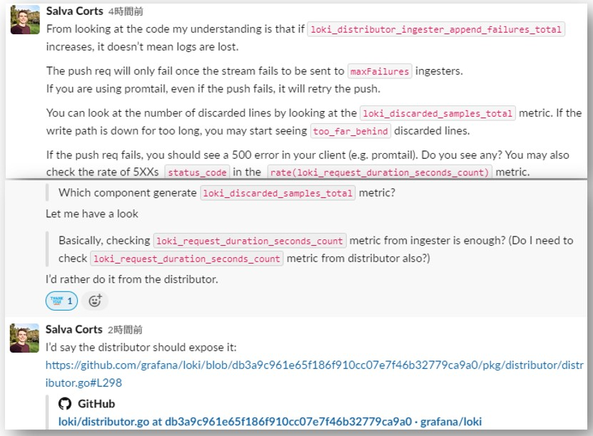

- **There are dashboards grafana labs uses available in the `dashboards` dir in the URL below**
  - https://github.com/grafana/loki/tree/main/production/loki-mixin

> [!NOTE]  
> ## Lokiが公開しているアラート設定一覧
> - https://github.com/grafana/loki/blob/main/operator/internal/manifests/internal/alerts/prometheus-alerts.yaml

# Observability
- Loki/promtailも自身に関するメトリクスを開示している
  - https://grafana.com/docs/loki/latest/operations/observability/
- Lokiのmetricsを収集するためのPrometheus設定
  - 以下はLokiと同じcluster内にPrometheusが存在する時の設定例
    ~~~yaml
    scrape_configs:
      - job_name: 'sos-loki'
        kubernetes_sd_configs:
        - role: endpoints
        relabel_configs:
        - source_labels: [__meta_kubernetes_pod_name]
          regex: ^sos-loki-distributed-(distributor|ingester|quer).+
          action: keep
        - source_labels: [__meta_kubernetes_pod_name]
          target_label: pod
        - source_labels: [__meta_kubernetes_pod_ip]
          regex: (.+)
          target_label: __address__
          replacement: ${1}:3100
    ~~~
- 役に立つメトリクス[^1]
  [^1]: https://taisho6339.gitbook.io/grafana-loki-deep-dive/monitoring

## Lokiの読み込みパフォーマンスを監視するためのメトリクス
- **`loki_request_duration_seconds`** (histogram)
  - HTTPリクエスト全体のレスポンスタイムを測定するメトリクス
  - LogQLクエリーだけのレスポンスタイムではなく、LokiのAPIサーバーがリクエストを受け取ってからレスポンスを返すまでの全体の時間を測定する
  - `route`ラベルでAPIの種類が分かる
    - `route="loki_api_v1_query_range"` → range query
    - `route="loki_api_v1_push"` → push log（loki形式）
- **`loki_logql_querystats_latency_seconds`** (histogram)  
  - **Query-frontendで記録される分割前のクエリー全体の所要時間（壁時計時間）**
  - `type`ラベルでクエリの種類が分かる
    - `type="filter"` → log query with filter (e.g. `{app="nginx"} |= "error"`)
    - `type="limited"` → log query without filter (e.g. `{app="nginx"}`)
    - `type="metric"` → metric query
- **`logql_query_duration_seconds`** (histogram)   
  - **Query-Frontendによって(default: 24時間単位で)分割された個々の(サブ)クエリーのレイテンシ**
  - `query_type`ラベルでクエリの種類が分かる
    - `query_type="range"` → range query
    - `query_type="instant"` → instant query

### その他のクエリ関連メトリクス
- `loki_logql_querystats_bytes_processed_per_seconds`
  - LogQLクエリの処理速度（バイト/秒）
- `loki_logql_querystats_chunk_download_latency_seconds`
  - チャンクダウンロードのレイテンシ
- `loki_logql_querystats_duplicates_total`
  - クエリ実行中に見つかった重複の総数
- `loki_logql_querystats_downloaded_chunk_total`
  - ダウンロードされたチャンクの総数
- `loki_logql_querystats_ingester_sent_lines_total`
  - Ingesterから送信された行の総数

> [!NOTE]  
> メトリクスからはどのクエリーが実行されたかまでは分からない。  
> 実行されたクエリーはLokiのログから確認する必要がある。  
> - **https://grafana.com/docs/loki/latest/operations/meta-monitoring/?utm_source=chatgpt.com#example-loki-log-line-metricsgo**
> - 1秒以上かかったクエリーをログから抽出する例（LogQL）  
> ```logql
> {service_name="loki"} | logfmt | query_type=~".+" | duration > 1s | line_format "●Query: {{.query}}\n●Query_Type: {{.query_type}}\n●Duration: {{.duration}}"
> ```

> [!CAUTION]  
> 上記のLogQLで確認するログはQuery-Frontendによって分割されたクエリーの実行ログで、`length`ラベルで分割されたクエリーの長さ(分割単位)が分かる。  
> 同じクエリーから分割されたクエリー実行ログは、同じ`query_hash`ラベルの値を持つ

## 共通
- `loki_memcache_request_duration_seconds_count`  
  → RPS (Memcached)
- `loki_memcache_request_duration_seconds_bucket`  
  → レイテンシー（Memcached）
  - PromQL例： `histogram_quantile(.99, sum(rate(loki_memcache_request_duration_seconds_bucket[$__rate_interval])) by (method, name, le, pod))`
- `loki_s3_request_duration_seconds_bucket`  
  → S3へのリクエストの応答(所要)時間。`operation`ラベルでS3に対するリクエストの種類(e.g. GET, PUT, DELETE)が分かる。  
  - PromQL例： `histogram_quantile(.95,sum(rate(loki_s3_request_duration_seconds_bucket[5m]))by(operation,le,pod,status_code))`
- `loki_s3_request_duration_seconds_count`  
  → S3へのリクエスト数。`operation`ラベルでS3に対するリクエストの種類(e.g. GET, PUT, DELETE)が分かる。

## Distributor
- `loki_distributor_lines_received_total` (counter)  
  → Distributorが受け付けたログ数(per tanant)
- `loki_distributor_bytes_received_total` (counter)  
  → Distributorが受信した圧縮前のlogのbytes  
  → **Lokiに連携されるlogのsizeを確認する時はこのmetric(すべてのdistributorのsum)から確認できそう**
  > The total number of uncompressed bytes received per both tenant and retention hours.  
  - **例えば1ヶ月(30日)分のログ(データ)量を確認したい場合は`sum(loki_distributor_bytes_received_total)`でGrafanaのTimeRangeを30日に設定して増加値を確認する**
- `loki_request_duration_seconds_count` (counter)  
  → Number of received HTTP requests.  
  → `status_code`5xx系のやつを注視
  - `auth_enabled: true`を設定したMulti-tenantモードのLokiにTenant ID(X-Scope-OrgID)が設定されてないデータが連携されると`status_code=401`がカウントされる。また、Client側では以下のような401エラーが出る。
    `server returned HTTP status 401 Unauthorized (401): no org id: errorString null`
- **`loki_discarded_samples_total`** (counter)  
  → rejected samples by reason  
  → distributorのRateLimitやvalidation checkで引っかかって破棄されたログ数  
  → `reason`ラベルに破棄された理由が入る（以下reasonの種類（参考: https://github.com/grafana/loki/blob/main/operator/docs/lokistack/sop.md#steps-5））  

    | Reason  | Description                                 | Corresponding Ingestion Limit Keys                 |
    |---------|---------------------------------------------|----------------------------------------------------|
    | `rate_limited` | This rate limit is enforced when a tenant has exceeded their configured log ingestion rate limit. | `ingestionRate`, `ingestionBurstSize`              |
    | `stream_limit`  | This limit is enforced when a tenant reaches their maximum number of active streams. | `maxGlobalStreamsPerTenant`                       |
    | `label_name_too_long` | If a sample is sent with a label name that has a length in bytes greater than Loki has been configured to allow, it will be rejected with the `label_name_too_long` reason. | `maxLabelNameLength`                            |
    | `label_value_too_long` | If a sample has a label value with a length in bytes greater than Loki has been configured to allow, it will be rejected for the `label_value_too_long` reason. | `maxLabelValueLength`                          |
    | `line_too_long` | This error occurs when a log line exceeds the maximum allowable length in bytes. The HTTP response will include the stream to which the offending log line belongs as well as its size in bytes. | `maxLineSize`                                      |
    | `max_label_names_per_series` | If a sample is submitted with more labels than Loki has been configured to allow, it will be rejected with the `max_label_names_per_series` reason. Note that ‘series’ is the same thing as a ‘stream’ in Loki - the ‘series’ term is a legacy name. | `maxLabelNamesPerSeries`         |
    | `per_stream_rate_limit` | This limit is enforced when a single stream reaches its rate limit. | `perStreamRateLimit`, `perStreamRateLimitBurst` |

  → **https://grafana.com/docs/loki/latest/operations/request-validation-rate-limits/** ⭐️  
    → 各reasonの意味が詳しく書いてあるので必ず確認！
- `loki_distributor_ingester_append_failures_total` (counter)  
  → The total number of failed batch appends sent to ingesters.  
    > **Note**  
    > このMetricsはLogの喪失を意味しているわけではない  
    > その他の必要最低限数のIngesterにPushできていればLogは喪失されない  
    > 万が一必要最低限数のIngesterにPushできなかった場合はPromtailが再送する
    
> [!WARNING]  
> 2025/06/09  
> `loki_distributor_ingester_append_failures_total`メトリクスは、**`loki_distributor_ingester_append_timeouts_total`メトリクスに置き換わった**  
> https://github.com/grafana/loki/pull/10456

  　→ githubのソースコード[pkg/distributor/distributor.go](https://github.com/grafana/loki/blob/db3a9c961e65f186f910cc07e7f46b32779ca9a0/pkg/distributor/distributor.go)から確認できる  
    - **`sendStreamsErr`Methodの`d.ingesterAppendFailures.WithLabelValues(ingester.Addr).Inc()`で`loki_distributor_ingester_append_failures_total`Metricsをカウントしている  
      `sendStreams`Methodのコメントに書いてある通り、`loki_distributor_ingester_append_failures_total`が発生しても必要最低限のingesterにpushできれば問題なさそう**  
      ~~~go
      func (d *Distributor) sendStreams(ctx context.Context, ingester ring.InstanceDesc, streamTrackers []*streamTracker, pushTracker *pushTracker) {
          err := d.sendStreamsErr(ctx, ingester, streamTrackers)

          // If we succeed, decrement each stream's pending count by one.
          // If we reach the required number of successful puts on this stream, then
          // decrement the number of pending streams by one.
          // If we successfully push all streams to min success ingesters, wake up the
          // waiting rpc so it can return early. Similarly, track the number of errors,
          // and if it exceeds maxFailures shortcut the waiting rpc.
          //
          // The use of atomic increments here guarantees only a single sendStreams
          // goroutine will write to either channel.
          for i := range streamTrackers {
              if err != nil {
                  if streamTrackers[i].failed.Inc() <= int32(streamTrackers[i].maxFailures) {
                      continue
                  }
                  if pushTracker.streamsFailed.Inc() == 1 {
                      pushTracker.err <- err
                  }
              } else {
                  if streamTrackers[i].succeeded.Inc() != int32(streamTrackers[i].minSuccess) {
                      continue
                  }
                  if pushTracker.streamsPending.Dec() == 0 {
                      pushTracker.done <- struct{}{}
                  }
              }
          }
      }

      func (d *Distributor) sendStreamsErr(ctx context.Context, ingester ring.InstanceDesc, streams []*streamTracker) error {
          c, err := d.pool.GetClientFor(ingester.Addr)
          if err != nil {
              return err
          }

          req := &logproto.PushRequest{
              Streams: make([]logproto.Stream, len(streams)),
          }
          for i, s := range streams {
              req.Streams[i] = s.stream
          }

          _, err = c.(logproto.PusherClient).Push(ctx, req)
          d.ingesterAppends.WithLabelValues(ingester.Addr).Inc()
          if err != nil {
              d.ingesterAppendFailures.WithLabelValues(ingester.Addr).Inc()
          }
          return err
      }
      ~~~
- `loki_write_failures_logged_total`、`write_failures_discarded_total`  
  > - "The total number of write failures logs successfully emitted for a tenant."
  > - The total number of write failures logs discarded for a tenant.
  - 具体的にどういうときに出すものか要確認

## Ingester
- `loki_ingester_chunks_flushed_total` (counter)  
  → どの要因でflushされたか、以下の`reason`ごとにflushされた件数  
   ・`full` → `chunk_target_size`の条件を満たしてflushされたもの  
   ・`idle` → `chunk_idle_period`の条件を満たしてflushされたもの  
   ・`max_age` → `max_chunk_age`の条件を満たしてflushされたもの  
- `loki_ingester_wal_corruptions_total` (counter)  
  → Ingester再起動によるWALのデータ復元時、WALが部分的に破損/削除が発生した件数  
  → https://grafana.com/docs/loki/latest/operations/storage/wal/#disclaimer--wal-nuances
- `loki_ingester_wal_disk_full_failures_total` (counter)  
  → WALで使っているストレージ(EBS等)の空き容量がなくなり、WALへの書き込みが失敗した場合  
  → WALへの書き込みが失敗してもLoki(Ingester)への書き込み自体は失敗しない  
    > In the event the underlying WAL disk is full, Loki will not fail incoming writes, but neither will it log them to the WAL. In this case, the persistence guarantees across process restarts will not hold.  
- `loki_ingester_wal_records_logged`  
  → Counter for WAL records logged
- `loki_ingester_wal_logged_bytes_total` (counter)  
  → Total bytes written to WAL

  → https://grafana.com/docs/loki/latest/operations/storage/wal/#disclaimer--wal-nuances
- `loki_ingester_memory_chunks`  
  → The total number of chunks in memory.
- `loki_ingester_memory_streams`  
  → The total number of streams in memory.
  → `loki_ingester_memory_chunks`と違い、`tenant`ラベルでTenantごとのStream数を把握できる
  → Stream数が多すぎるとChunkサイスが小さくなり検索パフォーマンスが落ちる
- `loki_chunk_store_deduped_chunks_total`  
  → The metric is incremented whenever a chunk is sent to flush but is already found in the chunk cache (meaning it has already been successfully flushed)  
  - https://github.com/grafana/loki/issues/5194

## promtail
- `promtail_sent_entries_total` (counter)  
  → promtailがingesterに送ったログ数
- `promtail_dropped_entries_total` (counter)  
  → promtailが設定されているすべてのretry回数内にingesterへの送信に失敗した(dropされた)ログ数