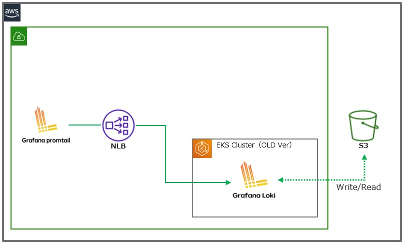
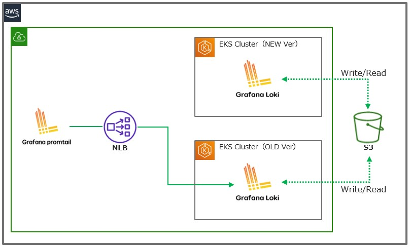
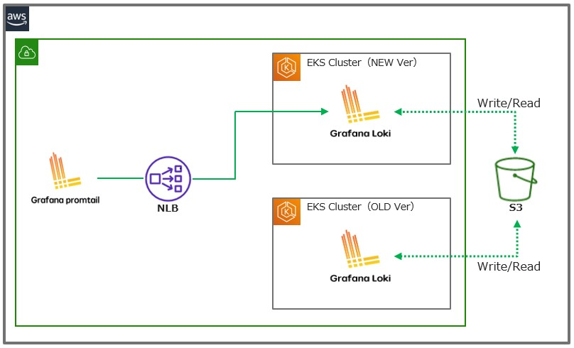
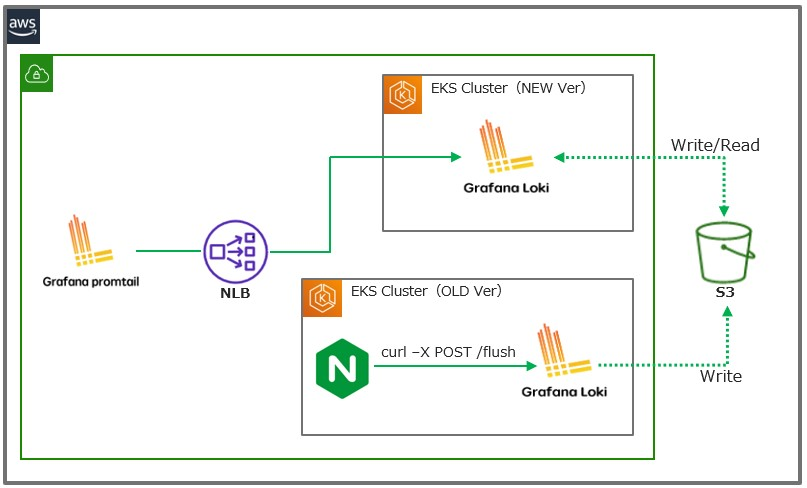
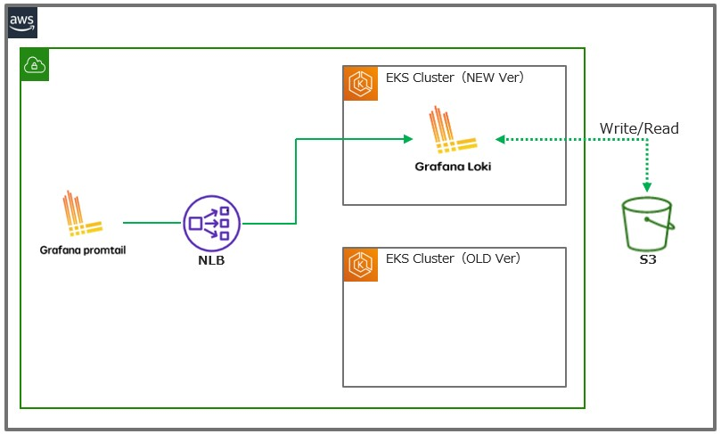
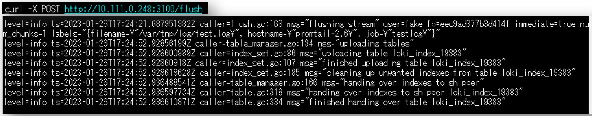
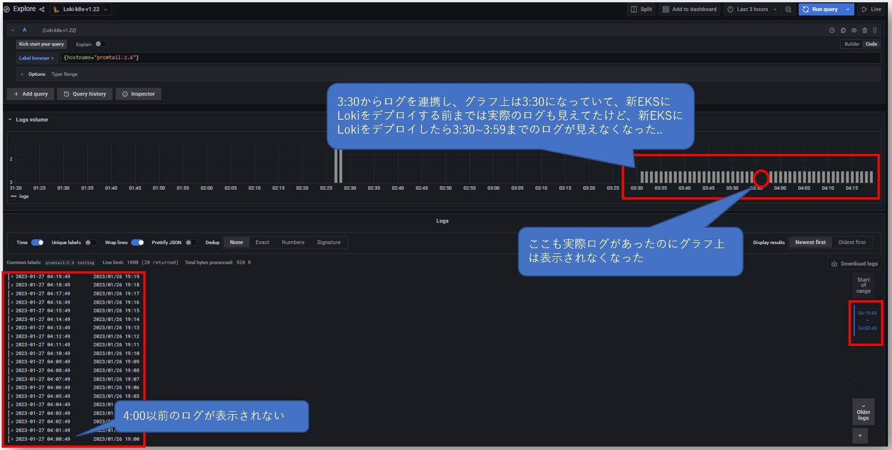
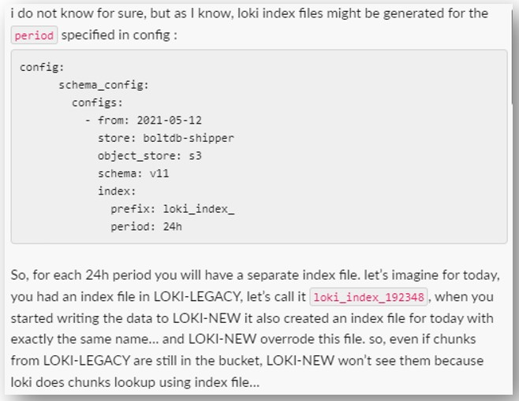

## Migration between k8s clusters (for k8s cluster VerUp)
### 背景
- AWS EKS上にLokiをmicroservice modeとして動かしていて、  
  EKSバージョンアップ(1.22 → 1.24)のためLokiの移行方法を確認する必要があった

### 構成
- Lokiバージョンは2.7.1
- Helmでmicroservice modeとしてインストール
  - https://github.com/grafana/helm-charts/tree/main/charts/loki-distributed
- EKSバージョンアップに備えてEKSクラスターと独立したNLBを利用
- cacheはElastiCache(redis)を利用

### 最初に考えた方法
- 移行中も継続的にログを受信できるよう、  
  新EKSクラスターに先にLokiをデプロイしてから移行する方式を検討
1. Cluster VerUp前  

2. 新EKSクラスターにLokiをデプロイ

3. NLB Target Groupに新EKSクラスター上のLokiを登録

4. NLB Target Groupから旧EKSクラスター上のLokiを解除

5. 旧EKSクラスター上のIngesterのメモリにあるflushされてないindexとchunkをflush

6. 旧EKSクラスター上のLokiを削除

> [!Note]  
> Ingesterにindexとchunkをflushするエンドポイント`/flush`がある  
> https://grafana.com/docs/loki/latest/api/#flush-in-memory-chunks-to-backing-store  
> 以下は`/flush`エンドポイントにPOSTを投げた時のingesterのログ
> 

> [!Note]  
> 2025/05/27 Update  
> - https://grafana.com/docs/loki/latest/reference/loki-http-api/
> - `/flush`以外に`/ingester/prepare_shutdown`、`/ingester/shutdown`エンドポイントも追加されている
>   - ただ、Ingester内部のchunkをバックエンドにflushするだけなら、`/flush`エンドポイントで良い（と思う）

### 上記の方法で起きたこと
- 一部のログが表示されなくなった

- 新EKS上のLokiと旧EKS上のLoki両方のIngesterからindexが生成され、どっちかのindexが上書きされてしまい、  
  chunk(ログ)は存在しててもindexが失われて見れない可能性が高い(とのこと)

## 最終的にとった方法
1. NLB Target Groupから旧EKSクラスター上のLokiを解除
2. 旧EKS上のloki-gateway(nginx) Podを削除
   - NLB Target Groupからの解除だけでは、promtailから旧EKS上のLokiへのセッションが切れず、  
     旧Lokiへログが連携され続けたため、明示的にloki-gateway Podを削除した
3. 旧EKSクラスター上のIngesterに`/flush`を送る
4. flushされるまでしばらく待ち、旧EKS上のLokiを削除する
5. 新EKSクラスターにLokiをデプロイ
6. NLB Target Groupに新EKSクラスター上のLokiを登録
> **Warning**  
> 上記方式では移行中ログ受信ができず、ログ欠損につながる恐れがあるため、  
> promtailの`backoff_config.max_retries`をdefaultの10より高く(20くらい?)設定して  
> 移行中に受信できなかったログをretryで拾えるようにしておく  
> https://grafana.com/docs/loki/latest/clients/promtail/configuration/#clients  
> ただ、directでLokiの`/loki/api/v1/push`にAPIでログを送っている場合は、  
> retryする仕組みを取り入れるなど、ログが失われないようにすること