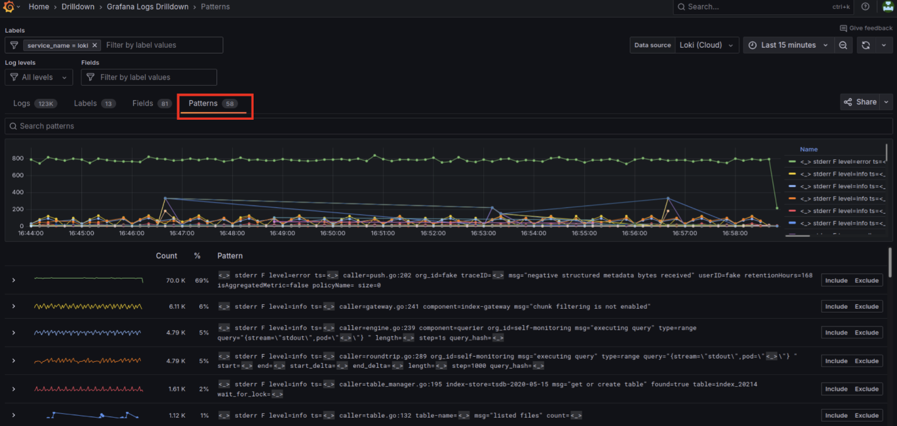
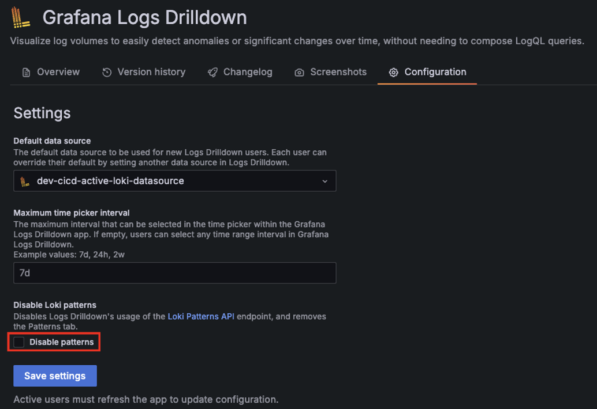
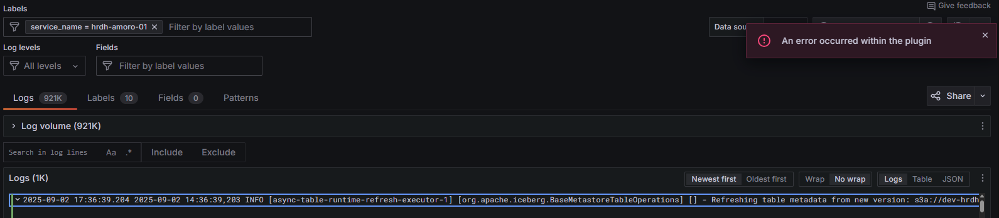

- **参考URL**
  - https://grafana.com/docs/loki/latest/reference/loki-http-api/#patterns-detection
  - https://grafana.com/docs/grafana/latest/explore/simplified-exploration/logs/patterns/

# Patterns detectionとは
- 複数のログからパターンを検出する機能  
  > This helps understand the structure of the logs Loki has ingested.
  - https://grafana.com/docs/grafana/latest/explore/simplified-exploration/logs/patterns/
- 専用のAPIエンドポイント `/loki/api/v1/patterns` が用意されている
  - https://grafana.com/docs/loki/latest/reference/loki-http-api/#patterns-detection
  - curl例  
    ```shell
    curl -v -s -H "X-Scope-OrgID:<tenant名>" "http://<LokiのQuery FrontendのIP/アドレス>:3100/loki/api/v1/patterns" \
    --data-urlencode 'query={app="loki"}' | jq
    ```

# Patterns detectionを使うために必要な設定
- https://grafana.com/docs/grafana/latest/explore/simplified-exploration/logs/access/ # Log Drilldown

- 設定例  
  > Enable pattern ingestion by setting `pattern-ingester.enabled` to `true` in your Loki configuration file.
  >
  > Enable structured metadata by setting `allow_structured_metadata` to `true` within your Loki configuration file.
  >
  > Enable the volume endpoint by setting `volume_enabled` to `true` within your Loki configuration file.  
  ```yaml
  pattern_ingester:
    enabled: true
  limits_config:
    allow_structured_metadata: true
    volume_enabled: true
  ```

# Log DrilldownでのPatterns detectionの使い方
- Drilldown → Logs画面を開く
- Patternsタブを開く
  

# Patterns detectionの無効化
- 「Grafana Logs Drilldown」Plugin設定で、`Disable Loki patterns`の`Disable patterns`にチェックを入れる  
  
  - Log Drilldownで「Patterns」タブが非表示になる

# Log Drilldown関連トレブルシューティング
- https://github.com/grafana/loki/issues/19092
- https://grafana.com/docs/grafana/latest/explore/simplified-exploration/logs/troubleshooting/

## pattern APIでLokiから `empty ring`（５００）エラーが出る
- 事象
  - GrafanaのLog Drilldownで以下のように「An error occurred within the plugin」エラーが出る（ログは正常に表示される）  
    
    - Grafanaから以下のエラーログが出る  
      ```shell
      logger=context <中略> level=error msg="Request Completed" method=GET path=/api/datasources/uid/depf6carbrytce/resources/patterns status=500 <中略> referer="https://grafana.com/a/grafana-lokiexplore-app/explore/service/unknown_service/logs?displayedFields=%5B%5D&from=now-15m&patterns=%5B%5D&prettifyLogMessage=false&sortOrder=%22Descending%22&timezone=browser&to=now&urlColumns=%5B%5D&var-all-fields=&var-ds=depf6carbrytce&var-fields=&var-filters=service_name%7C%3D%7Cunknown_service&var-jsonFields=&var-levels=&var-lineFilterV2=&var-lineFilters=&var-lineFormat=&var-metadata=&var-patterns=&visualizationType=%22logs%22&wrapLogMessage=false" handler=/api/datasources/uid/:uid/resources/* status_source=downstream errorReason=InternalError errorMessageID=plugin.requestFailureError error="client: failed to call resources: empty ring"
      ```
    - Lokiからも以下のようなエラーログが出る  
      ```shell
      level=warn <中略> msg="GET /loki/api/v1/patterns?end=2025-11-13T03%3A05%3A20.473Z&query=%7Blog_emitter%3D%22alloy%22%7D&start=2025-11-13T02%3A35%3A20.473Z&step=5s (500) 3.758977ms Response: \"empty ring\"
      ```
  - 直接CurlでQuery Frontendの`/loki/api/v1/patterns`エンドポイントに対してクエリーを投げたら以下のようなエラーが出た  
    ```shell
    curl -v -s -H "X-Scope-OrgID:plat" "http://10.23.4.246:3100/loki/api/v1/patterns" --data-urlencode 'query={service_name="alloy"}'

    *   Trying 10.23.4.246:3100...
    * Connected to 10.23.4.246 (10.23.4.246) port 3100
    > POST /loki/api/v1/patterns HTTP/1.1
    > Host: 10.23.4.246:3100
    > User-Agent: curl/8.5.0
    > Accept: */*
    > X-Scope-OrgID:plat
    > Content-Length: 38
    > Content-Type: application/x-www-form-urlencoded
    > 
    < HTTP/1.1 500 Internal Server Error
    < Content-Type: text/plain; charset=utf-8
    < X-Content-Type-Options: nosniff
    < Date: Thu, 13 Nov 2025 06:29:34 GMT
    < Content-Length: 10
    < 
    * Connection #0 to host 10.23.4.246 left intact
    empty ring
    ```
- 原因
  - 必要な設定は全部しているのに出ていて、Loki側のBugの可能性もある？
    - https://github.com/grafana/loki/issues/19092
- 対処
  - 「Grafana Logs Drilldown」Plugin設定で、Disable Loki patternsのDisable patternsにチェックを入れて無効化した