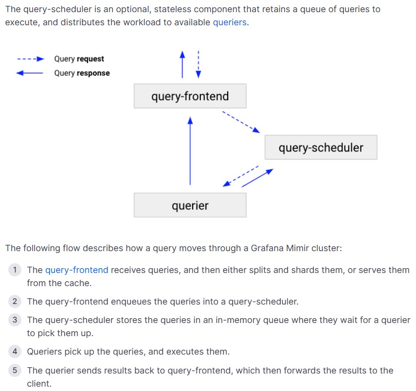

## query-schedulerとは
- query-frontendが持つqueryのqueueを代わりに保持し、query-frontendの負荷を軽減する  
  > The query-scheduler is an optional, stateless component that retains a queue of queries to execute, and distributes the workload to available queriers.
  
- query-schedulerは**Stateless**
- 参考URL
  - https://grafana.com/docs/loki/latest/operations/scalability/
  - **https://grafana.com/docs/mimir/latest/references/architecture/components/query-scheduler/**
  - https://grafana.com/docs/mimir/latest/references/architecture/components/query-frontend/#why-query-frontend-scalability-is-limited

## query-schedulerを使う際の注意点
1. `querier`と`query-frontend`にquery-schedulerアドレスを知らせる
   - query-schedulerを動かす場合、`querier`と`query-frontend`がquery-schedulerのアドレスを知っていてアクセスする必要がある。  
  そのためにはconfigファイルにて`frontend.scheduler_address`(query-frontend)と`frontend_worker.scheduler_address`(querier)でquery-schedulerのアドレスを指定する必要がある
      > To run with the Query Scheduler, the frontend needs to be passed the scheduler’s address via `-frontend.scheduler-address` and the querier processes needs to be started with `-querier.scheduler-address` set to the same address. Both options can also be defined via the configuration file.

    > **Warning**
    > - **`frontend_worker.scheduler_address`を指定した場合は`frontend_worker.frontend_address`の指定は外すこと！**  
    > >It is not valid to start the querier with both a configured frontend and a scheduler address.
   - Helmでdistributed chartでデプロイしている場合は`<Helmリソース名>-loki-distributed-query-scheduler`でServiceが作成されるので、`tsdb_shipper.index_gateway_client.server_address`に`<Helmリソース名>-loki-distributed-query-scheduler.<NameSpace>.svc.cluster.local:9095`を設定
#### frontend_worker
- `frontend_worker`はquerierの中で実行されるworkerでquery-frontend(もしくはquery-scheduler)からqueryを取り出して検索処理を行う  
  > The `frontend_worker` configures the worker - running within the Loki querier - picking up and executing queries enqueued by the query-frontend.

## query-schedulerのメトリクスを使ったquerierのHPA
- 以下のURLに書いてあるquerierのHPAの設定のためにquery-frontendとは別で`query-scheduler`を動かす必要がある
  - https://grafana.com/docs/loki/latest/operations/autoscaling_queriers/
- query-schedulerは`cortex_query_scheduler_inflight_requests`というqueryのqueue数とquerierによって処理中のqueries数の合計を表すメトリクスを開示する。これを使ってquerierのHAP設定を行う  
  > The query-scheduler exposes the cortex_query_scheduler_inflight_requests metric. It tracks the sum of queued queries plus the number of queries currently running in the querier workers. The following query is useful to scale queriers based on the inflight requests.

### `querier.max_concurrent`について
- `querier`の中に動いているworkerの数
- `querier`の中に`querier.max_concurrent`の数の分workerが動いてて、各workerは1つの`query-frontend`に接続してqueryを取り出してquery処理を実行する
  > When you don’t use the query-scheduler, the query-frontend stores a queue of queries to execute. A querier runs -querier.max-concurrent workers and each worker connects to one of the query-frontend replicas to pull queries to execute. A querier worker executes one query at a time.
  >
  > The connection between a querier worker and query-frontend is persistent. After a connection is established, multiple queries are delivered through the connection, one by one. To balance the number of workers connected to each query-frontend, the querier workers use a round-robin method to select the query-frontend replicas to connect to.
  >
  > If you run more query-frontend replicas than the number of workers per querier, the querier increases the number of internal workers to match the query-frontend replicas. This ensures that all query-frontends have some of the workers connected, but introduces a scalability limit because the more query-frontend replicas you run, the higher is the number of workers running for each querier, regardless of the configured -querier.max-concurrent.
  >
  > The query-scheduler is an optional component that you can deploy to overcome the query-frontend scalability limitations.
- https://grafana.com/docs/mimir/latest/references/architecture/components/query-frontend/#why-query-frontend-scalability-is-limited