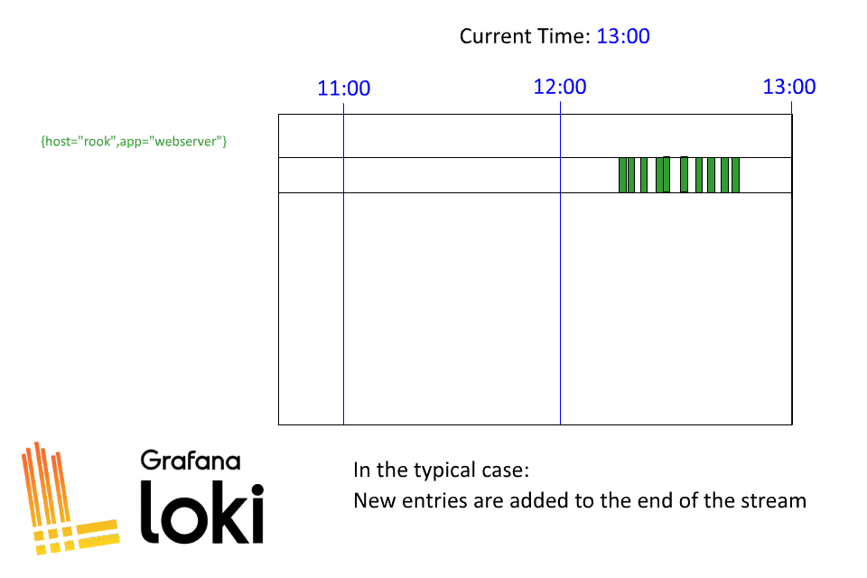
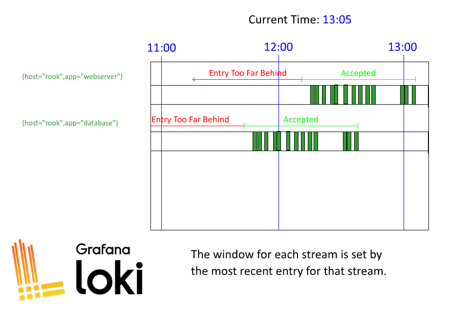

- 参考URL
  - **https://grafana.com/blog/2024/01/04/the-concise-guide-to-loki-how-to-work-with-out-of-order-and-older-logs/**  
    
    
  - https://grafana.com/docs/loki/latest/configure/#accept-out-of-order-writes  
    > How far into the past accepted out-of-order log entries may be is configurable with `max_chunk_age`. `max_chunk_age` defaults to 2 hour. Loki calculates the earliest time that out-of-order entries may have and be accepted with  
    > ```shell
    > time_of_most_recent_line - (max_chunk_age/2)
    > ```
    > Log entries with timestamps that are after this earliest time are accepted. Log entries further back in time return an out-of-order error.
    >
    > **For example, if `max_chunk_age` is 2 hours and the stream `{foo="bar"}` has one entry at `8:00`, Loki will accept data for that stream as far back in time as `7:00`. If another log line is written at `10:00`, Loki will accept data for that stream as far back in time as `9:00`.**
  - https://community.grafana.com/t/getting-entry-too-far-behind-even-if-reject-old-samples-and-reject-old-samples-max-age-should-allow/146706  
    > When you already have logs in a log stream `reject_old_samples_max_age` is irrelevant. When you try to write older logs into a log stream (log stream defined as logs with the same set of labels) that already has newer data then it’s considered out-of-oder writes. Loki has a limit of (`max_chunk_age/2`) when it comes to out-of-order write, and with default 2h of max chunk age that comes down to 1 hour. Essentially, if you have logs in a log stream, the oldest data you can write to the same stream is something 1 hours older than the latest log.

---

## `reject_old_samples_max_age`と`max_chunk_age`による、`greater_than_max_sample_age`エラーと`too_for_behind`(または`out_of_order`)エラー
- `reject_old_samples`は`true`に設定されている前提
- **まず、Lokiにログが連携されると、そのログのTiemstampが`reject_old_samples_max_age`(default:`1w`)の設定より古くないか確認され、それより古かったら`reason`labelが`greater_than_max_sample_age`になっている`loki_discarded_samples_total`と`loki_discarded_bytes_total`メトリクスCountが増える。  
  `greater_than_max_sample_age`より前のログの場合、該当Log Streamが存在するか確認し、存在しなかったら新しいLog Streamが生成される。もしすでに該当のStream（同じLabel Setのログ）が存在する場合、連携されてきたログのTimestampを確認し、`(Streamの中ですでに存在する一番新しいログのTimestamp - 連携されてきたログのTimestamp) < (max_chunk_age/2)`になっているかチェックする。もし、`(Streamの中ですでに存在する一番新しいログのTimestamp - 連携されてきたログのTimestamp) > (max_chunk_age/2)`の場合、`reason`labelが`too_far_behind`になっている`loki_discarded_samples_total`と`loki_discarded_bytes_total`メトリクスCountが増える。**
- **https://grafana.com/docs/loki/latest/operations/request-validation-rate-limits/**

---

## 古いログは連携はできてもすぐには見れない
- 古いログでもしばらくはIngesterの中に保存される。しかし、`query_ingesters_within`で設定している時間（default: `3h`）内のクエリーのみIngesterに確認しに行くので、それより前の古いIngester内のログはS3にFlushされるまでは見ることができない。
  - https://grafana.com/blog/2024/01/04/the-concise-guide-to-loki-how-to-work-with-out-of-order-and-older-logs/  
  > There is an important consideration to be aware of when ingesting older data into Loki. Specifically, if you want Loki to ingest data older than two hours from the current time, this data will not be immediately queryable.
  >
  > This is because of the configuration we mentioned in the last section: `query_ingesters_within`. Perhaps it’s a somewhat confusingly named configuration, but it essentially means “only query ingesters within this time window from the current time.” The default here is three hours; any query for data within three hours of the current time will be sent to the ingesters, anything outside that window will not.
  >
  > Loki is built this way because we know the `max_chunk_age` an ingester will allow is two hours. Therefore, we can save significant wear and tear on the ingesters by not asking them for data we know they won’t have. In other words, if you run a query for logs from yesterday, we don’t ask the ingester for them because it shouldn’t have logs from yesterday.
  >
  > The problem you may see here is that if you are sending Loki logs from yesterday, then those logs are in the ingester until they are flushed to storage (which is at most two hours). Until they are flushed, they will not return in a query result.
  >
  > You could change this configuration value to something larger, like 48 hours, so you can query your logs from yesterday as they are ingested today. But I really advise against this as you will be forcing Loki to query the ingesters for all queries within 48 hours. This forces your ingesters to do much more work, making them more expensive to operate. It also hurts performance in the normal scenario where they won’t have any data beyond two hours.
  >
  > If you are ingesting old data for backfill operations, I suggest just waiting the two hours for everything to flush. If you have a normal operation where you are ingesting older logs and don’t like waiting, then you might consider changing `query_ingesters_within`, but realize this may have some negative operational tradeoffs on cost and performance.

- 解決策としては`max_chunk_age`で設定している2時間待つか、ingesterの`/flush`エンドポイントにリクエストを投げて強制的にFlushさせるか、`query_ingesters_within`の値を修正するか
> [!CAUTION]  
> `query_ingesters_within`の値を上げるのは無駄にingesterに確認しに行く処理が発生するため、Cost & Performanceの観点で望ましくない。なので、本当に必要なのか要注意