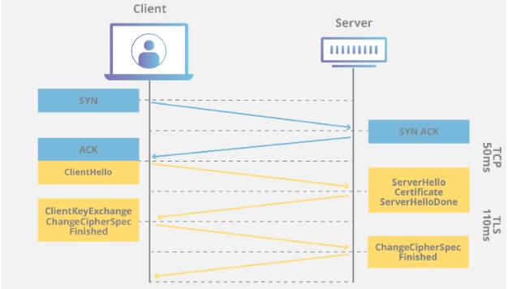
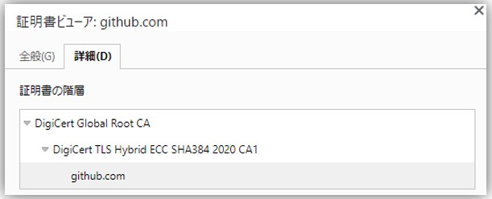

##### 参照URL
- https://blog.naver.com/alice_k106/221468341565 （KR）
- https://www.ssl.com/ko/%EC%9E%90%EC%A3%BC-%EB%AC%BB%EB%8A%94-%EC%A7%88%EB%AC%B8/%EC%9D%B8%EC%A6%9D-%EA%B8%B0%EA%B4%80%EC%9D%B4%EB%9E%80-%EB%AC%B4%EC%97%87%EC%9E%85%EB%8B%88%EA%B9%8C/ （KR）
- https://go-journey.club/archives/7519
- **https://www.digicert.co.jp/welcome/pdf/wp_sslandroot-certificate.pdf**

##### その他
- PKI (Public Key Infrastructure)とは、公開鍵暗号方式に基づいて、電子署名や相手認証等を実現するための技術基盤
- 現在はTLS 1.3が主流
- 共通鍵暗号方式(対称鍵暗号方式)の方が公開鍵暗号方式(非対称鍵暗号方式)より処理速度が早い。  
  なのでTLS handshakeにて最初に公開鍵暗号方式でサーバ/クライアント間で共通鍵を生成/交換した後、実際のデータのやり取り時は共通鍵を使って暗号化/復号化を行う。
- Root証明書 = CA(認証局)の公開鍵
- 暗号化/復号化は公開鍵/秘密鍵どちらでもできる
  - 公開鍵で暗号化して秘密鍵で復号化、秘密鍵で暗号化して公開鍵で復号化、どちらも可
- SSL/TLS証明書 = デジタル証明書 = 電子証明書

##### Hash関数
- 一方向性(不可逆変換)関数
  - inputからoutputを出すことはできるけど、outputからinputを導き出すことはできない(難しい)関数
- いかなる長さのデータを入力しても(inputデータ短くても長くても)固定長の擬似乱数データを出力(output)する関数
- データの完全性(データが改ざんされてないこと)を確認するのに良く使われる
- Hash関数で得られた値をHash値(もしくはMD(Message Digest))という

## ディジタル証明書(SSL/TLS証明書)の発行からディジタル証明書を使った通信の流れ
#### ディジタル証明書(SSL/TLS証明書)の発行
1. まずサーバ(事業者)側で秘密鍵/公開鍵を生成する
2. 使用したいドメイン(ex. amazon.com)と公開鍵をCA(認証局)に送ってディジタル証明書を要請する
3. CAは事業者を検証し本当にその事業者からの要請か確認してから、ディジタル証明書を生成して自身(CA)の秘密鍵でディジタル証明書のHash値を署名(暗号化)する
   - このディジタル証明書には**1.ドメイン(ex. amazon.com)などの情報**と**2.サーバ(事業者)の公開鍵**と**3.CAの秘密鍵で暗号化された1.+ 2.のHash値**が含まれる
   - ディジタル証明書の形式(規格)が`X.509`
   - ディジタル証明書の有効期限は6ヶ月~1年程度
#### ディジタル証明書を使った通信の流れ（TLS handshake）
1. クライアントがWebサイト(ex. amazon.com)に接続するとサーバからディジタル証明書(サーバ証明書)が送られる
2. ディジタル証明書を受け取ったクライアントはブラウザに内蔵されている(またはWindowsに保存されている)該当CAの公開鍵(Root証明書)でディジタル証明書の中のHash値を復号化し、再計算したHash値と一致することを確認することでディジタル証明書が改ざんされてないこととその証明書が該当CAによって署名/発行されたことを確認する
   > **Note**  
   > 各ブラウザには信頼できるCAのリストと各CAの公開鍵(Root証明書)が内蔵されている  
   > ※*各CAから公開鍵(Root証明書)をダウンロードしてブラウザに登録することもできる（オンプレ上のブラウザ等）*
   - *CAの公開鍵(Root証明書)も定期的に再発行される。そうなると既存のRoot証明書は使えないのでRoot証明書を更新する必要がある。ただ、Windows UpdateでWindows内のRoot証明書が更新されるので普通は気にすることはないけど、Internetに繋がってない(Windows Updateを行わない)Windows環境では手動で該当CAサイトからRoot証明書をダウンロードしてWindowsにImportする必要がある*
   - 
3. クライアントは任意のデータをサーバに送る
4. サーバはクライアントから送られてきた任意のデータを自身の秘密鍵で暗号化してクライアントに返す
5. クライアントはサーバのディジタル証明書に含まれている公開鍵でデータを復号化し、復号化できれば通信相手が偽物ではないことを確認できる
6. クライアントは共通鍵を生成して、ディジタル証明書に含まれている公開鍵で暗号化しサーバに送る
7. サーバはクライアントから送られてきた暗号化されてる共通鍵を自身の秘密鍵で復号化する
   > **Note**  
   > クライアントが生成した共通鍵を**Session Key**とも呼ぶ
8.  以降クライアントとサーバはこの共通鍵(Session Key)を使ってデータを暗号化/復号化してやり取りをする

    ##### TLS handshakeについて
    - 参照URL
        - https://www.cloudflare.com/ja-jp/learning/ssl/what-happens-in-a-tls-handshake/
    - TLS handshakeはTLS暗号化を使った通信セッションを始めるプロセス
    - TLS handshakeの間通信する二者がメッセージをやり取りして互いを認識し、検証し、使用する暗号化アルゴリズムを決定し、Session Keyについて合意する
    - 使用するTLSのバージョン（TLS 1.2、1.3など）を指定
    - 使用する暗号スイート[^1]を決定
    - サーバー公開鍵とSSL証明書認証局のデジタル署名を介して、サーバーのIDを認証
    - handshake完了後に対称暗号化[^2]に使うためのSession Keyを生成  
    [^1]:鍵交換や暗号化方式、ハッシュ関数など暗号化通信に使われる各種アルゴリズムの組合せ
    [^2]:対称暗号化方式 ⇒ 共通鍵暗号方式  
    非対称暗号化方式 ⇒ 公開鍵暗号方式
    - TLS handshakeはTCP handshakeでTCP接続が開かれた後に行われる
    

#### ディジタル証明書の種類
- 証明書は持ち主をどこまで証明するかによって3つに分類される
- DV → OV → EVの順で証明する内容が多くなり、信頼性・証明書価格も高くなる

1. **ドメイン認証(DV)**
    - ドメインの所有者と、SSL証明書の申請者が一致していることを証明

2. **企業実在認証・組織認証(OV)**
    - ドメイン認証に加えて、企業が実在していることを証明

3. **EV認証(EV)**
    - 上記2つの認証に加えて更に厳格な審査を受ける

## 中間証明書(中間CA証明書)/について
- 原則SSL/TLS証明書は以下のように階層構造になっている
  
  - 最上位が **「Root証明書」**、中間が **「中間証明書」**、  
    最下位のドメインに紐づくものが　**「サーバ証明書」**
- 認証局(CA)は「Root認証局」と「中間認証局」に二分できる
- **Root認証局**
  - 自分の正当性を自分自身で証明できて、他の認証局に証明書を発行できる最上位の認証局
- **中間認証局**
  - 自分の正当性を自分自身で証明することができず、上位認証局からの認証を受ける必要がある
  - Root証明書で署名されたのが**中間証明書**で、中間認証局の公開鍵が含まれている
- 中間証明書は通常SSL/TLS証明書の発行元(のWebサイトなど)から入手できる
- **Webサーバ側にサーバ証明書と一緒に中間証明書もインストール(設定)しておく必要がある**
  - Root証明書はすでにクライアント(ブラウザやOS)に登録されているため、Webサーバにインストールする必要がない
- **サーバ証明書は中間認証局の秘密鍵で署名(Hash化)される**
- クライアントは **(1)サーバ証明書 → (2)中間証明書 → (3)Root証明書** の順で確認(検証)する
- 参考URL
  - **https://ssl.sakura.ad.jp/column/difference-in-ssl/**
  - https://www.ssl-secure.jp/news/20170605/
  - https://www.f5.com/ja_jp/glossary/intermediate-certificate
    > SSLで通信を行う際には、Webサイト（Webサーバ）は事前に認証局からSSLサーバ証明書という電子証明書を発行してもらい、これを通信相手のクライアントに送る必要がありますが、これに加えて認証局の証明書も一緒に送る必要があります。そのため、SSLサーバ証明書を発行してもらう際には、認証局から「中間証明書」も受け取り、Webサーバにインストールしておく必要があります。
    > 
    > クライアントはこれらの証明書の階層構造をチェックし、ルート証明書の正当性を確認することで、SSLサーバ証明書が正当なものであると判断します。なおSSL通信をサポートするほとんどのクライアントにはルート証明書が事前にインストールされており、このルート証明書とWebサーバから受け取ったルート証明書を比較することで、ルート証明書の正当性を判断します。

#### 中間証明書を使う理由
1. リスク分散
   - サーバ証明書を中間認証局の秘密鍵で署名することで、  
     中間認証局の秘密鍵で流出しても他の中間認証局によって署名されたサーバ証明書には影響がなく、  
     影響範囲を局所化できる
2. 証明書失効分散  
   https://ssl.sakura.ad.jp/column/difference-in-ssl/  
   > もし、ルート証明書で署名されたサーバー証明書を大量に失効する必要があった場合、無数にあるPCやスマートフォンからルート証明書を削除するか、大量のサーバー証明書を1つ1つ失効処理しなければなりません。ルート証明書は有効期間が非常に長いため、時間が経つにつれて署名されるサーバー証明書の数が膨大になり、このような失効処理時の影響が大きくなります。
   >
   > そのような影響拡大を抑えるため、間に中間CA証明書を挟んでサーバー証明書に署名する階層構造を構成し、ルート証明書よりも有効期間を短く※することでルート証明書を直接削除・失効するリスクを分散しています。これが中間CA証明書の目的です。

## 証明書pinning(ピン留め)
- 証明書pinning(ピン留め)とは
  > Webサーバの公開鍵を、通信を開始するアプリケーションに「ピン留めする」、つまりアプリケーションと事前に共有しておくプロセスのこと

  > 証明書ピニング (SSL ピンニングとも呼ばれる) は、アプリケーションで、ホストに証明書階層ではなく X.509 証明書またはパブリックキーを直接関連付けることによって、リモートホストを検証するのに使用できるプロセスです。したがって、アプリケーションでは、ピニングを使用して SSL/TLS 証明書チェーンの検証をバイパスします。一般的な SSL 検証プロセスでは、ルート認証局 (CA) 証明書から下位 CA 証明書 (存在する場合) まで、証明書チェーン全体の署名をチェックします。また、階層の最下位にあるリモートホストの証明書もチェックします。その代わりに、アプリケーションは、証明書をピニングすることにより、リモートホストに、ルート証明書またはチェーン内の他のものではなく、その証明書のみが信頼できるということを伝えられます。リモートホストの証明書またはパブリックキーを開発中にアプリケーションに追加できます。または、最初にホストに接続する際にアプリケーションが証明書またはキーを追加することができます。
- 参考URL
  - https://docs.aws.amazon.com/ja_jp/acm/latest/userguide/acm-bestpractices.html#best-practices-pinning
  - https://rms.ne.jp/sslserver/basis/pinning2/
  - https://kb.vmware.com/s/article/2960779?lang=ja

## Root証明書・中間証明書の期限が切れたら
- Root証明書または中間証明書の期限が切れたら配下のSSL/TLS証明書も無効になるため、  
  新しくSSL/TLS証明書を発行する必要がある。
  > 中間CA証明書が失効されると、その配下のSSL証明書も無効になってしまいます。これを回避するため、別の中間CA証明書から発行されたSSL証明書に入れ替える必要があります。
- Root証明書自体はOS(またはFirefoxブラウザ)のアップデートで自動更新されるけど、  
  中間証明書は更新後のものを手動で取得してWebサーバにインストールする必要がある
- 参考URL
  - https://ssl.sakura.ad.jp/column/mass-revocation-202007/
  - https://zenn.dev/mindwood/articles/d6d73ac56b44ad

## KubernetesでのSSL/TLS
- 参考URL (KR)
  - https://ikcoo.tistory.com/25
- Public Key
  - `*.crt`もしくは`*.pem`
- Private Key
  - `*.key`もしくは`*.key.pem`
