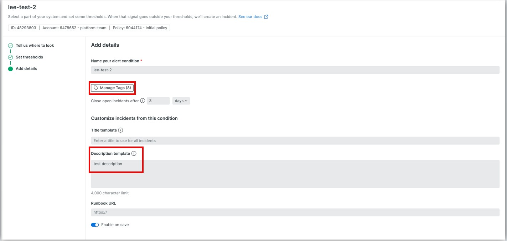
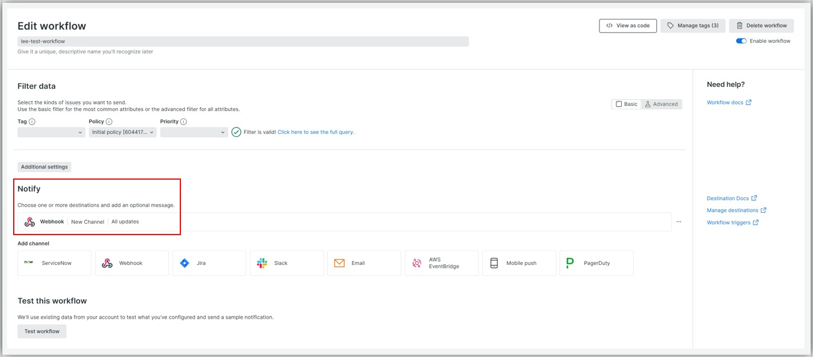
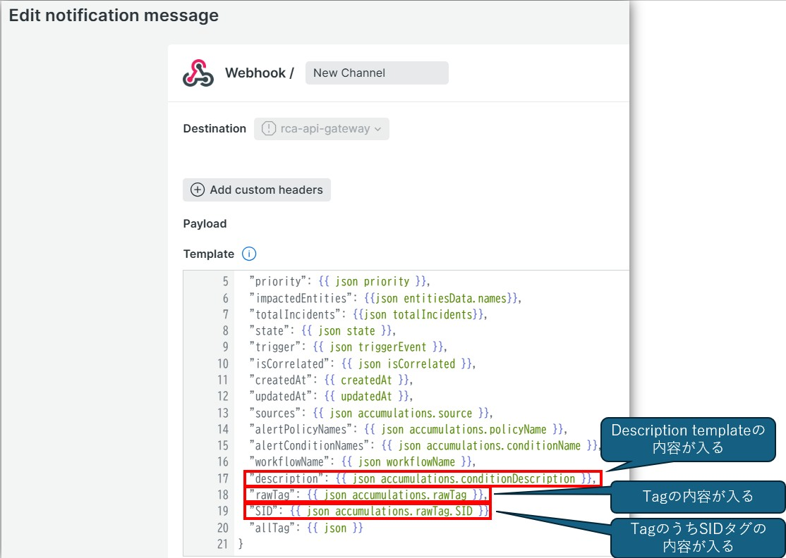

## 概念
- Alert Conditions、Workflows、Destinations、Alert Policiesを設定する必要がある
- 各AlertはAlert Policyに属する
  - なので、先にAlert Policyを作成する必要がある
- **Alert Conditions**
  - アラートを発砲する条件
- **Alert Policies**
  - 1つ以上の Alert Condition をまとめるグループ
- **Workflows**
  - どのアラートをどこに通知するかの設定
- **Destinations**
  - 通知の送信先（Slack, Email, Webhook など）

## アラートに設定したTagやDescription templateをWebHookに連携/取得する方法
- アラートの設定時、TagとDestinationの設定ができて、WebHook時それを連携することができる
- アラート(Alert Condition)  
  
- Workflows  
  
  