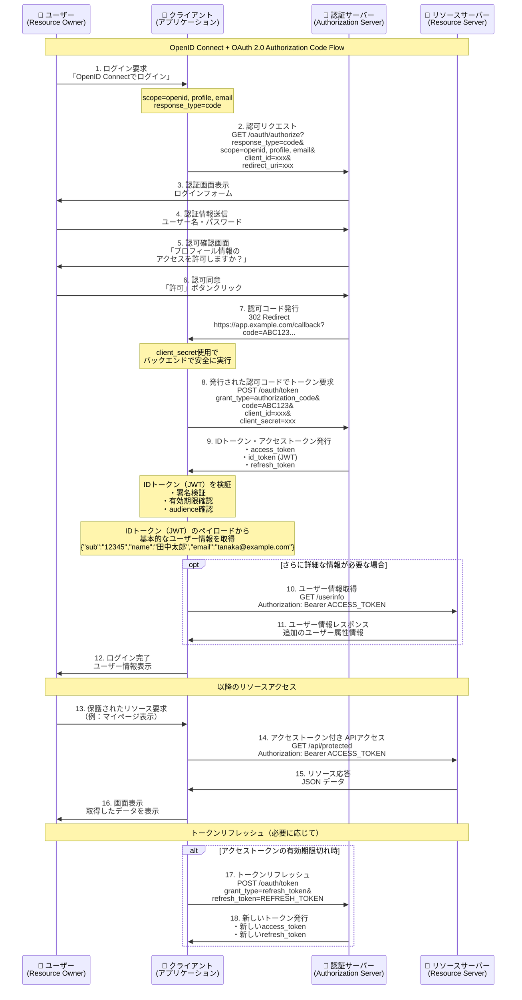

- **IDトークン**: OIDC固有で、ユーザーの認証情報（`sub`, `email`, `name`など）を含むJWT
- **アクセストークン**: リソースへのアクセス権限（何ができるか）を表すもので、APIアクセス用
- **スコープ**: openidは必須、profileやemailで追加情報を要求

# OAuth 2.0
- **認可**のプロトコル
- Third-Party アプリケーションに対して、ユーザーの代わりにリソースにアクセスする権限を安全に委譲する

## OAuthの登場人物
#### **リソースオーナー（Resource Owner）**
- 認可を与えるユーザー
#### **クライアント（Client）**
- リソースオーナーの代理としてリソースサーバーにアクセスするアプリケーション
- Scope（範囲）を指定して、アクセス権限を制限することができる
#### **認可サーバー（Authorization Server）**
- リソースオーナーの認証・認可を受けて、クライアントにアクセストークンを発行するサーバー
#### **リソースサーバー（Resource Server）**
- APIを通じてクライアントに保護されたリソースを提供するサーバー
- アクセストークンを検証して、クライアントのアクセスを許可する

# OIDC（OpenID Connect）
- **認証**のプロトコル
- OAuth 2.0の上に構築された認証レイヤー（OAuth 2.0に「ユーザー認証（Who you are）」の要素を追加したもの）