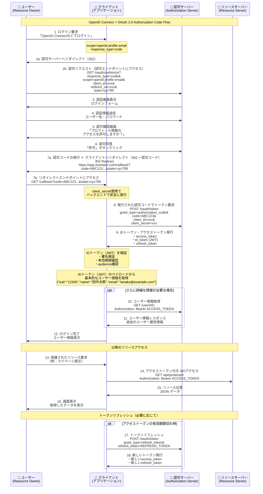
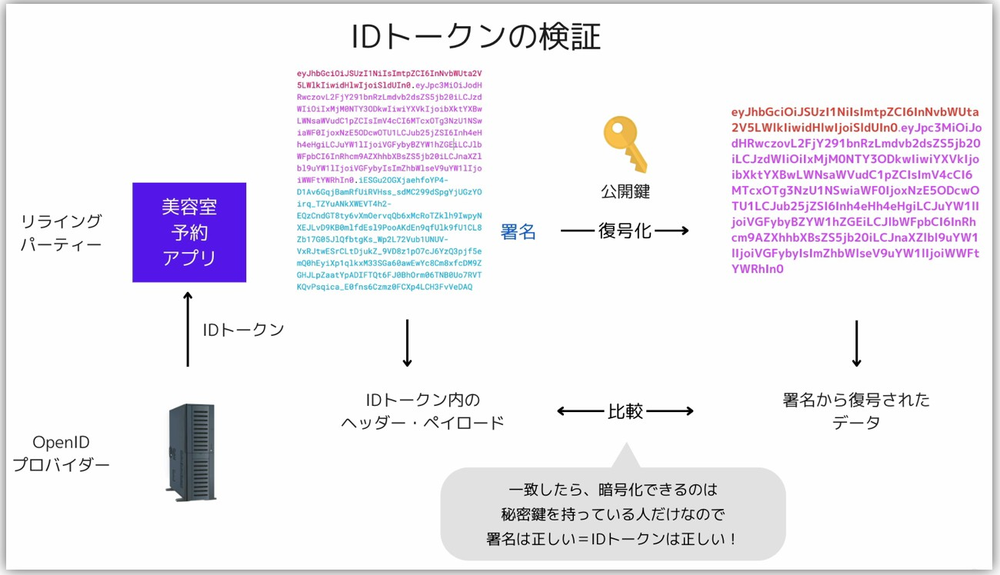
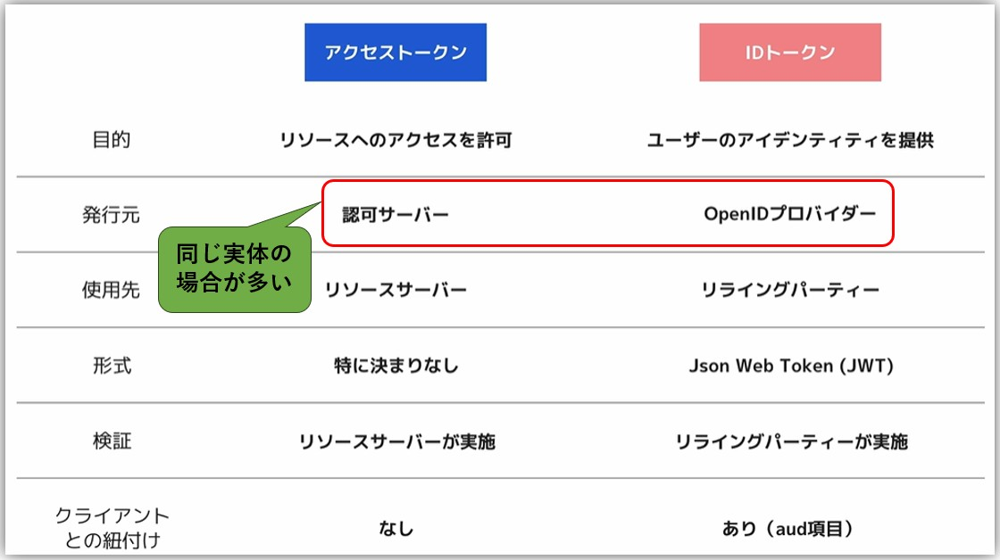

- **IDトークン**: OIDC固有で、ユーザーの認証情報（`sub`, `email`, `name`など）を含むJWT
- **アクセストークン**: リソースへのアクセス権限（何ができるか）を表すもので、APIアクセス用
  - 認可サーバへの認証・認可許可後、認可サーバから連携される認可コードを使用してアクセストークンを取得し、アクセストークンを使用してリソースサーバーにアクセスする
  - アクセストークンを直接Resource Ownerに送信せずに、1回認可コードからアクセストークンを取得する理由は、アクセストークンを直接Resource Ownerに送信すると、セキュリティ上のリスクがあるため
    - ブラウザのURLでトークンを渡すと、ブラウザ履歴やRefererヘッダー経由で漏洩するリスクがある
    - 認可コードフローでは、トークン交換をバックチャネル（サーバー間通信）で行うため安全
- **スコープ**: openidは必須、profileやemailで追加情報を要求
  - 大文字・小文字は区別される
  - 複数のスコープを指定する場合はスペースで区切る
  - 複数のスコープを指定時、スコープの順番は意味を持たない
- **リフレッシュトークン**: アクセストークンの有効期限が切れた際に、新しいアクセストークンを取得するために使用されるトークン
  - アクセストークンと一緒に認可サーバーから発行されて、クライアントに渡される
  - アクセストークンは通常短期間（数分～数時間）で期限切れになるため、リフレッシュトークン（アクセストークンより長期間有効）を使用して新しいアクセストークンを取得する
  - リフレッシュトークンの発行は必須ではなく、オプションであり、認可サーバーの設定による

# OAuth 2.0
- **認可**のプロトコル
- Third-Party アプリケーションに対して、ユーザーの代わりにリソースにアクセスする権限を安全に委譲する

## OAuthの登場人物
#### **リソースオーナー（Resource Owner）**
- **クライアントにアクセスを許可するリソースの所有者（ユーザー）**
#### **クライアント（Client）**
- リソースオーナーの代理としてリソースサーバーにアクセスするアプリケーション
- Scope（範囲）を要求し、認可サーバによって許可された範囲内でのみリソースにアクセスできる
- 事前に**認可サーバ**に登録し、**クライアントID**（識別子）を発行してもらう必要がある
  - **コンフィデンシャルクライアント（Confidential Client）**の場合は、**クライアントシークレット**も発行される。
- クライアントの種類に応じて、クライアント認証またはPKCEなどの仕組みを用い、認可サーバーからアクセストークンを取得する
  - コンフィデンシャルクライアント（Confidential Client）の場合は、クライアントIDとクライアントシークレットを使用して、クライアント認証を行い、認可サーバーからアクセストークンを取得する
- クライアントシークレットを安全に保管できるかどうかで、クライアントの種類が分かれる
  - **コンフィデンシャルクライアント（Confidential Client）**: クライアントシークレットを安全に保管できるサーバーサイドアプリケーションなど
  - **パブリッククライアント（Public Client）**: クライアントシークレットを安全に保管できないモバイルアプリやSPAなど
#### **認可サーバー（Authorization Server）**
- リソースオーナーの認証・認可を受けて、クライアントにアクセストークンを発行するサーバー
#### **リソースサーバー（Resource Server）**
- APIを通じてクライアントに保護されたリソースを提供するサーバー
- アクセストークンを検証して、クライアントのアクセスを許可する

## OAuthのエンドポイント
### **認可エンドポイント（Authorization Endpoint）**
- **提供**: 認可サーバー側
- パス例: `/authorize`, `/oauth/authorize`
- ユーザーの認証と認可同意を行い、**認可コードを発行する役割**
- **フロントチャネル**（ブラウザリダイレクト）で通信
- 主なリクエストパラメータ:
  - `response_type`: 応答タイプ（`code` など）
  - `client_id`: クライアント識別子
  - `redirect_uri`: リダイレクト先URL
  - `scope`: 要求するスコープ
  - `state`: CSRF対策用のランダム値

### **トークンエンドポイント（Token Endpoint）**
- **提供**: 認可サーバー側
- パス例: `/token`, `/oauth/token`
- **認可コードをパラメーターとして受け取って、アクセストークン（およびリフレッシュトークン）を発行する役割**
- リフレッシュトークンによるトークン更新にも使用
- **バックチャネル**（サーバー間通信）で通信
- 主なリクエストパラメータ:
  - `grant_type`: `authorization_code` または `refresh_token`
  - `code`: 認可コード
  - `client_id` / `client_secret`: クライアント認証情報

### **リダイレクトエンドポイント（Redirection Endpoint / Redirect URI）**
- **提供**: クライアント側
- パス例: `/callback`, `/oauth/callback`
- **認可サーバーが認可コード（またはエラー）を返す先のURL**
- **クライアントが事前に認可サーバーに登録しておく必要がある**
- 認可リクエスト時に `redirect_uri` パラメータで指定

---

# OIDC（OpenID Connect）
- **認証**のプロトコル
- OAuth 2.0の上に構築された認証レイヤー（OAuth 2.0に「ユーザー認証（Who you are）」の要素を追加したもの）
  - OAuth 2.0の拡張仕様
- トークンタイプ
  - **IDトークン**: ユーザーの属性情報（ID、名前、メールアドレスなど）を含むJWT（JSON Web Token）
  - **アクセストークン**: リソースへのアクセス権限を表すトークン（OAuth 2.0と同様）
- 主な用途
  - SSO
  - ユーザログイン

## IDトークンの検証で使われる鍵
- **秘密鍵**: OpenIDプロバイダーが内部で使用する秘密鍵で、IDトークンの署名を行う際に使用
- **公開鍵**: OpenIDプロバイダーが提供する公開鍵を使用して、IDトークンの署名を検証

## OIDCの登場人物
#### **エンドユーザー**
- リソースオーナーとして認証を受けるユーザー
#### **リライングパーティ（Relying Party）**
- 認証を利用するクライアントアプリケーション
#### **OpenIDプロバイダー（OpenID Provider）**
- ユーザーの認証を行い、IDトークン（場合によりアクセストークンも）を発行するサーバー
#### **UserInfoエンドポイント**
- ユーザー情報を提供するAPIエンドポイント
- OpenIDプロバイダーから取得したアクセストークンを使用して、リライングパーティがユーザーの詳細情報を取得

# Access Token と ID Token との比較

# OIDC/OAuth vs SAML
| 項目 | SAML | OIDC/OAuth |
| --- | --- | --- |
| **データ形式** | XML | JSON |
| **主な用途** | エンタープライズSSO、属性交換 | Web/モバイル認証（OIDC）、API認可（OAuth） |
| **登場人物** | ・Identity Provider（IdP） ・Service Provider（SP） ・ユーザー | ・Authorization Server ・Client（Relying Party） ・Resource Server ・Resource Owner（ユーザー） |
| **トークン** | **SAML Assertion** ・XML形式の認証/認可情報 ・デジタル署名付き ・ユーザー属性を含む | **Access Token**：リソースアクセス用（JWT形式の場合もある（e.g. Azure EntraID）） **ID Token（OIDC）**：ユーザー認証情報（JWT） **Refresh Token**：トークン更新用 |
| **通信方式** | ・HTTP POST/Redirect ・SOAP over HTTP ・ブラウザリダイレクトベース | ・HTTPS REST API ・JSON over HTTP ・Authorization Headerでトークン送信 |
| **SSO実現方式** | ・SP-Initiated SSO ・IdP-Initiated SSO ・メタデータ交換による信頼関係構築 | ・Authorization Code Flow ・Discovery URLによる動的設定 ・複数サービス間でのトークン共有 |
| **パフォーマンス** | ・メッセージサイズ：大（2-10KB） ・処理速度：遅い（XML解析） ・ネットワーク：複数リダイレクト | ・メッセージサイズ：小（0.5-2KB） ・処理速度：速い（JSON解析） ・ネットワーク：効率的なAPI通信 |

# PKCE（Proof Key for Code Exchange）
- 日本語読みは「ピクシー」
- PKCE（Proof Key for Code Exchange）は、OAuth 2.0のセキュリティ拡張仕様の一つで、特にパブリッククライアント（モバイルアプリ、SPAなど）での認可コードグラントフローを安全に実行するための仕組み
## PKCEが必要な理由
- 通常のOAuth 2.0の認可コードフローでは、以下のような流れでアクセストークンを取得する  
  1. クライアント → 認可サーバに認可リクエスト（code を要求）
  2. 認可サーバ → 認可コードをリダイレクトで返す
  3. クライアント → 認可コードを使ってアクセストークンリクエスト
  4. アクセストークンを取得
- この時、モバイルアプリやSPAのような「クライアントシークレットを安全に保管できない」環境では、認可コードが盗まれると第三者にアクセストークンを取られてしまう危険性がある
## PKCEの仕組み
1. クライアントがランダムな `code_verifier` を生成
2. `code_verifier` を `SHA256` ハッシュして Base64URL エンコード → `code_challenge`
3. 認可リクエストに `code_challenge` と `code_challenge_method=S256` を含める
4. 認可サーバが認可コードを発行
5. アクセストークンリクエスト時、クライアントが `code_verifier` を送る
6. 認可サーバが側で `code_verifier` を使って `code_challenge` を再生成し、最初に受け取った値と一致するか確認し、一致すれば、アクセストークンを発行
- 認可コードが盗まれた場合、攻撃者は `code_verifier` を知らないため、アクセストークンを取得できない
