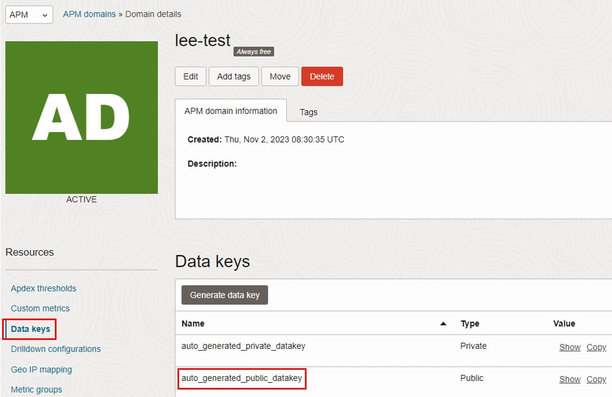

## OpenTelemetryを使ってOCI APMにトレース/メトリクスを送る方法
- APMのAdministratorでまずドメインを作成する必要がある
  
  
- 作成したドメインに入ってData Keysタブで自動生成されたPrivate Keyを押さえておく
  
- 同じくデータを連携するエンドポイントも押さえておく
  

#### 参考ページ
- https://docs.oracle.com/ja-jp/iaas/application-performance-monitoring/doc/configure-open-source-tracing-systems.html#GUID-4D941163-F357-4839-8B06-688876D4C61F__GUID-6E301FC6-5CED-4AE1-9308-D6A342DE1339
- https://guides.micronaut.io/latest/micronaut-cloud-trace-oci-maven-kotlin.html
- https://blogs.oracle.com/cloud-infrastructure/post/opentelemetry-instrumentation-oci-apm
- https://docs.oracle.com/en-us/iaas/releasenotes/changes/abe28c55-1d52-4368-88e5-601b83dbca18/
- https://docs.oracle.com/ja-jp/iaas/application-performance-monitoring/doc/use-trace-explorer.html