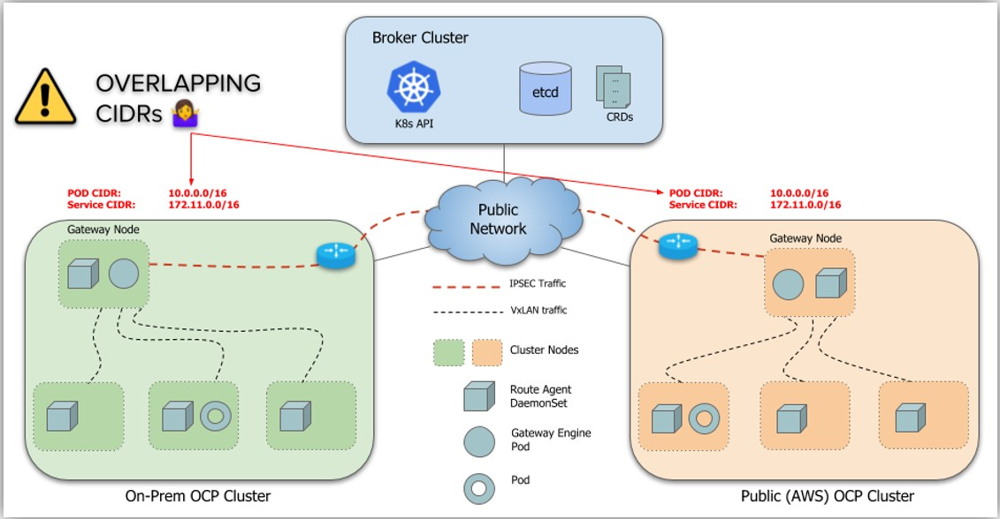
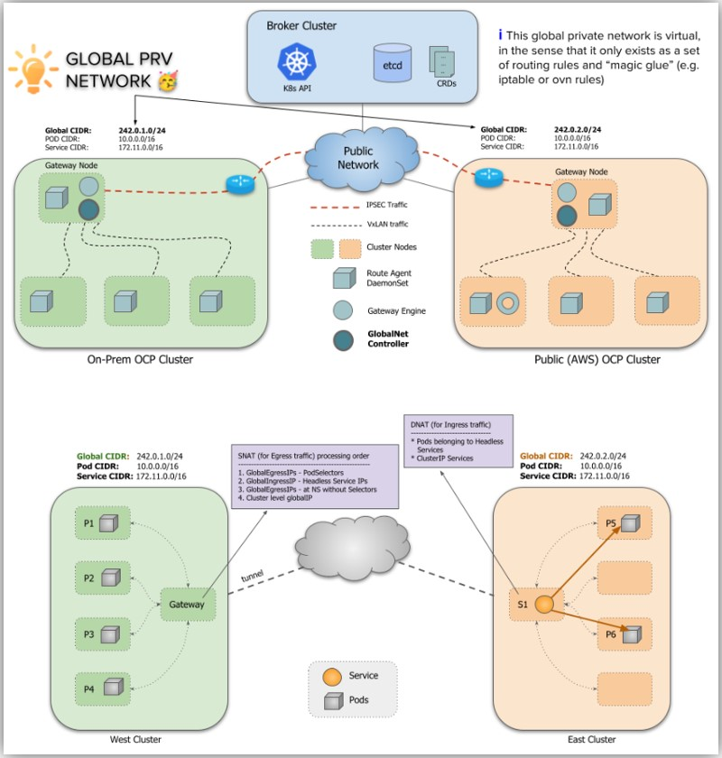
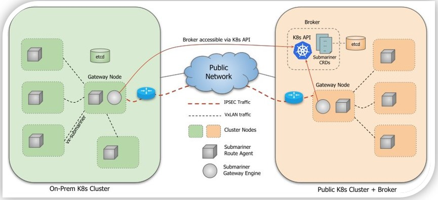
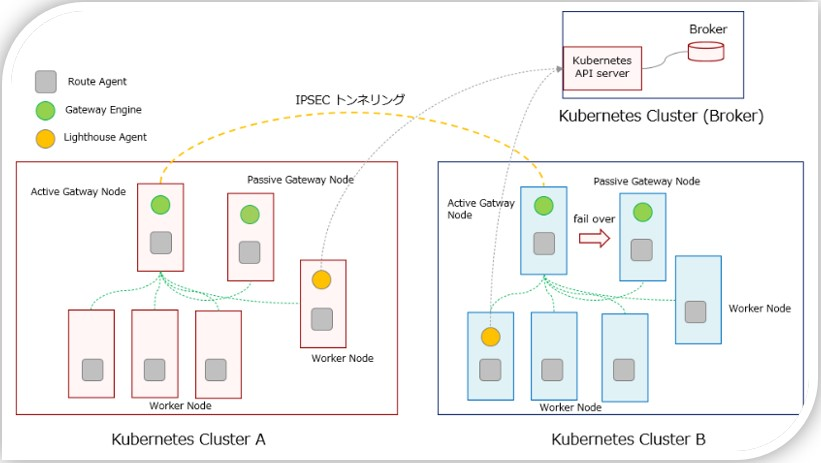
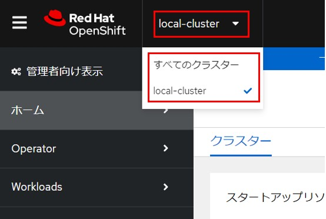
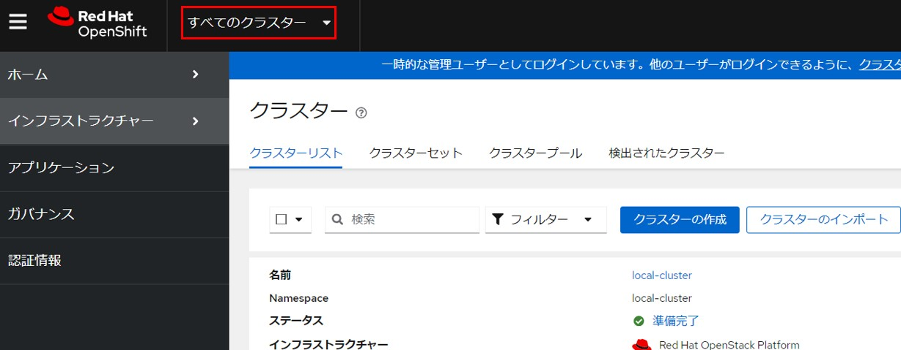
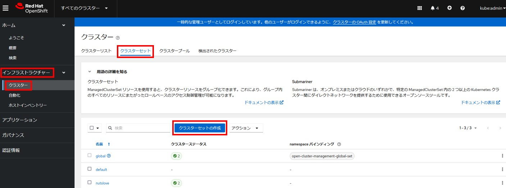
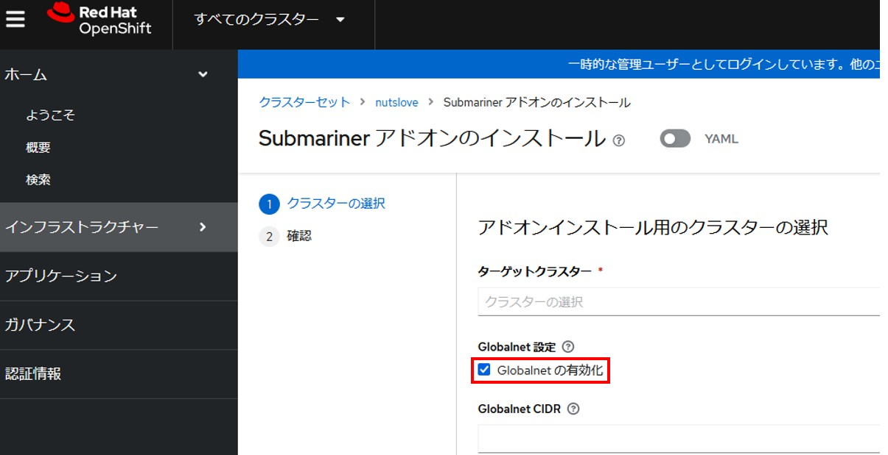

# Submariner
- 参考URL
  - https://rheb.hatenablog.com/entry/2021/05/13/Kubernetes_%E9%96%93%E3%82%92%E3%83%97%E3%83%A9%E3%82%A4%E3%83%99%E3%83%BC%E3%83%88%E3%81%AA%E3%83%8D%E3%83%83%E3%83%88%E3%83%AF%E3%83%BC%E3%82%AF%E3%81%A7%E6%8E%A5%E7%B6%9A%E3%81%99%E3%82%8B_Submariner_
  - https://submariner.io/
- Submarinerは異なるKubnerentesクラスター間をオーバーレイネットワークで結ぶためのOSSツール。  
  異なるクラスター間で、Kubernetesの`Service`名を解決するためのLighthouseというプロジェクトもセットで使われている。  
  > Submariner enables direct networking between Pods and Services in different Kubernetes clusters, either on-premises or in the cloud.

  > オンプレミスまたはクラウドのいずれかの環境で、2 つ以上のマネージドクラスター間で直接ネットワークおよびサービスディスカバリーを提供します。
- https://submariner.io/#what-submariner-provides
  - **What Submariner Provides**
    - Cross-cluster L3 connectivity using encrypted or unencrypted connections
    - [Service Discovery](https://submariner.io/getting-started/architecture/service-discovery/) across clusters
    - `subctl`, a command-line utility that simplifies deployment and management
    - Support for interconnecting clusters with [overlapping CIDRs](https://submariner.io/getting-started/architecture/globalnet/)

## Service Discovery
- https://submariner.io/getting-started/architecture/service-discovery/
- クラスター跨ぎの`Service`ディスカバリー(`Service`名による名前解決)ができるようになる

## overlapping CIDRとGLOBALNET CONTROLLER
- https://submariner.io/getting-started/architecture/globalnet/
- overlapping CIDR問題をGLOBALNET CONTROLLERで回避
- overlapping CIDRとは  
  
- GLOBALNET CONTROLLERとは  
  

## SubmarinerのArchitecture

## Submarinerのコンポーネント
### Gateway Engine
- クラスター間のトンネリングを管理するコンポーネント
- `DaemonSet`として`submariner.io/gateway=true`ラベルが付いているノードにデプロイされる

### Broker
- Gatway Engine 間のメタデータの交換を助けるコンポーネント
- CRD(Custom Resrouce Definition) とそれを保管している Kubernetes の事を指し 、PodやServiceがデプロイされるわけではない

### Route Agent
- ノードからアクティブなGateway EngineへトラフィックをルートするAgent
- masaterノードを含むすべてのノードに`DaemonSet`としてデプロイされる

### Service Disovery
- クラスター間のServiceのDNS解決を提供するコンポーネント

### Lighthouse Agent
- 各クラスター内部に存在しているAgentで、Brokerを通じてServiceの情報のmetadata を他のクラスターと交換する

## Openshift環境でのSubmariner利用
- Openshiftでは「Red Hat Advanced Cluster Management for Kubernetes」Operatorをインストールすると、必須で`MultiClusterHub`リソース作成が必要で、`MultiClusterHub`リソースを作成すると、Submarinerがadd-onとしてインストールされる
  - https://access.redhat.com/documentation/ja-jp/red_hat_advanced_cluster_management_for_kubernetes/2.10/html/install/advanced-config-hub
  - https://access.redhat.com/documentation/ja-jp/red_hat_advanced_cluster_management_for_kubernetes/2.10/html/networking/submariner
- 「Red Hat Advanced Cluster Management for Kubernetes」Operatorと`MultiClusterHub`リソースを作成するとOpenShiftのUIにクラスターを選択できる画面とクラスター一覧などを確認できるUIが作成される
  
  
- 既存のOpenShiftクラスターを追加するには、「インフラストラクチャー」→「クラスター」→「クラスターリスト」タブ →「クラスターのインポート」
  - API Serverのエンドポイント ＋ Token、Kubeconfigなどいくつか登録方法がある
  - OpenStackの場合は`Clouds.yaml`が必要。クラウド名は*openstack*
    - Openstackの「APIアクセス」からダウンロードする`clouds.yaml`に`password`の追加が必要
- **「Red Hat Advanced Cluster Management for Kubernetes」は１つのOpenShiftクラスターにのみインストールする**
  - これが「管理クラスター」になる

- 「インフラストラクチャー」→「クラスター」→「クラスターセット」で、「クラスターセットの作成」で新規クラスターセットを作成し、インポートしたクラスターと管理クラスターを追加する  
  
  - 最初から作成されている*default*クラスターセットを使っても問題はない

- gatewayとmetrics-proxyは`submariner.io/gateway=true`ラベルが付いているノードにデプロイされて、`submariner.io/gateway=true`ラベルは自動では付与されないため、以下コマンドでgatewayとmetrics-proxyをデプロイしたいノードにラベルを付与する必要がある
  - `oc label nodes <対象のノード名> submariner.io/gateway=true`

- *Submariner Operator*は管理クラスターとマネージドクラスターで先にOperator Hubでインストールしてから、  
  ACMの画面で**Submarinerアドオン**をインストールしてもいいけど、**Submarinerアドオン**をインストールしたら自動的に*Submariner Operator*とSubmarinerの各コンポーネントPodが起動される
- 内部のPodとServiceのIPレンジが被る場合は、globalnetを有効にしてインストールする(CIDRは空欄でOK)
  - 追加で*globalnet*のPodが起動される  
    

### 管理クラスター
- ACM(Advanced Cluster Management)をインストールするクラスター
- このクラスターから他のクラスターを管理・接続する

### マネージドクラスター
- 管理クラスターによって管理されるクラスター
- ACMのインストールは不要。ただ、**Submariner Operatorはインストールが必要**。

# multicluster engine for Kubernetes
- 「Red Hat Advanced Cluster Management for Kubernetes」Operatorをインストールすると、「multicluster engine for Kubernetes」operatorもインストールされる
  - https://docs.openshift.com/container-platform/4.15/architecture/mce-overview-ocp.html