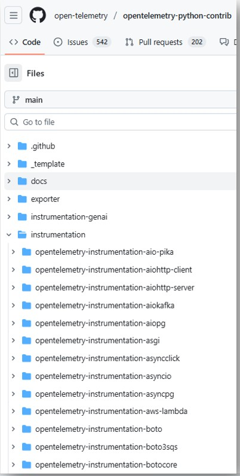

- **https://opentelemetry.io/ja/docs/zero-code/python/**
- https://github.com/open-telemetry/opentelemetry-python-contrib

## 手順
- 以下を実行し、必要なパッケージをインストールする  
  ```bash
  pip install opentelemetry-distro opentelemetry-exporter-otlp
  opentelemetry-bootstrap -a install
  ```
  - `opentelemetry-bootstrap -a install`は、自動的に現在の環境のライブラリを検出し、対応するOpenTelemetryのinstrumentationパッケージをインストールする

> [!NOTE]  
> `opentelemetry-exporter-otlp`をインストールすると、`opentelemetry-exporter-otlp-proto-grpc`と`opentelemetry-exporter-otlp-proto-http`の両方が自動でインストールされる

> [!NOTE]  
> ## `opentelemetry-bootstrap -a install`の実際の処理内容
> - [opentelemetry-instrumentation/pyproject.toml](https://github.com/open-telemetry/opentelemetry-python-contrib/blob/main/opentelemetry-instrumentation/pyproject.toml)の`opentelemetry-bootstrap = "opentelemetry.instrumentation.bootstrap:run"`に記載されている`run`関数が実行される
> - その実態は[opentelemetry-instrumentation/src/opentelemetry/instrumentation/bootstrap.py](https://github.com/open-telemetry/opentelemetry-python-contrib/blob/main/opentelemetry-instrumentation/src/opentelemetry/instrumentation/bootstrap.py)の`run`関数であり、`bootstrap_gen.py`に定義されている`libraries`と`default_instrumentations`のリストにあるパッケージを引数として`_run_install`関数を実行する
> - `_run_install`関数は、`_find_installed_libraries`関数を呼び出す
> - `_find_installed_libraries`関数は、`default_instrumentations`リスト内のすべてのパッケージと、`libraries`リスト内のパッケージのうちインストールされているものを`_is_installed`関数で検出し、インストールされているパッケージだけを返す
> - `_run_install`関数に戻って、`_sys_pip_install`関数で、`default_instrumentations`リスト内のすべてのパッケージと、`libraries`リスト内でインストールされているパッケージのみのinstrumentationパッケージを、`_sys_pip_install`関数でインストールする

- 以下の環境変数を設定
  - `OTEL_EXPORTER_OTLP_ENDPOINT`
    - OTLPエクスポーターのエンドポイントURLを指定する。デフォルトは`http://localhost:4318`（HTTPプロトコルの場合）
  - `OTEL_EXPORTER_OTLP_PROTOCOL`
    - OTLPエクスポーターのプロトコルを指定する。`http/protobuf`または`grpc`を指定可能。デフォルトは`http/protobuf`
  - `OTEL_SERVICE_NAME`
    - サービス名を指定

- その後は、Python実行時に`opentelemetry-instrument`コマンドを使用してアプリケーションを起動するだけで、自動的に計装が行われる  
  ```bash
  opentelemetry-instrument python your_application.py
  ```

## Python Auto Instrumentationが対応(サポート)しているライブラリ/フレームワーク
- https://opentelemetry.io/ecosystem/registry/?language=python&component=instrumentation
- 以下のPythonのOpenTelemetryリポジトリの「**instrumentation**」ディレクトリ配下から確認可能（そのディレクトリ配下にあるのがAuto Instrumentationが対応しているライブラリ/フレームワーク）
  - https://github.com/open-telemetry/opentelemetry-python-contrib  
  

## ログ(log)との連携
要確認/整理
- https://signoz.io/docs/userguide/python-logs-auto-instrumentation/
- https://opentelemetry.io/ja/docs/zero-code/python/logs-example/
- https://opentelemetry.io/ja/docs/zero-code/python/configuration/#logging
- https://github.com/open-telemetry/opentelemetry-python/blob/main/docs/examples/logs/example.py