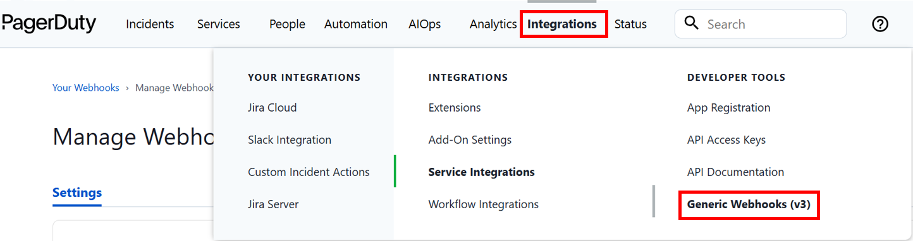
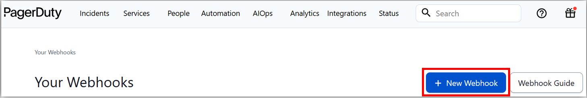
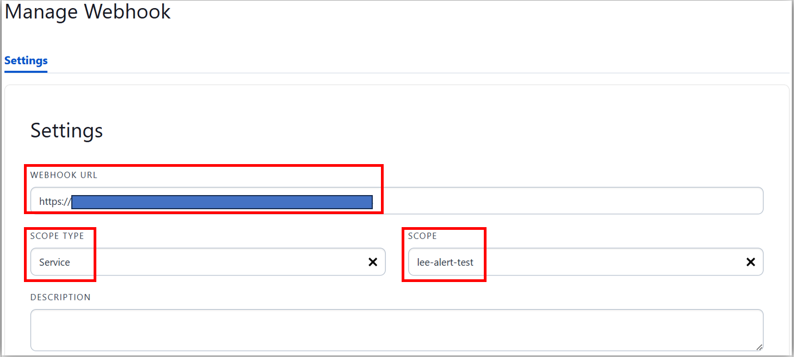
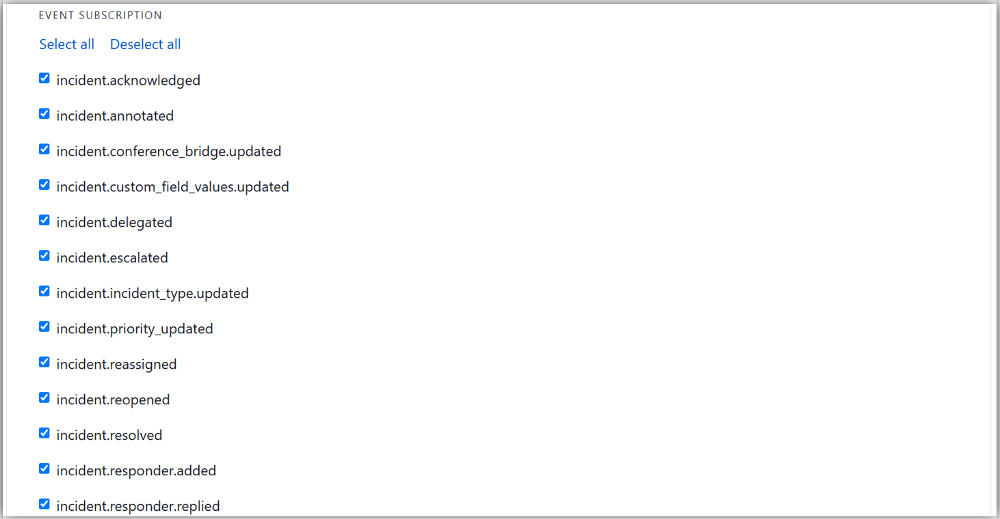
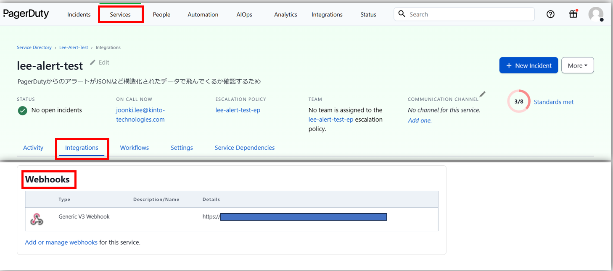
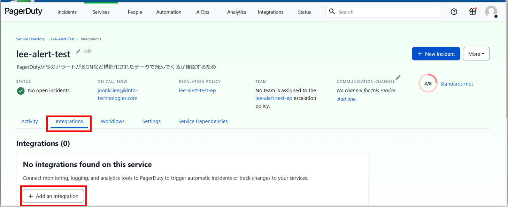
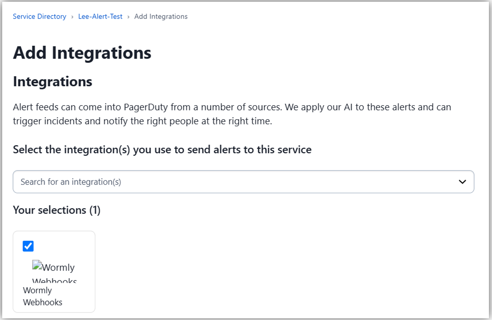
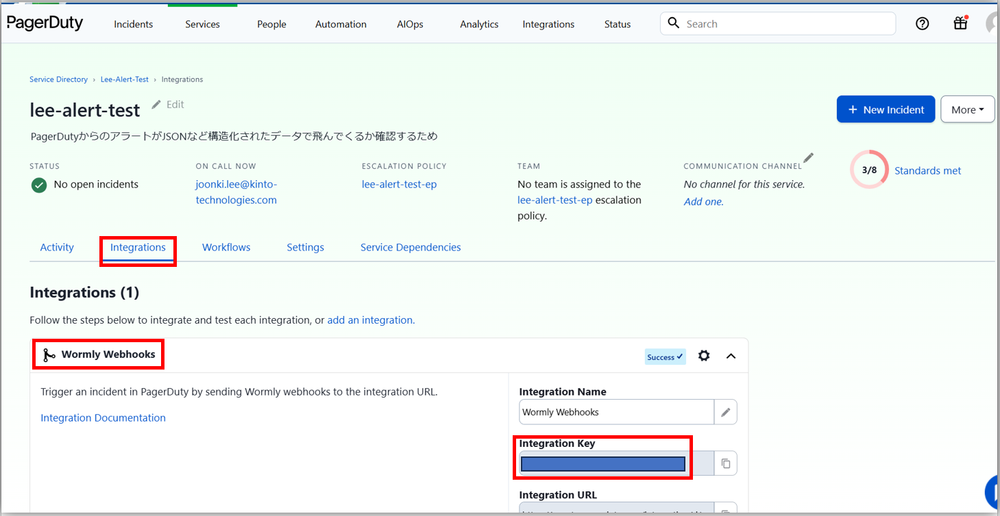
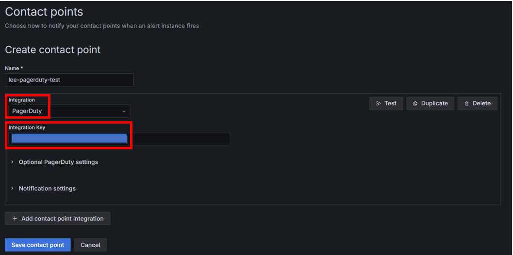

## WebHook設定
- Incident（アラート）が発生したときに外部にWebHookを設定することができる
### 手順
- 「Integrations」タブの「Generic Webhooks（v3）」をクリック  
  
- 「＋ New Webhook」をクリック  
  
- 「Webhook URL」にPOST先のURLを入力し、「Scope Type」(e.g. Service)と「SCOPE」を選択し、「Event Subscription」でどういうときにWebhookを投げるかを設定し、「Add Webhook」を押下  
    
  
- その後、Webhookで関連付けたServiceの「Integrations」タブの「Webhooks」ブロックに設定したWebhookが表示されていることを確認  
  

#### 作成後のテスト
- 作成したWebhookは「Test」ブロックの「Send Test Event」でテストのWebhookを飛ばすことができる

## GrafanaのアラートのPagerDutyへの連携
- 対象Serviceの「Integrations」タブで「＋ Add an Integration」を押下  
  
- Webhookを検索し、選択後、「Add」を押下  
  
- 作成されたWebhookから「Integration Key」を押さえておく  
  
- Grafanaの「Contact Points」でintegrationとしてPagerDutyを選択し、「Integration Key」に上で確認した値を入力して保存する  
  