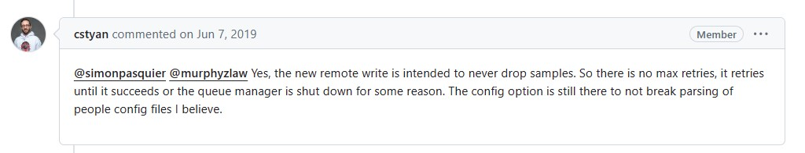

## Remote Write仕様
- https://prometheus.io/docs/concepts/remote_write_spec/

## Remote WriteとPrometheus内部のローカルストレージ(TSDB)の関係
- https://prometheus.io/docs/practices/remote_write/  
> Each remote write destination starts a queue which reads from the write-ahead log (WAL), writes the samples into an in memory queue owned by a shard, which then sends a request to the configured endpoint. The flow of data looks like:
>```
>      |-->  queue (shard_1)   --> remote endpoint
>WAL --|-->  queue (shard_...) --> remote endpoint
>      |-->  queue (shard_n)   --> remote endpoint
>```
> When one shard backs up and fills its queue, Prometheus will block reading from the WAL into any shards. **Failures will be retried without loss of data unless the remote endpoint remains down for more than 2 hours. After 2 hours, the WAL will be compacted and data that has not been sent will be lost.**
>
> During operation, Prometheus will continuously calculate the optimal number of shards to use based on the incoming sample rate, number of outstanding samples not sent, and time taken to send each sample.

## Remote Write関連チューニング/設定
- https://prometheus.io/docs/practices/remote_write/#parameters

## Retries & Backoff
- https://prometheus.io/docs/concepts/remote_write_spec/#retries-backoff
  > **Prometheus Remote Write compatible senders MUST retry write requests on HTTP 5xx responses and MUST use a backoff algorithm to prevent overwhelming the server.** **They MUST NOT retry write requests on HTTP 2xx and 4xx responses other than 429.** **They MAY retry on HTTP 429 responses**, which could result in senders "falling behind" if the server cannot keep up. This is done to ensure data is not lost when there are server side errors, and progress is made when there are client side errors.
  >
  > **Prometheus remote Write compatible receivers MUST respond with a HTTP 2xx status code when the write is successful.** **They MUST respond with HTTP status code 5xx when the write fails and SHOULD be retried.** **They MUST respond with HTTP status code 4xx when the request is invalid, will never be able to succeed and should not be retried.**
- `max_retries`パラメータがなくなって、Remote Writeが成功するかqueue managerが何らかの理由で落ちるまでretryし続ける。
  - https://github.com/prometheus/prometheus/issues/5636  
  
  