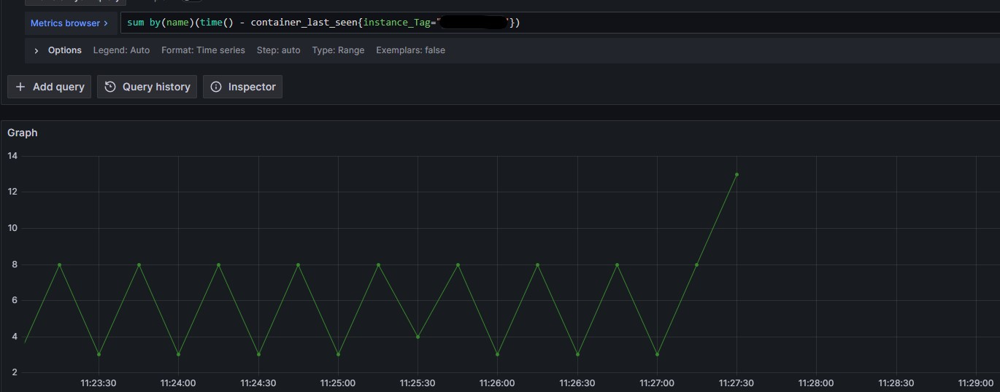

### コンテナの死活監視
- `container_last_seen` metricを使って監視できる
  - *`container_last_seen`: cAdvisorが最後に観測した時刻をUNIXタイムスタンプで表示（Counter）*
- **`container_last_seen`はコンテナが停止/削除されると最後に取得したメトリクスで切れる**  
  ただ、`time() - container_last_seen`で最後に取得される値は通常と異なるのでアラートは設定できる  
  
- `sum by(name)(time() - container_last_seen{<ラベル>}) > 閾値`のようにアラートの設定ができる  
  - **環境によって取得される値は幅が異なる(ように見える)。ただ、増減幅はだいたい決まっている(上記の例だと4~8)。**