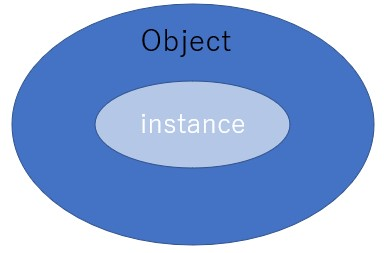
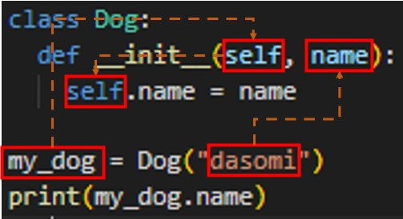

## 概念
- Class
  - 鋳型(주형)
- Object
  - 鋳型(주형)から作られたもの
- Attribute
  - Class内の変数
- Method
  - Class内の関数
- `__init__` (생성자)
  - Objectを作るときに実行される関数
- Instance
  - メモリ内のObject
  - Objectの概念の中にInstanceがあるイメージ  
    

## `self`について
- Object自分自身を指すもの  
  ~~~python
  class Dog:
    def __init__(self, name):
      self.name = name
    
  my_dog = Dog("dasomi")
  print(my_dog.name)
  ~~~
  - 例えば上記の場合、`my_dog`が`self`に、`dasomi`が`name`に入る
    

## 継承 (inheritance)
- 既存のClassの属性やMethodを使いつつ、既存のClassにはない属性やMethodを追加/修正するなど、Classを拡張するもの
- 継承の書き方
  ~~~python
  class クラス名(継承するクラス名):
    def __init__(self):
      super().__init__() --→ これがないと親Classの属性やMethodを使えない
  ~~~
  - 例
    ~~~python
    class Animal(): ------→ 親Class
      def __init__(self):
        self.num_eyes = 2

      def breathe(self):
        print("Inhale, exhale.")

    class Fish(Animal):
      def __init__(self):
        super().__init__()

      def swim(self):
        print("moving in water.")

    nimo = Fish()
    nimo.breathe() --------→ "Inhale, exhale."が出力される
    print(nimo.num_eyes) --→ 2が出力される
    ~~~
- 親ClassのMethodを拡張する方法
  ~~~python
  class Animal():
    def __init__(self):

    def breathe(self):
      print("Inhale, exhale.")

  class Fish(Animal):
    def __init__(self):
      super().__init__()

    def breathe(self):
      super().breathe() ----→ 親Classのbreathe Methodを実行
      print("doing this underwater.") --→ 処理を追加(拡張)

  nimo = Fish()
  nimo.breathe() --→ "Inhale, exhale.\n doing this underwater."が出力される  
  ~~~