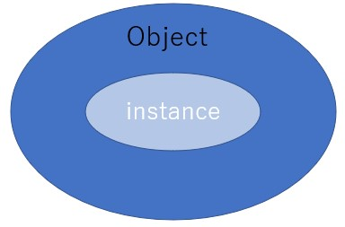
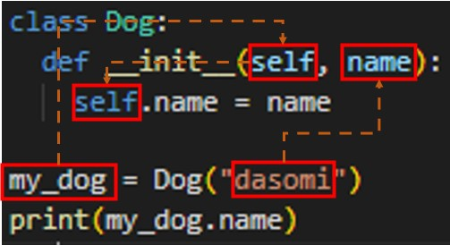

## 概念
- Class
  - 鋳型(주형)
- Object
  - 鋳型(주형)から作られたもの
- Attribute
  - Class内の変数
- Method
  - Class内の関数
- `__init__` (생성자)
  - Objectを作るときに実行される関数
- Instance
  - メモリ内のObject
  - Objectの概念の中にInstanceがあるイメージ  
    

## `self`について
- Object自分自身を指すもの  
  ~~~python
  class Dog:
    def __init__(self, name):
      self.name = name
    
  my_dog = Dog("dasomi")
  print(my_dog.name)
  ~~~
  - 例えば上記の場合、`my_dog`が`self`に、`dasomi`が`name`に入る
    

### `self`内にある属性があるか確認する方法
- `hasattr(オブジェクト, '属性名')`  
  ```python
  class Dog:
    def __init__(self, name):
      self.name = name

  my_dog = Dog("dasomi")
  print(hasattr(my_dog, 'name')) --→ True
  print(hasattr(my_dog, 'age')) --→ False
  ``` 
- Classのメソッド内で`self`内にある属性があるか確認する方法  
  ```python
  class Dog:
    def __init__(self, name):
      self.name = name

    def bark(self):
      if hasattr(self, 'name'):
        print(f"{self.name} is barking.")
      else:
        print("This dog has no name.")

  my_dog = Dog("dasomi")
  my_dog.bark() --→ "dasomi is barking."が出力される

  nameless_dog = Dog(None)
  del nameless_dog.name --→ name属性を削除
  nameless_dog.bark() --→ "This dog has no name."が出力される
  ```

## クラス変数とインスタンス変数
- **クラス変数**: クラス自身に1つだけ存在し、そのクラスから作られた全インスタンスで共有される変数（クラス直下、`__init__`の外で定義）
- **インスタンス変数**: 各インスタンスが個別に持つ変数（`self.属性名 = 値`のように`self`経由で定義）
  ```python
  class Counter:
      count = 0          # クラス変数（全インスタンスで共有）

      def __init__(self, name):
          self.name = name    # インスタンス変数（インスタンスごとに個別）
          Counter.count += 1

  c1 = Counter("a")
  c2 = Counter("b")

  print(Counter.count)     # 2 → c1とc2で共有されている
  print(c1.name, c2.name)  # a b → それぞれ別の値
  ```
- アクセス方法
  - クラス変数は`クラス名.変数名`（`Counter.count`）でも`インスタンス.変数名`（`c1.count`）でもアクセスできる
  - ただし**インスタンスから代入すると、クラス変数は更新されず、そのインスタンス専用の新しいインスタンス変数が作られてしまう**点に注意  
    ```python
    c1.count = 100   # Counter.countは変わらず、c1だけに新しいインスタンス変数countができる
    print(Counter.count)  # 2のまま
    print(c1.count)       # 100
    print(c2.count)       # 2（影響を受けない）
    ```
  - クラス変数自体を更新したい場合は、基本的に`クラス名.変数名 = 値`（例: `Counter.count += 1`）の形で書くのが安全
- 主な用途
  - 全インスタンスで共通の設定値・定数を持たせたいとき（例: `MAX_SIZE = 100`）
  - インスタンス生成数のカウントなど、クラス全体で状態を共有したいとき
- 関連
  - [[classmethodについて]]（`cls`経由でクラス変数にアクセスするメソッド）
  - [[staticmethodについて]]（クラス変数・インスタンス変数のどちらにもアクセスしないメソッド）
  - [[Pydantic, TypedDict, typingについて]]の`ClassVar`（その属性がクラス変数であることを示す型ヒント）

---

## 継承 (inheritance)
- 既存のClassの属性やMethodを使いつつ、既存のClassにはない属性やMethodを追加/修正するなど、Classを拡張するもの
- 継承の書き方
  ~~~python
  class クラス名(継承するクラス名):
    def __init__(self):
      super().__init__() --→ これがないと親Classの属性やMethodを使えない
  ~~~
  - 例
    ~~~python
    class Animal: ------→ 親Class
      def __init__(self):
        self.num_eyes = 2

      def breathe(self):
        print("Inhale, exhale.")

    class Fish(Animal):
      def __init__(self):
        super().__init__()

      def swim(self):
        print("moving in water.")

    nimo = Fish()
    nimo.breathe() --------→ "Inhale, exhale."が出力される
    print(nimo.num_eyes) --→ 2が出力される
    ~~~
- 親ClassのMethodを拡張する方法
  ~~~python
  class Animal:
    def __init__(self):

    def breathe(self):
      print("Inhale, exhale.")

  class Fish(Animal):
    def __init__(self):
      super().__init__()

    def breathe(self):
      super().breathe() ----→ 親Classのbreathe Methodを実行
      print("doing this underwater.") --→ 処理を追加(拡張)

  nimo = Fish()
  nimo.breathe() --→ "Inhale, exhale.\n doing this underwater."が出力される  
  ~~~