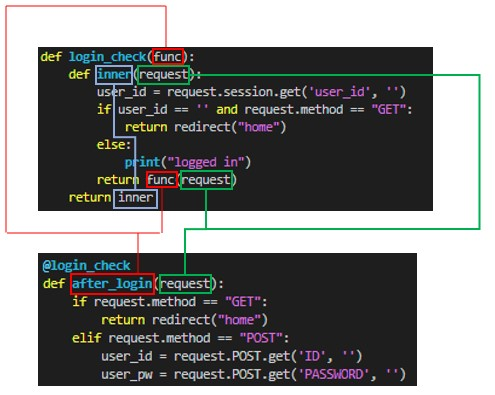

# Decoratorsについて
- 参考URL
  - https://www.programiz.com/python-programming/decorator

- 以下の場合、`func`はdecoratorを呼び出している関数`after_login`を指す
  - 同じ色にしているものは同じもので、合わせる必要がある
  - まず`inner`関数が実行される
  - そのあと`return func(request)`で元の関数に含まれていた引数も含めて、元の関数に返す（デコレーター内で生成した値を元の関数の引数に返すことできる）
    

~~~python
def make_pretty(func):
    # define the inner function 
    def inner():
        # add some additional behavior to decorated function
        print("I got decorated")

        # call original function
        func()
    # return the inner function
    return inner

# define ordinary function
def ordinary():
    print("I am ordinary")
    
# decorate the ordinary function
decorated_func = make_pretty(ordinary)

# call the decorated function
decorated_func()
~~~

- decorator例
    ~~~python
    def smart_divide(func):
        def inner(a, b):
            print("I am going to divide", a, "and", b)
            if b == 0:
                print("Whoops! cannot divide")
                return

            return func(a, b)
        return inner

    @smart_divide
    def divide(a, b):
        print(a/b)

    divide(2,5)

    divide(2,0)
    ~~~

## `@wraps(func)`について
- `functools`モジュールから提供されるdecoratorであり、デコレータがラップする関数のメタデータ（ドキュメント文字列、関数名など）を保持するために使われる。
- 必須ではないが、デコレータを作成する際に使うことが強く推奨される。
  - 使わないとラップされた関数のメタデータが失われるため、デバッグやドキュメンテーションの生成、関数のインスペクションが難しくなる。
- `@wraps(func)`を使う場合  
    ```python
    from functools import wraps

    def my_decorator(func):
        @wraps(func)
        def wrapper(*args, **kwargs): ★こういうふうに呼び出し側の引数と関係なく(*args, **kwargs)で受け付けることもできる
            print("Before the function call")
            result = func(*args, **kwargs)
            print("After the function call")
            return result
        return wrapper

    @my_decorator
    def say_hello(name):
        """Greet someone by name."""
        print(f"Hello, {name}!")

    say_hello("Alice")
    print(say_hello.__name__)  ★# "say_hello" が出力される
    print(say_hello.__doc__)   ★# "Greet someone by name." が出力される
    ```
- `@wraps(func)`を使わない場合  
    ```python
    def my_decorator(func):
        def wrapper(*args, **kwargs):
            print("Before the function call")
            result = func(*args, **kwargs)
            print("After the function call")
            return result
        return wrapper

    @my_decorator
    def say_hello(name):
        """Greet someone by name."""
        print(f"Hello, {name}!")

    say_hello("Alice")
    print(say_hello.__name__)  ★# "wrapper" が出力される
    print(say_hello.__doc__)   ★# None が出力される
    ```

#### デコレートされた関数(デコレータがラップする関数)、デコレータ関数、ラッパー関数
- 上記の例でいうとデコレートされた関数は`say_hello`、デコレータ関数は`my_decorator`、ラッパー関数は`wrapper`

## Decorator内で生成された値を元の関数に返す
- Decorator内で生成された値を元の呼び出し関数の引数として返すこともできる
- 例  
    ```python
    def token_validation_check(func):
        @wraps(func)
        async def wrapper(*args, **kwargs):

            token = "asdqwdasdasd"
            project_id = "ProjectID"
            is_admin = True

            return await func(token, project_id, is_admin, *args, **kwargs)
        return wrapper

    async def logaas_update(token: str, project_id: str, is_admin: bool, cluster_id: str, reqData: logaas.LOGaaSClientBase, request: Request):
        （中略）
    ```
#### **元の呼び出し関数の引数とDecoratorで返す引数の順番を合わせる必要がある**
- NG例
  - 下の例だと`"引数1の値", "引数2の値", "デコレーター内で生成された値"`が期待値だが、`"デコレーター内で生成された値", "引数1の値", "引数2の値"`になってしまう
    ```python
    def my_decorator(func):
        def wrapper(*args, **kwargs):
            generated_value = "デコレーター内で生成された値"
            
            # generated_valueを最初に渡す
            result = func(generated_value, *args, **kwargs)
            
            return result
        return wrapper

    @my_decorator
    def my_function(original_arg1, original_arg2, decorated_value):
        print(f"元の関数の引数1: {original_arg1}")
        print(f"元の関数の引数2: {original_arg2}")
        print(f"Decoratorから受け取った値: {decorated_value}")

    my_function("引数1の値", "引数2の値")
    ```
- OK例  
    ```python
    def my_decorator(func):
        def wrapper(*args, **kwargs):
            generated_value = "デコレーター内で生成された値"
            
            # generated_valueを最初に渡す
            result = func(*args, generated_value, **kwargs)
            
            return result
        return wrapper

    @my_decorator
    def my_function(original_arg1, original_arg2, decorated_value):
        print(f"元の関数の引数1: {original_arg1}")
        print(f"元の関数の引数2: {original_arg2}")
        print(f"Decoratorから受け取った値: {decorated_value}")

    my_function("引数1の値", "引数2の値")
    ```
