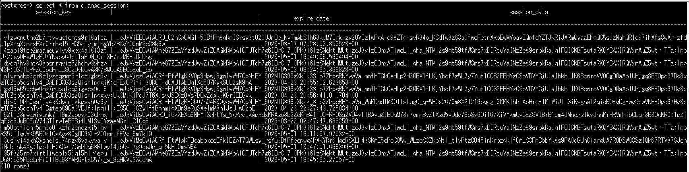

- https://docs.djangoproject.com/en/4.2/topics/http/sessions/
- https://developer.mozilla.org/ko/docs/Learn/Server-side/Django/Sessions
- https://ssungkang.tistory.com/entry/Django%EB%A1%9C%EA%B7%B8%EC%9D%B8-%EC%9C%A0%EC%A7%80%ED%95%98%EA%B8%B0-%EC%BF%A0%ED%82%A4%EC%99%80-%EC%84%B8%EC%85%98
- https://sinyblog.com/django/user_session/
- https://valuefactory.tistory.com/708
   
#### Cookie
- Sessionの設定は`set_cookie("<セッションKey名>", <セッションValue>, None|max_age=<セッションのTTL>)`
  - e.g. `response.set_cookie("user_id", user_id, max_age=600)`
- Sessionの取得は`request.COOKIES.get('<セッションKey名>')`
  - e.g. `request.COOKIES.get('user_id')`

### 手順
- `settings.py`の`INSTALLED_APPS`と`MIDDLEWARE`に以下を追加(すでに追加されている場合は不要)
  ~~~python
  INSTALLED_APPS = [
    ...
    'django.contrib.sessions',
    ....

  MIDDLEWARE = [
    ...
    'django.contrib.sessions.middleware.SessionMiddleware',
    ....
  ~~~
- run `manage.py migrate` to install the single database table that stores session data.

### defaultではセッションは(django.contrib.sessions.models.Session モデルを用いて)DBに保存される。
- ファイルシステムやキャッシュに保存するように設定(変更)することもできる
  - キャッシュを使ったセッション管理
    - https://docs.djangoproject.com/ja/4.2/topics/http/sessions/#using-cached-sessions
  - ファイルを使ったセッション管理
    - https://docs.djangoproject.com/ja/4.2/topics/http/sessions/#using-file-based-sessions
- https://docs.djangoproject.com/ja/4.2/topics/http/sessions/#configuring-the-session-engine
  > By default, Django stores sessions in your database (using the model django.contrib.sessions.models.Session). Though this is convenient, in some setups it’s faster to store session data elsewhere, so Django can be configured to store session data on your filesystem or in your cache.
- Session IDは`request.session.session_key`に入る
  - https://ssungkang.tistory.com/entry/Django%EB%A1%9C%EA%B7%B8%EC%9D%B8-%EC%9C%A0%EC%A7%80%ED%95%98%EA%B8%B0-%EC%BF%A0%ED%82%A4%EC%99%80-%EC%84%B8%EC%85%98
- セッション情報は`django_session`テーブルに保存される
  - `session_key`, `session_data`, `expire_date`３つのカラムで構成されている
  

### defaultではセッションは２週間の有効期限を持つ
- `request.session.set_expiry(<セッション有効期間(秒数)>)`で変更できる
- セッションの有効期限は最初に設定されて、以降削除したり変更されたりしない限り延長されない（ブラウザの操作では延長されない）
  - https://docs.djangoproject.com/ja/4.2/topics/http/sessions/#when-sessions-are-saved
    > デフォルトでは、Django がセッションデータベースへデータを保存するのは、セッションが修正された時だけ、つまり、ディクショナリ直下の値が代入または削除された時だけです。
    ~~~python
    # Session is modified.
    request.session["foo"] = "bar"

    # Session is modified.
    del request.session["foo"]

    # Session is modified.
    request.session["foo"] = {}

    # Gotcha: Session is NOT modified, because this alters
    # request.session['foo'] instead of request.session.
    request.session["foo"]["bar"] = "baz"
    ~~~

### セッション設定/取得など
- セッション取得
  - __getitem__(key)
    - 例1: `fav_color = request.session['fav_color']`
    - 例2: `user_id = request.session.get('user_id', '')`

- セッション設定
  - __setitem__(key, value)
    - 例: `request.session['fav_color'] = 'blue'`

- セッション削除
  - __delitem__(key)
    - 例: `del request.session['fav_color'] `
    - 与えられた key がセッション内にない場合には、KeyError 例外を起こす
    - **現在ブラウザのセッションだけ切断される**
  - すべてのセッションクリアは`request.session.clear()`

- DBにセッションを保存する場合、期限がすぎたセッションもDB上に残り続けるので定期的に期限切れのセッションを削除した方が良い
  - `python manage.py clearsessions`コマンドを打てば自動的に期限切れのセッションを削除してくれる
  - 参考URL
    - https://qiita.com/elephant_dev/items/44f2922f613b461869a1