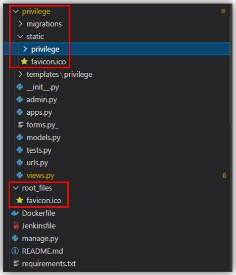

#### faviconとは
- 「favicon」は、「favorites icon」の略語で、Webブラウザのアドレスバーやブックマークリストに表示される小さなロゴやアイコンのこと

## WhiteNoiseを使っている時にfavicon.icoをDjangoで読み込ませるための設定
#### 前提
- favicon(`favicon.ico`)は他の静的ファイルのように`<アプリ名>/static/<アプリ名>`配下に置く方法では読み込まれない
  - 以下のようなエラーが出る
    ~~~
    "GET /favicon.ico HTTP/1.1" 404
    ~~~
- Project名を`app`、Application名を`privilege`とする

### うまくいった設定例
- `settings.py`に`WHITENOISE_ROOT`設定を追加する
  ~~~python
  WHITENOISE_ROOT = BASE_DIR / 'root_files'
  ~~~
- `manage.py`があるTopディレクトリに上記の設定に合わせて`root_files`ディレクトリを作成して、`favicon.ico`ファイルを配置する
- `<アプリ名>/static/`配下に同じ`favicon.ico`ファイルを配置する
- HTMLテンプレートファイルで以下の通り`favicon.ico`の読み込む
  ~~~html
  
          ・
          ・
  <head>
      <link rel="shortcut icon" type="image/x-icon" href="">
  </head>
  ~~~
- 実際のディレクトリの中はこんなイメージ
  

#### その他 (試したことなど)
- 色んなサイトに`STATICFILES_DIRS`設定が書いてあったが、自分の場合うは要らなかった。
- 最初に設定した後やicoを変えた場合は、ブラウザの履歴(キャッシュ)を削除する必要がある
- `WHITENOISE_ROOT`に設定したディレクトリ配下と`<アプリ名>/static/`配下両方に`favicon.ico`を配置しないと正常に動作しなかった
- 参考URL
  - https://whitenoise.readthedocs.io/en/latest/django.html
  - https://stackoverflow.com/questions/65927187/how-to-server-favicon-ico-with-django-and-whitenoise