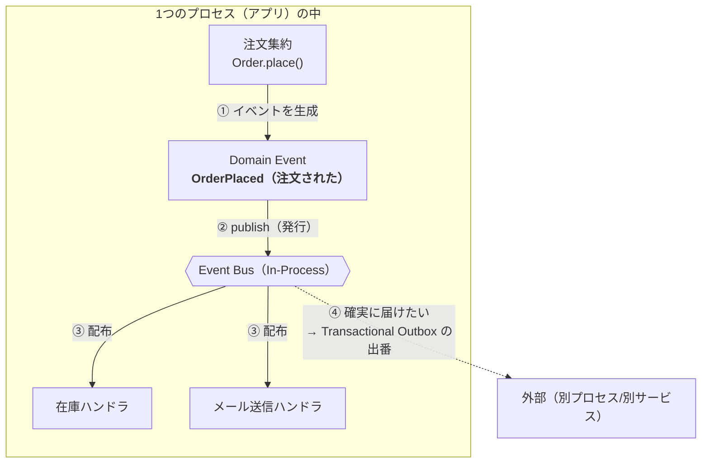
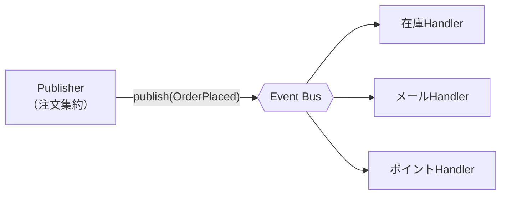
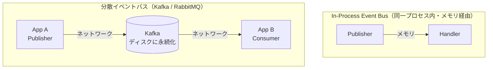
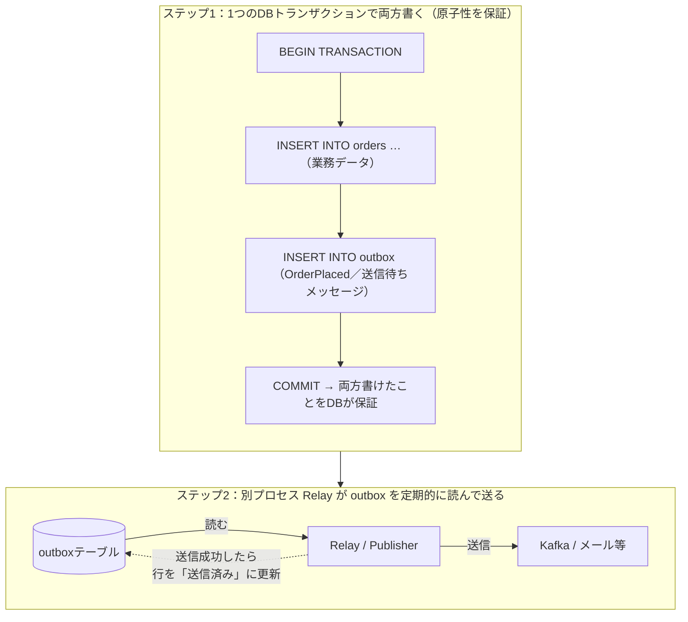
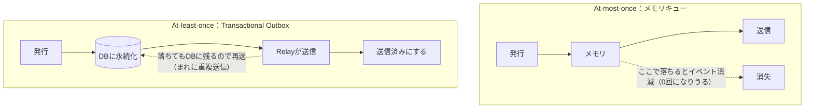

# Domain Events・In-Process Event Bus・Transactional Outboxについて

> DDD（ドメイン駆動設計）でよく登場する 3 つの概念。
> 関連: [DDD（ドメイン駆動設計）について](<../Coding-Design-Practices/ DDD（ドメイン駆動設計）について.md>)

## 全体像（先に結論）

3 つの概念は「役割」が違うだけで、対立するものではなく **組み合わせて使う** もの。

| 概念 | 一言でいうと | 役割 |
| --- | --- | --- |
| **Domain Events** | 「〇〇が起きた」というメッセージ（データ） | **What（何を伝えるか）** |
| **In-Process Event Bus** | そのメッセージを同一プロセス内で配る仕組み | **How（どう運ぶか）** |
| **Transactional Outbox** | DB更新と外部通知を確実に整合させる設計パターン | **信頼性（確実に届けるか）** |



---

## 1. Domain Events（ドメインイベント）

### 何を表すものか

**「ドメイン（業務領域）の中で発生した、ビジネス的に重要な出来事」を表すオブジェクト**。

- 例：`OrderPlaced`（注文が確定された）、`PaymentReceived`（支払いが受領された）、`UserRegistered`（ユーザーが登録された）
- 「起きた事実」なので **過去形** で命名するのが慣習。
- 一度起きた事実は変わらないので **イミュータブル（変更不可）** にする。

```python
from dataclasses import dataclass
from datetime import datetime

@dataclass(frozen=True)  # frozen=True で不変にする
class OrderPlaced:
    order_id: str
    customer_id: str
    total_amount: int
    placed_at: datetime
```

> [!NOTE]
> `@dataclass(frozen=True)` については [dataclassについて](dataclassについて.md) を参照。

### DDDでの位置づけ

DDDには「**1トランザクション = 1集約（Aggregate）だけを更新する**」という原則がある。
（集約 = 「必ず一緒に整合性を保つべきデータのかたまり」。※例：注文とその明細行）

すると「注文が確定したら在庫も減らしたい」のように、**複数の集約をまたいで処理したい** ケースで困る。
これを解決するのが Domain Events。

- 注文集約は「OrderPlaced が起きた」という事実だけを発行する。
- 在庫集約は後からそのイベントを受け取って、自分のトランザクションで在庫を減らす。
- こうして **集約同士を疎結合（お互いを直接知らない）に保ったまま連携** できる。

これが「**結果整合性（Eventual Consistency）**」＝「今すぐ完全に一致していなくても、最終的には一致する」という考え方。

**主な用途**

| 用途 | 説明 |
| --- | --- |
| 集約間の連携 | 「注文確定 → 在庫引当・ポイント付与」を疎結合に |
| 外部システムへの通知 | メール送信、Slack通知など |
| 監査ログ | 「いつ何が起きたか」の記録 |
| イベントソーシング | 状態そのものではなく「起きたイベント列」で状態を表現する設計 |

### Domain Event と Integration Event の違い

同じ「イベント」でも、**使う範囲** によって2種類に分かれる。混同しやすいので区別しておく。

| | Domain Event | Integration Event |
| --- | --- | --- |
| 使う範囲 | **プロセス内・同じ境界（Bounded Context）の中** | **サービス間・外部システムとの連携** |
| 目的 | 集約同士の連携、ドメインの表現 | 他サービスへ「起きたこと」を知らせる |
| 運ぶ仕組み | In-Process Event Bus | Kafka / RabbitMQ などの分散バス |
| 中身 | ドメインの語彙そのまま（リッチ） | 外部向けに最小限・安定した形に整える |

ポイントは、**外部には Domain Event をそのまま流さず、Integration Event に「変換」して送る** のが定石ということ。
（Domain Event はドメインの都合で頻繁に変わるので、そのまま外部に公開すると他サービスが振り回される）

> [!NOTE]
> 冒頭の「全体像」の図で外部へ出ている矢印（④）は、正確には **Domain Event → Integration Event に変換して送る** 部分にあたる。

---

## 2. In-Process Event Bus（インプロセス・イベントバス）

### pub/sub（出版・購読）の仕組み

Event Bus は **pub/sub パターン** で動く。

- **Publisher（発行者）**：イベントを発行する側。「OrderPlaced が起きたよ」と投げるだけ。
- **Subscriber / Handler（購読者）**：特定のイベントに興味がある側。「OrderPlaced が来たら在庫を減らす」など。
- **Event Bus**：PublisherとSubscriberの **仲介役**。誰が受け取るかを発行者は知らなくてよい。



ポイントは **Publisherは「誰が受け取るか」を知らない** こと。
新しい処理（例：不正検知）を追加したくなったら、Handler を1つ登録するだけで済み、発行側のコードは一切変えなくてよい。

### 最小の実装イメージ（Python）

```python
from collections import defaultdict
from typing import Callable

class InProcessEventBus:
    def __init__(self):
        # イベント型 → ハンドラ関数のリスト
        self._handlers: dict[type, list[Callable]] = defaultdict(list)

    def subscribe(self, event_type: type, handler: Callable):
        """このイベント型が来たらこの関数を呼んで、と登録する"""
        self._handlers[event_type].append(handler)

    def publish(self, event) -> None:
        """イベントを発行 → 登録された全ハンドラを呼ぶ"""
        for handler in self._handlers[type(event)]:
            handler(event)   # ← 同じプロセス内で、その場で関数を呼ぶだけ

# --- 使い方 ---
bus = InProcessEventBus()

def send_email(event: OrderPlaced):
    print(f"確認メール送信: {event.order_id}")

def reduce_stock(event: OrderPlaced):
    print(f"在庫を減らす: {event.order_id}")

bus.subscribe(OrderPlaced, send_email)
bus.subscribe(OrderPlaced, reduce_stock)

# 注文確定時にイベントを発行
bus.publish(OrderPlaced(order_id="A-001", customer_id="U-1",
                        total_amount=5000, placed_at=datetime.now()))
# → send_email と reduce_stock が順番に呼ばれる
```

### 「In-Process」（同一プロセス内・メモリ経由）の意味

**「In-Process」= 同じアプリケーションプロセスの中、メモリ上だけで完結する** という意味。

- イベントは **ただのPythonオブジェクト**。ネットワークもディスクも介さない。
- `publish()` は実質「登録された関数を順番に呼び出す」だけ。
- とても **速い**（メモリ上の関数呼び出しなので）。
- ただし **プロセスが落ちたらイベントは消える**（メモリ上にしかないため）。

> [!WARNING]
> **In-Process Event Bus も、ハンドラが外部I/Oをすると不整合を起こしうる**
> ハンドラの中でメール送信や外部API呼び出しをすると、「DB更新」と「外部への副作用」がズレる危険が出てくる。
> - **DBコミット前に発行** → ハンドラでメールを送ったのに、その後DBがロールバック（メールだけ飛ぶ）
> - **DBコミット後に発行** → コミット直後・発行前にクラッシュ（DBは更新済みなのにメールが飛ばない）
>
> これは後述の **Dual Write問題（4章）と同じ構図**。だから「絶対に落としたくない外部連携」では、In-Process Bus ではなく **Transactional Outbox** を使う。

### Kafka・RabbitMQ等の分散イベントバスとの違い

Kafka や RabbitMQ は **別プロセス・別サーバーで動く「メッセージブローカー」** を経由する。
イベントはネットワークを通り、ディスクに保存される。



| 観点 | In-Process Event Bus | 分散イベントバス（Kafka/RabbitMQ） |
| --- | --- | --- |
| 動く場所 | 同じプロセス内・メモリ | 別プロセス/別サーバー（ブローカー） |
| 経由するもの | 関数呼び出しだけ | ネットワーク＋ディスク |
| 速度 | 非常に速い | ネットワーク分のオーバーヘッドあり |
| 永続化 | されない（落ちたら消える） | される（再起動しても残る） |
| プロセスをまたげるか | ❌ 同一プロセス内のみ | ✅ 別サービス間で連携できる |
| 障害耐性 | 低い | 高い（再送・再処理が可能） |
| 導入コスト | ほぼゼロ（コードだけ） | ミドルウェアの運用が必要 |

**使い分けの目安**
- 同じアプリ内の集約間連携 → **In-Process** で十分。
- 別のマイクロサービスやシステムに確実に届けたい → **Kafka/RabbitMQ**。

---

## 3. Domain Events と In-Process Event Bus の関係

### 「メッセージ(What)」と「運ぶ仕組み(How)」の違い

この2つは **役割が完全に別物**。よくある郵便のたとえで整理する。

| | Domain Event | Event Bus |
| --- | --- | --- |
| たとえ | **手紙の中身**（何が書いてあるか） | **郵便屋さん**（誰に届けるか） |
| 担当 | **What** = 何が起きたか | **How** = どう配るか |
| 具体 | `OrderPlaced` というデータ | `publish` / `subscribe` の仕組み |

- **Domain Event** は「注文が確定した」という **事実そのもの（データ）**。運び方には関心がない。
- **Event Bus** は「そのデータを、興味のある人に届ける」**運搬の仕組み**。中身が何かには関心がない。

### なぜ分離すると良いか

**運ぶ仕組み（How）を差し替えても、メッセージ（What）は変えなくてよい** から。

1. **配送方法を後から変えられる**
   - 最初は In-Process Event Bus で始める。
   - 後で「別サービスにも届けたい」となったら、**Event Bus の実装だけ Kafka に差し替える**。
   - `OrderPlaced` というイベント定義や、発行するドメインのコードはそのまま。

2. **テストしやすい**
   - ドメインは「イベントを発行する」ことだけテストすればよい。
   - 実際にメールを送るなどの副作用は、Bus とHandler側で個別にテストできる。

3. **関心の分離（疎結合）**
   - 注文ドメインは「メールの送り方」も「在庫の減らし方」も知らなくてよい。
   - 「OrderPlaced が起きた」とだけ言えば、あとは Bus と Handler が面倒を見る。

```python
# ドメイン側：What（イベント）を発行するだけ。Howは知らない
class Order:
    def place(self) -> list:
        self.status = "PLACED"
        # 「注文された」という事実を返す（誰にどう届くかは関知しない）
        return [OrderPlaced(self.id, self.customer_id, self.total, datetime.now())]

# アプリ側：How（Bus）を選んで運ぶ。ここを差し替えれば配送方法が変わる
events = order.place()
for event in events:
    bus.publish(event)   # ← bus を Kafka 版に変えても order.place() は不変
```

> [!NOTE]
> この分離の考え方は [依存性注入(DI)](<../Coding-Design-Practices/依存性注入(DI).md>) とも相性が良い（Bus を差し替え可能にする）。

---

## 4. Transactional Outbox（トランザクショナル・アウトボックス）

### まず「Dual Write（二重書き込み）問題」とは

「DBを更新して、**かつ** 外部にも通知する」処理には、実は **落とし穴** がある。

```python
# ❌ 危険なコード（Dual Write）
def place_order(order):
    db.save(order)               # ① DBに注文を保存
    kafka.publish(OrderPlaced)   # ② Kafkaにイベント発行
```

この①と②は **別々のシステムへの書き込み** なので、まとめて1つのトランザクションにできない。
そのため、途中で失敗すると **不整合** が起きる。

| 失敗パターン | 結果 |
| --- | --- |
| ①成功 → ②の直前でアプリがクラッシュ | DBには注文があるのに通知が飛ばない（在庫が減らない・メールが来ない） |
| ①失敗 → でも②は成功 | 注文は保存されていないのに「注文された」通知だけ飛ぶ（幽霊注文） |

これが **Dual Write問題**。「2つの異なる書き込み先を、確実に両方成功／両方失敗にはできない」という根本的な難しさ。

### Transactional Outbox による解決

アイデアはシンプル。
**「外部への通知」も、業務データと同じDBの中に「送信待ちメッセージ」として一緒に保存する。**

外部への通知を直接叩くのではなく、いったん同じDBの `outbox` テーブルに書く。
**業務データの更新と outbox への書き込みを、1つのDBトランザクションにまとめる** のがミソ。
同じDBなので、これは1トランザクションで「両方成功 or 両方失敗」を保証できる。



```sql
-- outbox テーブルの例
CREATE TABLE outbox (
    id           UUID PRIMARY KEY,
    event_type   TEXT,          -- 'OrderPlaced'
    payload      JSONB,         -- イベントの中身
    created_at   TIMESTAMP,
    published_at TIMESTAMP       -- NULL = まだ未送信
);
```

```python
# ステップ1：業務更新とoutbox書き込みを同一トランザクションで
def place_order(order, session):
    with session.begin():                 # 1つのDBトランザクション
        session.add(order)                # 業務データ
        session.add(OutboxMessage(         # 送信待ちメッセージ
            event_type="OrderPlaced",
            payload={"order_id": order.id, "amount": order.total},
        ))
    # COMMIT成功 = 注文とイベントが「両方」確実に残った

# ステップ2：別プロセスが未送信メッセージを拾って送る（ポーリング）
def relay():
    for msg in session.query(OutboxMessage).filter_by(published_at=None):
        kafka.publish(msg.event_type, msg.payload)  # 外部へ送信
        msg.published_at = datetime.now()           # 送信済みにする
        session.commit()
```

これで Dual Write 問題は解消する。
「注文は保存されたのに通知が飛ばない」も「注文がないのに通知だけ飛ぶ」も、どちらも起こらない。

> [!NOTE]
> **発展：リレー（Relay）の実装は2方式ある**
> 上のコードは **① Polling Publisher**（outboxテーブルを定期的にSELECTする）。実務ではもう一つ **② Transaction Log Tailing（CDC）** がよく使われる。
>
> | | ① Polling Publisher | ② Transaction Log Tailing（CDC） |
> | --- | --- | --- |
> | 仕組み | テーブルを定期ポーリング | DBのトランザクションログを読む（例：Debezium） |
> | 順序 | `created_at` 順（おおむね） | **commit順を厳密に保証** |
> | レイテンシ | ポーリング間隔ぶん遅れる | ほぼリアルタイム |
> | DB負荷 | ポーリングの負荷がかかる | テーブルを叩かないので低い |
> | 手軽さ | 簡単・どのDBでも動く | 専用ツール（Debezium等）の運用が必要 |
>
> **まずは①で始め、レイテンシやDB負荷が問題になったら②へ**移行するのが定石。outboxテーブルの構造は同じなので、アプリ側のコードを変えずに切り替えられる。

### メモリキュー（In-Process Event Bus）との違い — At-most-once vs At-least-once

先ほどの In-Process Event Bus は「メモリ上」だった。ここが信頼性の分かれ目。

**メモリキュー（In-Process）は At-most-once（最大1回）**
- イベントはメモリにしかない。
- 送信前にプロセスがクラッシュすると **イベントは消えて二度と届かない**。
- 「多くても1回、下手すると0回」＝ **At-most-once**。

**Transactional Outbox は At-least-once（最低1回）**
- イベントはDBに永続化されている。
- Relay が送信直後・DB更新前にクラッシュしても、`published_at` がNULLのままなので **次回また送られる**。
- 「最低でも1回は必ず届く（ただし重複することはある）」＝ **At-least-once**。



| 観点 | メモリキュー（In-Process Bus） | Transactional Outbox |
| --- | --- | --- |
| 保存場所 | メモリ | DB（永続化） |
| 配信保証 | **At-most-once**（消えることがある） | **At-least-once**（最低1回は届く） |
| クラッシュ時 | イベント消失 | 再送される |
| 重複 | 起きない | **起こりうる → 受信側の対策が必要** |
| 速度・手軽さ | 速い・簡単 | 少し重い（DB＋Relayが必要） |
| 向いている用途 | 落ちても困らない同一プロセス内連携 | 絶対に失いたくない外部連携・お金が絡む処理 |

> [!IMPORTANT]
> **At-least-once の代償：冪等性（べきとうせい）**
> Outbox は「重複することがある」ので、**受信側は「同じイベントを2回受け取っても結果が同じ」になるように作る**必要がある（＝冪等に作る）。
> 例：イベントに一意なIDを付け、「このIDは処理済み」と記録して2回目は無視する。
>
> なお「1回きり（Exactly-once）」の配信は分散システムでは基本的に実現できない。
> 現実的には **At-least-once（最低1回）＋ 受信側の冪等性** の組み合わせで、実質1回きり（**effectively-once**）を達成するのが定石。

---

## まとめ

- **Domain Events** … 「〇〇が起きた」という業務上の事実を表す **メッセージ（What）**。DDDでは集約をまたぐ連携を疎結合に保つ手段。プロセス内で使うのが Domain Event、外部連携用に変換したものが Integration Event。
- **In-Process Event Bus** … そのメッセージを **同一プロセス内・メモリ経由** で pub/sub 配信する **運搬の仕組み（How）**。速いが落ちると消える。ハンドラが外部I/Oをすると Dual Write と同じ不整合を起こしうる。Kafka等の分散バスはネットワーク＋永続化で別サービス間を確実に繋ぐ。
- **What と How は分離** すると、配送方法（Bus）を差し替えてもメッセージ（Event）を変えずに済み、疎結合・テスト容易になる。
- **Transactional Outbox** … 「DB更新」と「外部通知」を確実に整合させる設計。業務更新と outbox 書き込みを **1トランザクション** にまとめて **Dual Write問題** を解決。メモリキューが **At-most-once**（消えうる）なのに対し、Outbox は **At-least-once**（最低1回・要冪等）で信頼性が高い。リレーは Polling と CDC の2方式があり、At-least-once＋冪等性で実質1回（effectively-once）を狙う。
