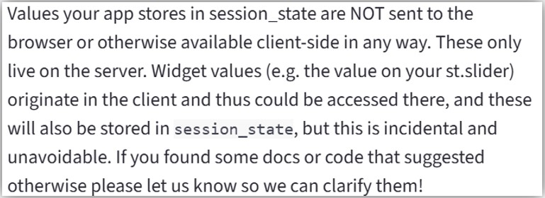

## install
- `pip install streamlit`

## Streamlit実行
- `streamlit run <.pyファイル>`

## MultiPage App
- https://docs.streamlit.io/get-started/tutorials/create-a-multipage-app
- `pages`ディレクトリ配下のpythonファイルから、initial画面用のpythonファイルがある(1つ上の階層)ディレクトリにあるPythonコードから`import`する時、  
  `from .. import`ではなく、同じ階層のPythonファイルをimportする時と同じように`import`だけでimportする

## 画面右上に表示される`Deploy`と設定ボタンを非表示にする方法
- https://discuss.streamlit.io/t/how-to-hide-deploy-button-in-streamlit-version-1-38/80477

## 会話履歴をすべて表示させる方法
```python
def init_state(key: str, value: any = None) -> None:
    if key not in st.session_state:
        st.session_state[key] = value

def main():
    init_state("chat_history", None)
    init_state("sess_id", str(uuid.uuid4()))
    init_state("messages", [{"role": "assistant", "content": "初めまして、ChatBotです。何でも聞いてください。"}])

    ## 以下のfor文がポイント
    for message in st.session_state.messages:
        with st.chat_message(message["role"]):
            st.markdown(message["content"])

    if user_input := st.chat_input("質問を入力してください"):
        ## 以下のappendがないとユーザの質問が毎回上書きされる
        st.session_state.messages.append({"role": "user", "content": user_input})
        with st.chat_message("user"):
            st.markdown(user_input)

        with st.chat_message("assistant"):
            with st.spinner("Thinking..."):
              message = <回答を生成する処理>
              st.markdown(message)
              ## 以下のappendがないとAIの回答が毎回上書きされる
              st.session_state.messages.append({"role": "assistant", "content": message})
```

## `session_state`によるセッション管理について
- https://docs.streamlit.io/develop/api-reference/caching-and-state/st.session_state
- `session_state`を使ってユーザごとのセッションを管理することができる
- `session_state`のデータはサーバ側で保存されて、ブラウザなどclient側には保存されない
  - https://discuss.streamlit.io/t/hey-i-have-a-serious-issue-about-storing-things-in-the-session-state/35761/8  
  