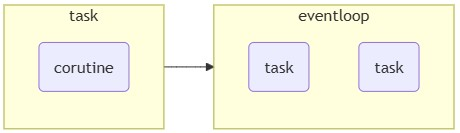

# 概念
- 非同期処理は、I/O待ち時間などのブロッキング操作が多いアプリケーションのパフォーマンスを向上させるための強力な機能。特にネットワーク通信やファイル操作などの場面で効果を発揮する。
  - CPUバウンドな処理には向いていない。CPUバウンドな処理には`multiprocessing`や`concurrent.futures`の方が適している。
- 非同期プログラミングでは、タスクが完了するのを待つ間に他のタスクを実行できる。Pythonでは`asyncio`パッケージと`async`と`await`キーワードを使用して実装する。
- 参考URL
  - https://zenn.dev/iharuoru/articles/45dedf1a1b8352
  - https://nachwon.github.io/asyncio-futures/

# 主要な要素



           ┌────────────┐
           │ async def  │
           │ コルーチン  │
           └────┬───────┘
                │
        asyncio.create_task()
                ↓
           ┌────────┐
           │ Task   │───▶ Event Loop が管理
           └────────┘


## コルーチン（Coroutine）
- `async def`で定義される関数は「コルーチン」と呼ばれ、非同期処理の基本単位
- 一時停止と再開が可能
- 通常の関数と異なり、処理の途中で他のタスクに実行を譲ることができる

## タスク（Task）
- タスクはコルーチンをスケジュールし、その実行を管理するためのオブジェクト
  - コルーチンをイベントループで実行するためのオブジェクト
  - コルーチンをタスクとして登録することで、イベントループによる管理が可能になる
- 基本的に1つのタスクは1つのコルーチンに対応
- 複数のコルーチンを並行して実行するには、タスクを作成する  
  ```python
  async def main():
      # 3つのタスクを作成して並行実行
      task1 = asyncio.create_task(fetch_data())
      task2 = asyncio.create_task(fetch_data())
      task3 = asyncio.create_task(fetch_data())
      
      # 全てのタスクが完了するまで待機
      results = await asyncio.gather(task1, task2, task3)
      print(results)
  ```

- **タスクはイベントループに対してフラットに登録される**
  - コルーチンの中で別のタスクを作成しても、親子（入れ子）構造にはならない。すべてのタスクはイベントループによって平等にスケジュールされる
  - 親タスクの役割は`create_task()`でタスクを作り、`await`で完了を待つだけ
  ```
  イベントループ（1つ、フラット）
  ├── task_parent
  ├── task_other
  ├── task_a      ← parentの中で作られたが、イベントループに直接登録される
  └── task_b      ← 同上
  ```

  ```python
  async def child_work(name):
      await asyncio.sleep(1)
      return f"{name}の結果"

  async def parent():
      # ここで子タスクを作成するが、イベントループにフラットに登録される
      task_a = asyncio.create_task(child_work("child_a"))
      task_b = asyncio.create_task(child_work("child_b"))
      # parentはtask_a, task_bの完了をawaitで待つだけ
      results = await asyncio.gather(task_a, task_b)
      return results

  async def main():
      task_parent = asyncio.create_task(parent())
      task_other = asyncio.create_task(other_work())
      await asyncio.gather(task_parent, task_other)
  ```

> [!NOTE]  
> 通常の`create_task()`ではタスクがフラットに管理されるため、親タスクが例外で終了しても子タスクが走り続ける（野良タスクになる）問題がある。
> ```python
> async def parent():
>     task_a = asyncio.create_task(child_work("a"))
>     task_b = asyncio.create_task(child_work("b"))
>     raise Exception("parentが死んだ")
>     # ↓ ここに到達しないのでawaitされない
>     await asyncio.gather(task_a, task_b)
>     # → task_a, task_bは誰にもawaitされず走り続ける（野良タスク）
> ```
> `asyncio.TaskGroup`は`async with`ブロック内で作成したタスクが必ずそのブロック内で完了またはキャンセルされることを保証し、この問題を解決している。
> ```
> 【フラット（通常）】
> イベントループ
> ├── parent  ← 死んでも
> ├── task_a  ← 走り続ける（野良）
> └── task_b  ← 走り続ける（野良）
>
> 【構造化（TaskGroup）】
> イベントループ
> └── parent
>     └── TaskGroup が管理
>         ├── task_a  ← parentが死んだらキャンセル
>         └── task_b  ← parentが死んだらキャンセル
> ```

## イベントループ（EventLoop）
- コルーチンの実行を管理し、I/Oイベントの発生を監視する中心的な役割を担う
- タスクをスケジュールする

### EventLoopの取得方法

イベントループを取得・操作する方法はいくつかあり、利用シーンによって使い分ける。

#### 1. `asyncio.get_running_loop()`（推奨・async関数内）

```python
import asyncio

async def main():
    loop = asyncio.get_running_loop()  # Python 3.7+
    print(loop)

asyncio.run(main())
```

- **async関数内で使う最も安全な方法**
- 実行中のループが存在しない場合は`RuntimeError`を発生させるため、意図しない使い方を防げる
- `get_event_loop()`との違いは、「今まさに動いているループしか返さない」点で、誤用のリスクが低い

#### 2. `asyncio.get_event_loop()`（同期コードでの取得）

```python
import asyncio

loop = asyncio.get_event_loop()
loop.run_until_complete(some_coroutine())
loop.close()
```

> [!WARNING]  
> Python 3.10以降、実行中のループが存在しない状態でこれを呼ぶと`DeprecationWarning`が発生する。
> 新しいコードでは後述の`asyncio.run()`や`asyncio.new_event_loop()`を使うことが推奨されている。

#### 3. `asyncio.new_event_loop()`（新規ループを明示的に作成）

```python
import asyncio

loop = asyncio.new_event_loop()
asyncio.set_event_loop(loop)

try:
    loop.run_until_complete(some_coroutine())
finally:
    loop.close()
```

- テストコードや、既存のループとは独立したループが必要な場面で使う
- 使い終わったら必ず`loop.close()`でリソースを解放すること

#### 4. `asyncio.run()`（現代的な推奨パターン）

```python
import asyncio

async def main():
    # 必要な処理をここに書く
    await asyncio.sleep(1)
    print("done")

asyncio.run(main())  # ループの作成・実行・クローズを自動管理
```

- Python 3.7+で推奨されるエントリーポイントのパターン
- ループのライフサイクル（作成→実行→クローズ）を自動で管理してくれるため、手動でループを操作する必要がない
- **`asyncio.run()`はasync関数の中では使えない**（その場合は`await`や`asyncio.create_task()`を使う）

#### まとめ

| 用途 | 推奨メソッド |
|---|---|
| async関数内でループが必要 | `asyncio.get_running_loop()` |
| プログラムのエントリーポイント | `asyncio.run()` |
| 新しいループを明示的に作成したい | `asyncio.new_event_loop()` |
| 既存ループを取得（古い書き方） | `asyncio.get_event_loop()`（非推奨） |

> [!TIP]  
> 基本方針：**ループの管理は`asyncio.run()`に任せ、async関数内でループが必要な場合のみ`asyncio.get_running_loop()`を使う**。ループを直接操作するコードは、レガシーコードの維持や特殊なユースケース（テスト、マルチスレッド連携など）に限定するのがベストプラクティス。

### `asyncio.run()`の終了時の挙動

`asyncio.run()`は`main()`が終了した後、**残っているタスクを安全にクリーンアップしてから**イベントループを閉じる。これは「`main()`が終わっても`await`していない野良タスクが残っている」ケースのリソースリークを防ぐための仕組み。

#### なぜクリーンアップが必要なのか

```python
async def background_task(name):
    print(f"{name}: 開始")
    await asyncio.sleep(10)  # 10秒かかる処理
    print(f"{name}: 完了")   # mainが先に終わるとここに到達しない

async def main():
    asyncio.create_task(background_task("タスクA"))  # awaitしない！
    asyncio.create_task(background_task("タスクB"))  # awaitしない！

    await asyncio.sleep(1)  # mainは1秒で終わる
    print("mainが終了")
    # ← タスクA・Bはまだ生きているが誰もawaitしていない（野良タスク）

asyncio.run(main())
```

このままループを閉じると、タスクA・BのDB接続やファイルハンドルなどのリソースが解放されないままになってしまう。そのため`asyncio.run()`は自動でクリーンアップ処理を行う。

#### クリーンアップの4ステップ

```
asyncio.run(main())
│
├─① main() を実行
│
├─② main() が終了
│
└─③ [クリーンアップ開始]
     ├─ Step1: 残タスクを全部集める
     ├─ Step2: 全タスクに cancel() を送る
     ├─ Step3: gather() でグループ化
     └─ Step4: 全タスクの終了を待つ
         ↓
     イベントループを閉じて完全終了
```

**Step1: まだ生きているタスクを全部集める**

`main()`が終了した時点で、イベントループに残っているタスクをすべて把握する。

```
[main()終了時点でのイベントループの状態]

イベントループ
├── タスクA（asyncio.sleep(10)で待機中）← まだ生きてる
└── タスクB（asyncio.sleep(10)で待機中）← まだ生きてる
```

**Step2: 全タスクにキャンセルを送る**

各タスクに`cancel()`を送り、次に`await`に到達した時点で`CancelledError`を発生させる。タスク側で`try/except`を書いておけば、終了前に後片付け処理を実行できる。

```python
async def background_task(name):
    try:
        print(f"{name}: 開始")
        await asyncio.sleep(10)
    except asyncio.CancelledError:
        # Step2でここが呼ばれる → 後片付けのチャンス
        print(f"{name}: キャンセル受信 → クリーンアップ中...")
        # DB接続を閉じる、ファイルを閉じるなどの処理をここに書く
        raise  # CancelledErrorは必ずre-raiseする（マナー）
    finally:
        print(f"{name}: クリーンアップ完了")
```

> [!NOTE]  
> `CancelledError`の処理は任意（`try/except`を書かなくてもいい）。書かない場合はキャンセル通知を受け取った時点でタスクがそのまま終了する。後片付け処理が必要な場合のみ書く。

**Step3: gather()でグループ化**

バラバラのタスクを一括管理できるようにまとめる。`return_exceptions=True`にすることで、`CancelledError`が発生しても`gather()`自体は止まらず全タスクの終了を待てる。

```python
# asyncio.run()が内部でやっていること（概念的なコード）
group = asyncio.gather(*remaining_tasks, return_exceptions=True)
```

**Step4: 全タスクが"完了"するまで待つ**

ここでの「完了」は「正常終了」だけでなく、**「CancelledErrorの処理が終わった状態」も含む**。後片付け処理が終わって初めて`asyncio.run()`が完全終了する。

```
タスクA: CancelledError発生 → except節でクリーンアップ → 終了 ✅
タスクB: CancelledError発生 → except節でクリーンアップ → 終了 ✅
          ↓ 全タスク完了
        asyncio.run() が完全終了
```

#### 動作確認できる完全なサンプル

```python
import asyncio

async def background_task(name):
    try:
        print(f"  [{name}] 開始（10秒かかる処理）")
        await asyncio.sleep(10)
        print(f"  [{name}] 完了")  # キャンセルされるので到達しない
    except asyncio.CancelledError:
        print(f"  [{name}] キャンセルを受け取った → クリーンアップ中...")
        await asyncio.sleep(0.1)  # クリーンアップに少し時間がかかる想定
        print(f"  [{name}] クリーンアップ完了")
        raise  # 必ずre-raise

async def main():
    asyncio.create_task(background_task("タスクA"))
    asyncio.create_task(background_task("タスクB"))

    await asyncio.sleep(1)
    print("=== main() 終了 ===")

print("--- asyncio.run() 開始 ---")
asyncio.run(main())
print("--- asyncio.run() 完全終了 ---")

# 出力:
# --- asyncio.run() 開始 ---
#   [タスクA] 開始（10秒かかる処理）
#   [タスクB] 開始（10秒かかる処理）
# === main() 終了 ===
#   [タスクA] キャンセルを受け取った → クリーンアップ中...
#   [タスクB] キャンセルを受け取った → クリーンアップ中...
#   [タスクA] クリーンアップ完了
#   [タスクB] クリーンアップ完了
# --- asyncio.run() 完全終了 ---
```

#### CancelledError を re-raise しないとどうなるか

`CancelledError`を`except`で捕まえて**re-raiseしないと、そのタスクは「正常終了した」とみなされる**。

```python
async def background_task(name):
    try:
        await asyncio.sleep(10)
    except asyncio.CancelledError:
        print(f"{name}: キャンセルされた（でもre-raiseしない）")
        # raise しない ← これが問題
        # → タスクは「正常終了」として扱われる
```

この場合、`task.cancelled()` が `False` になり、キャンセルが成功したかどうかを外側のコードが判断できなくなる。  
具体的には Step4 のタイミングで問題が起きる。

```
Step2: cancel()を送る → CancelledError発生
Step4: 全タスクの終了を待つ
        ↑ re-raiseしていない場合
          タスクが「正常終了」として返ってくる
          → gather()は「キャンセルを送ったのに正常終了が返ってきた」という
            矛盾した状態になる
          → キャンセルの伝播チェーンが途中で断ち切られる
```

特に`TaskGroup`と組み合わせた場合、子タスクのキャンセルが正しく伝わらず、グループ全体のライフサイクル管理が壊れる。

**「マナー」と表現した理由**：Pythonが強制しているわけではないが、慣例として守るべきルールであるため。ただし言語レベルでも設計意図が示されており、`CancelledError`はPython 3.8以降、`Exception`ではなく`BaseException`を直接継承している。

```
BaseException
├── SystemExit
├── KeyboardInterrupt
├── CancelledError  ← Python 3.8+（Exceptionではない）
└── Exception
    ├── RuntimeError
    └── ...
```

これは「キャンセルは通常のエラーではなく"終了シグナル"として扱うべき」という設計思想を示しており、`except Exception`では捕まえられないようになっている。re-raiseは「後片付けはするが、キャンセル要求には従う」という意思表示。

#### Step4の「完了」に正常終了はあり得るか

**あり得る。ただし意図的にそう書いた場合に限る。**

`CancelledError`を捕まえてre-raiseせずに処理を完走させると、タスクは「正常終了」として扱われる。

```python
async def background_task():
    try:
        await asyncio.sleep(10)
    except asyncio.CancelledError:
        # キャンセルを受け取ったが、残りの処理を最後まで終わらせる
        print("キャンセルされたが、残り処理を完走させる")
        await finish_remaining_work()  # 追加の非同期処理も可能
        return "正常終了の結果"  # ← re-raiseせずに正常値を返す
```

これは「途中でキャンセルされても最低限のデータだけは確実に保存したい」といった、意図的にキャンセルを無視して処理を完遂させたい場合の正当なパターン。ただし**上位のコードにキャンセルが伝わらない**という副作用があるため、`TaskGroup`と組み合わせる場合などは注意が必要。

| re-raiseするか | タスクの状態 | キャンセル伝播 | 用途 |
|---|---|---|---|
| する（推奨） | キャンセル済み | 正常に伝わる | 後片付けだけして終わる |
| しない | 正常終了扱い | 伝わらない | 意図的に処理を完走させたい場合のみ |

# コルーチンの実行方法

## 一般的な基本パターン

実際の現場でのコードはほぼ次のパターンに収まる。

```python
def main():
    asyncio.run(async_main())            # ① 同期の世界からasyncioを起動

async def async_main():
    task1 = asyncio.create_task(...)     # ② タスク化して並行実行をスケジュール
    task2 = asyncio.create_task(...)
    results = await asyncio.gather(task1, task2)  # ③ まとめて完了を待つ
```

他の方法はこの基本パターンでは対応できない要件のために存在する。

| 方法 | 使う場面 |
|---|---|
| `await コルーチン` | 並行不要な時に直列で呼ぶ（シンプルなケース） |
| `asyncio.gather(コルーチン直接)` | `create_task`の手間を省きたい省略記法 |
| `TaskGroup`（3.11+） | エラー時に他タスクも確実にキャンセルしたい場合（`gather`の堅牢版） |
| `as_completed` | 完了した順に即座に処理したい場合 |

Python 3.11以降であれば`TaskGroup`が`gather`より安全なため、新規コードでは`TaskGroup`を基本とする流儀も増えている。

```python
# Python 3.11+での現代的な基本パターン
async def async_main():
    async with asyncio.TaskGroup() as tg:
        task1 = tg.create_task(fetch("url1"))
        task2 = tg.create_task(fetch("url2"))
    # ブロックを抜けた時点で全タスクの完了が保証される
```

`gather`は使いやすいが雑、`TaskGroup`は少し書き方が増えるが堅牢、という違い。

## `asyncio.run()`を使用
- 最上位レベルからコルーチンを実行するために使う。これはプログラムのエントリーポイントで一度だけ呼び出すべき。
- **`asyncio.run`は逆に`async`内では使えない**

## `await`キーワードを使用
- 別の非同期関数（`async def`で定義された関数）の中からコルーチンを呼び出す時に使う
- **`await`キーワードは「この操作が完了するまで待機し、その間は他のタスクを実行できる」ことを示す**
  - 何か別の処理が完了するまで待つ時に`await`を使う  
  ```python
  async def fetch_data():
      print("データ取得開始")
      await asyncio.sleep(2)  # データ取得を模擬（2秒待機）
      print("データ取得完了")
      return {"data": "結果"}
  ```
- **`await`は`async`内でしか使えない**

### `await`の仕組み
```
コルーチンが await に到達
      ↓
EventLoop に制御を返す（yield）
      ↓
EventLoop が OS の I/O 監視機構（epoll/kqueue 等）で
「どの I/O が完了したか」を確認
      ↓
準備できた別のタスクに実行権を渡す
      ↓
元のタスクの I/O が完了したら、次の実行サイクルで再開  
```

## `asyncio.create_task()`を使用
- コルーチンをタスクに変換して並行実行させる方法

## `asyncio.gather()`を使用
- 複数のコルーチンを管理するための方法
- `asyncio.create_task()`で作成した複数のタスクをまとめて管理（すべてのタスクが完了するまで待機）  
  ```python
  async def main():
      # 複数のタスクを作成
      task1 = asyncio.create_task(fetch_data('url1'))
      task2 = asyncio.create_task(fetch_data('url2')) 
      task3 = asyncio.create_task(fetch_data('url3'))
      
      # すべてのタスクを並行実行し、結果を待機
      results = await asyncio.gather(task1, task2, task3)
      
      # 結果の処理
      for result in results:
          print(result)
  ```
  またはリスト内包表記と組み合わせる方法  
  ```python
  async def main():
      urls = ['url1', 'url2', 'url3', 'url4']
      
      # タスクのリストを作成
      tasks = [asyncio.create_task(fetch_data(url)) for url in urls]
      
      # すべてのタスクを並行実行
      results = await asyncio.gather(*tasks)
  ```
- **`asyncio.gather()`はコルーチンを内部的にタスクに変換して実行してくれるので、引数にタスクではなく、コルーチンを指定してもいい**  
  ```python
  async def hello():
      print('I say,')
      await asyncio.sleep(1) # 1秒かかる
      print('hello')

  async def goodbye():
      print('you say,')
      await asyncio.sleep(2) # 2秒かかる
      print('goodbye')

  async def main():
      await asyncio.gather(goodbye(), hello()) # タスクも同様
  ```

## `asyncio.TaskGroup`（Python 3.11+）
- `asyncio.gather()`とは異なるアプローチで並行処理を管理するコンテキストマネージャ
- `gather()`との主な違いは、いずれかのタスクが例外を発生させた場合に**他のタスクを自動的にキャンセル**してくれる点
- 構造化された並行処理（Structured Concurrency）のパターンに沿っており、タスクのライフサイクルが`async with`ブロック内に閉じるため管理しやすい
```python
async def main():
    try:
        async with asyncio.TaskGroup() as tg:
            task1 = tg.create_task(fetch_data("url1"))
            task2 = tg.create_task(fetch_data("url2"))
            task3 = tg.create_task(fetch_data("url3"))
        # async withブロックを抜けた時点で全タスク完了
        print(task1.result(), task2.result(), task3.result())
    except* Exception as eg:
        # いずれのタスクかが例外を出すと、他のタスクも自動キャンセルされ、ExceptionGroupがraiseされる
        # except*はPython 3.11で追加されたExceptionGroup用の構文
        for exc in eg.exceptions:
            print(f"エラー: {exc}")
```
- **TaskGroupで作成した子タスクも、イベントループにはフラットに登録される（別のイベントループに入るわけでも、優先度が変わるわけでもない）**

- **`gather()` との使い分け**

  | | `asyncio.gather()` | `asyncio.TaskGroup` |
  |---|---|---|
  | 例外時の他タスク | キャンセルされない（継続） | 自動キャンセル |
  | エラーハンドリング | `return_exceptions`で制御 | `ExceptionGroup`（`except*`）で処理 |
  | Python バージョン | 3.4+ | 3.11+ |
  | 向いているケース | 独立したタスクで、成功したものだけ使いたい場合 | 全タスクが揃わないと意味がない場合 |

## `asyncio.as_completed()`
- `asyncio.gather()`はすべてのタスクが完了するまで待機するのに対し、`asyncio.as_completed()`はタスクが完了した順に結果を取得(処理)できる
```python
async def main():
    tasks = [fetch_data(url) for url in urls]
    for coro in asyncio.as_completed(tasks):
        result = await coro
        print(f"完了: {result}")  # 完了した順番で処理
```

> [!IMPORTANT]  
> - 複数のコルーチンを`asyncio.create_task()`でtaskに変換せずに直接`await`する場合、各コルーチンが逐次処理になるため、`asyncio.create_task()`を使って並行実行する方が効率的。
> - 直接`await`する場合(**6秒**かかる)  
>   - `await`は対象のコルーチンが完了するまで次の行に進まないため、各コルーチンが順番に実行される  
>   ```python
>   import asyncio
>   import time
>
>   async def fetch_data(name, delay):
>       print(f"{name}: 開始")
>       await asyncio.sleep(delay)
>       print(f"{name}: 完了")
>       return f"{name}の結果"
>
>   async def sequential_example():
>       print("=== 逐次実行 ===")
>       start = time.time()
>
>       result1 = await fetch_data("タスク1", 2)  # 2秒待つ
>       result2 = await fetch_data("タスク2", 3)  # その後3秒待つ
>       result3 = await fetch_data("タスク3", 1)  # その後1秒待つ
>
>       end = time.time()
>       print(f"総実行時間: {end - start:.2f}秒")
>       return [result1, result2, result3]
>
>   def main():
>       asyncio.run(sequential_example())
>
>   if __name__ == "__main__":
>       main()
>
>   # 実行結果:
>   # === 逐次実行 ===
>   # タスク1: 開始
>   # タスク1: 完了
>   # タスク2: 開始
>   # タスク2: 完了
>   # タスク3: 開始
>   # タスク3: 完了
>   # 総実行時間: 6.00秒（2+3+1秒）
>   ```
> - `asyncio.create_task()`を使って並行実行する場合(**3秒**かかる)  
>   ```python
>   import asyncio
>   import time
>
>   async def fetch_data(name, delay):
>       print(f"{name}: 開始")
>       await asyncio.sleep(delay)
>       print(f"{name}: 完了")
>       return f"{name}の結果"
>
>   async def concurrent_example():
>       print("=== 並行実行 ===")
>       start = time.time()
>
>       # この時点でスケジュール（実行予約）される
>       task1 = asyncio.create_task(fetch_data("タスク1", 2))
>       task2 = asyncio.create_task(fetch_data("タスク2", 3))
>       task3 = asyncio.create_task(fetch_data("タスク3", 1))
>
>       # awaitでevent loopに制御が戻り実行され、結果を待つ
>       result1 = await task1
>       result2 = await task2
>       result3 = await task3
>
>       end = time.time()
>       print(f"総実行時間: {end - start:.2f}秒")
>       return [result1, result2, result3]
>
>   def main():
>       asyncio.run(concurrent_example())
>
>   if __name__ == "__main__":
>       main()
> 
>   # 実行結果:
>   # === 並行実行 ===
>   # タスク1: 開始
>   # タスク2: 開始
>   # タスク3: 開始
>   # タスク3: 完了
>   # タスク1: 完了
>   # タスク2: 完了
>   # 総実行時間: 3.00秒
>   ```

# 実践的な例
## 複数のURLから同時にデータを取得
```python
import asyncio
import aiohttp
import time

async def fetch(session, url):
    async with session.get(url) as response:
        return await response.text()

async def fetch_all(urls):
    async with aiohttp.ClientSession() as session:
        tasks = [fetch(session, url) for url in urls]
        return await asyncio.gather(*tasks)

async def main():
    urls = [
        'https://example.com',
        'https://python.org',
        'https://docs.python.org'
    ]
    
    start = time.time()
    results = await fetch_all(urls)
    end = time.time()
    
    print(f"取得完了: {len(results)} URLs in {end - start:.2f} 秒")
    print(f"最初の結果の長さ: {len(results[0])} 文字")

# 実行
asyncio.run(main())
```
> [!NOTE]
> `*`はPythonのアンパック演算子（unpacking operator）と呼ばれるもので、リストやタプルなどのイテラブルをアンパック（展開）する  
>  ```python
>  def add(a, b, c):
>      return a + b + c
>
>  numbers = [1, 2, 3]
>  result = add(*numbers)  # add(1, 2, 3) と同等
>  ```

> [!NOTE]
> `async with`は通常の`with`文の非同期版で、非同期コンテキストマネージャを扱うために使用する。これにより、リソースの初期化と解放を非同期的に行える。
> 例えば`async with session.get(url) as response`の部分では、
> 1. `session.get(url)`は非同期操作で、HTTPリクエストを開始
>     - この操作が完了するまでの間、CPUをブロックせず、他のコルーチンや処理がCPUを使えるようにする 
> 2. `async with`はこの操作の完了を待ち、結果を`response`に代入
> 3. ブロック（`async with`の下のコード）が終了すると、`response`オブジェクトの`__aexit__`メソッドが非同期的に呼び出され、リソース（接続など）が適切に解放される

## 非同期でのファイル操作
```python
import asyncio
import aiofiles

async def read_file(filename):
    async with aiofiles.open(filename, 'r') as f:
        return await f.read()

async def write_file(filename, content):
    async with aiofiles.open(filename, 'w') as f:
        await f.write(content)

async def process_files():
    # 複数のファイルを並行して読み込み
    tasks = [
        read_file('file1.txt'),
        read_file('file2.txt'),
        read_file('file3.txt')
    ]
    
    contents = await asyncio.gather(*tasks)
    
    # 処理を行う（例：すべての内容を結合）
    combined = '\n'.join(contents)
    
    # 結果を書き込み
    await write_file('combined.txt', combined)

# 実行
asyncio.run(process_files())
```

# その他
## エラーハンドリング
- `asyncio.gather()`には`return_exceptions=True`オプションがある
  - `return_exceptions=False`（デフォルト）: いずれかのタスクが例外を発生させると、`gather()`の`await`が即座にその例外をraiseする。ただし、他のタスクはキャンセルされずバックグラウンドで実行が継続する。
  - `return_exceptions=True`: 例外が発生しても例外をraiseせず、全タスクの完了を待ち、例外オブジェクトを結果リストに含めて返す。
```python
async def main():
    # 3つのタスクを作成して並行実行
    task1 = asyncio.create_task(fetch_data())
    task2 = asyncio.create_task(fetch_data())
    task3 = asyncio.create_task(fetch_data())
    
    # 全てのタスクが完了するまで待機
    results = await asyncio.gather(task1, task2, task3, return_exceptions=True)
    print(results)
    # 例外が発生した場合の結果例
    # results = [正常な結果, Exception('エラー'), 正常な結果]
```

## タイムアウト処理
- 長時間実行されるタスクに対して`asyncio.wait_for()`を使ってタイムアウトを設定できる
```python
try:
    result = await asyncio.wait_for(long_running_task(), timeout=5.0)  # 5秒でタイムアウト
except asyncio.TimeoutError:
    print("処理がタイムアウトしました")
```

## キャンセル処理
```python
task = asyncio.create_task(some_coroutine())
# 何らかの条件でキャンセルしたい場合
task.cancel()
try:
    await task  # キャンセルされたタスクを待機するとCancelledErrorが発生
except asyncio.CancelledError:
    print("タスクがキャンセルされました")
```

## セマフォを使った並行処理の制限
```python
# 最大5つのタスクを同時実行
semaphore = asyncio.Semaphore(5)

async def limited_task(n):
    async with semaphore:  # セマフォを獲得
        await some_heavy_task(n)  # リソースを消費する処理
```

## 非同期ジェネレータ
- `async for`を使った非同期イテレーション
```python
import asyncio

async def async_generator():
    for i in range(10):
        await asyncio.sleep(0.1)
        yield i

async def main():
    async for value in async_generator():
        print(value)

asyncio.run(main())
```

## Executor
- asyncioのイベントループ内で同期的な（ブロッキングな）処理を別スレッドや別プロセスで実行するための仕組み
- **asyncioのイベントループはシングルスレッドなので、ブロッキング（同期）処理をそのまま呼ぶとイベントループ全体が止まる**
```python
  async def bad_example():
      time.sleep(5)  # ← これでイベントループが5秒止まる。他のタスクも全部止まる
      await some_async_work()
```
- **こういった同期処理を別スレッド/プロセスに逃がすのが`Executor`**
```python
  import asyncio
  import concurrent.futures

  def blocking_io():
      # 同期的なブロッキング処理（例：重いファイル操作、同期ライブラリの呼び出し）
      time.sleep(3)
      return "結果"

  async def main():
      loop = asyncio.get_event_loop()

      # ThreadPoolExecutor（I/Oバウンド向け）
      result = await loop.run_in_executor(None, blocking_io)  # Noneはデフォルトのexecutor

      # 明示的にExecutorを指定する場合
      with concurrent.futures.ThreadPoolExecutor() as executor:
          result = await loop.run_in_executor(executor, blocking_io)

      # ProcessPoolExecutor（CPUバウンド向け）
      with concurrent.futures.ProcessPoolExecutor() as executor:
          result = await loop.run_in_executor(executor, heavy_computation)

  asyncio.run(main())
```

- **Executorの種類**

  | | `ThreadPoolExecutor` | `ProcessPoolExecutor` |
  |---|---|---|
  | 用途 | I/Oバウンド（ファイル操作、同期HTTPライブラリなど） | CPUバウンド（重い計算処理） |
  | 仕組み | 別スレッドで実行 | 別プロセスで実行 |
  | GILの影響 | 受ける（CPU処理には不向き） | 受けない |

- **Pythonのスレッドとasyncioの違い**
  - 「シングルスレッド」なのはasyncioのイベントループであり、Python自体は`threading`モジュールでマルチスレッドが使える
  - ただしPythonにはGIL（Global Interpreter Lock）があり、Pythonバイトコードを実行できるスレッドは常に1つだけ。I/O操作中はGILが解放されるので、その間に別スレッドが動ける
```
    スレッド1: [Python実行] → [I/O待ち（GIL解放）] → [Python実行]
    スレッド2: [GIL待ち]   → [Python実行]           → [GIL待ち]
```
  - そのため`ThreadPoolExecutor`はI/Oバウンドな同期処理に有効だが、CPUバウンドな処理には`ProcessPoolExecutor`を使う

  | | マルチスレッド可能？ | 並列実行で速くなる？ |
  |---|---|---|
  | I/Oバウンド（ネットワーク、ファイル） | ✅ | ✅（I/O待ち中にGIL解放） |
  | CPUバウンド（計算処理） | ✅（スレッド自体は作れる） | ❌（GILで結局1つずつ） |
```
  イベントループ（メインスレッド）
  ├── async task_a
  ├── async task_b
  └── run_in_executor(blocking_io)
          ↓
      別スレッド/プロセスで実行（イベントループをブロックしない）
          ↓
      完了したらイベントループに結果を返す
```

### Executorはいつ使う？
- 基本的には**使いたいライブラリがasync対応していない時**に使う
  - async対応ライブラリがある場合はそちらを使う方がオーバーヘッドも少なく効率的（`requests` → `aiohttp`/`httpx`、`open()` → `aiofiles` など）
  - Executorは「async対応していない同期処理をasyncioの世界で使うための最終手段」という位置づけ
- 具体的なケース
  1. **同期ライブラリしかない場合**（例：`requests`、一部のDBドライバ）
  2. **CPUバウンドな処理をasyncioの中で使いたい場合**
  3. **C拡張やOS操作などasync化できない処理**（DNSの名前解決、画像処理ライブラリなど）
- **判断フロー**
```
  同期的なブロッキング処理を使いたい
      │
      ├── async対応のライブラリがある？
      │       → YES → そっちを使う（Executor不要）
      │       → NO  → Executorを使う
      │
      └── CPUバウンド？
              → YES → ProcessPoolExecutor
              → NO（I/Oバウンド） → ThreadPoolExecutor
```